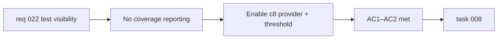

## item_047_enable_vitest_coverage_reporting_with_threshold - Enable Vitest coverage reporting with threshold
> From version: 0.3.0
> Schema version: 1.0
> Status: Draft
> Understanding: 95%
> Confidence: 95%
> Progress: 0%
> Complexity: Small
> Theme: Quality
> Reminder: Update status/understanding/confidence/progress and linked task references when you edit this doc.

# Problem
- The project has 32 unit tests but no coverage reporting configured.
- Without a coverage metric, the team cannot identify which code paths are untested until a bug surfaces in production.
- Vitest supports c8/Istanbul natively — enabling it is low-effort and high-value.

# Scope
- In:
  - install a Vitest coverage provider (`@vitest/coverage-v8` or equivalent)
  - configure `vitest.config.ts` to generate a coverage report on `npm run test`
  - add a coverage threshold that reflects the current actual coverage (to be ratcheted upward over time)
  - add `coverage/` to `.gitignore` if not already present
- Out:
  - changing existing tests or writing new ones (that is `item_050`)
  - uploading coverage to an external service (Codecov, Coveralls)
  - adding coverage badges to the README

# Acceptance criteria
- AC1: `npm run test` outputs a coverage summary to the terminal and the team can identify uncovered files/lines.
- AC2: A minimum coverage threshold is configured in `vitest.config.ts` and the test run fails if coverage drops below it.

# AC Traceability
- AC1 -> Scope: coverage provider + config. Proof: `npm run test` output includes coverage table.
- AC2 -> Scope: threshold configuration. Proof: lowering a threshold value causes `npm run test` to fail.

# Decision framing
- Product framing: Not required
- Product signals: none — internal quality improvement
- Product follow-up: None.
- Architecture framing: Not required
- Architecture signals: none
- Architecture follow-up: None.

# Links
- Product brief(s): `prod_000_mermaid_generator_product_direction`
- Request: `req_022_strengthen_developer_tooling_test_visibility_and_css_maintainability`
- Primary task(s): `task_008_orchestrate_post_030_developer_tooling_and_quality_wave`

# AI Context
- Summary: Install a Vitest coverage provider and configure `vitest.config.ts` to output a coverage report with an enforced minimum threshold.
- Keywords: vitest, coverage, c8, v8, threshold, test visibility, quality
- Use when: Use when touching `vitest.config.ts` or improving test infrastructure.
- Skip when: Skip when the work concerns writing new tests, E2E coverage, or external coverage services.

# Priority
- Impact: High
- Urgency: Medium

# Notes
- Derived from `req_022`, test visibility theme, AC1.
- The initial threshold should be set to the actual current coverage level, then ratcheted upward as new tests are added.
