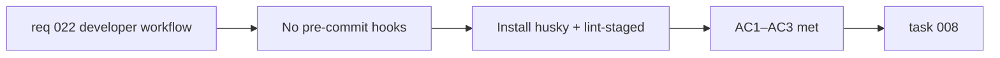

## item_048_add_pre_commit_hooks_with_husky_and_lint_staged - Add pre-commit hooks with husky and lint-staged

> From version: 0.3.0
> Schema version: 1.0
> Status: Done
> Understanding: 95%
> Confidence: 95%
> Progress: 100%
> Complexity: Small
> Theme: Quality
> Reminder: Update status/understanding/confidence/progress and linked task references when you edit this doc.

# Problem

- Linting and type checking are enforced only in CI.
- A developer can push code that fails lint, wait for CI feedback, and iterate remotely.
- This slows down the feedback loop and wastes CI minutes on trivially fixable issues.

# Scope

- In:
  - install `husky` and `lint-staged` as devDependencies
  - configure a `pre-commit` hook that runs `lint-staged`
  - configure `lint-staged` in `package.json` (or `.lintstagedrc`) to run `eslint --fix` on staged `.ts` and `.tsx` files
  - add a `prepare` script in `package.json` to auto-install hooks on `npm install`
- Out:
  - running `typecheck` in the pre-commit hook (too slow for a blocking hook — remains CI-only)
  - running tests in the pre-commit hook
  - adding Prettier to the hook (that is `item_049`)

# Acceptance criteria

- AC1: `husky` and `lint-staged` are installed as devDependencies and a `prepare` script is present in `package.json`.
- AC2: Committing a staged `.ts`/`.tsx` file with a lint violation triggers an automatic `eslint --fix` and blocks the commit if the violation is not auto-fixable.
- AC3: A developer who has not run `npm install` (and thus has no hooks installed) is not blocked — CI remains the source of truth.

# AC Traceability

- AC1 -> Scope: install + prepare script. Proof: `npm install` in a fresh clone installs hooks.
- AC2 -> Scope: lint-staged config. Proof: introduce a deliberate lint violation, attempt commit, observe block.
- AC3 -> Scope: non-blocking for missing hooks. Proof: CI pipeline is unchanged and catches violations independently.

# Decision framing

- Product framing: Not required
- Product signals: none — internal developer workflow
- Product follow-up: None.
- Architecture framing: Not required
- Architecture signals: none
- Architecture follow-up: None.

# Links

- Product brief(s): `prod_000_mermaid_generator_product_direction`
- Request: `req_022_strengthen_developer_tooling_test_visibility_and_css_maintainability`
- Primary task(s): `task_008_orchestrate_post_030_developer_tooling_and_quality_wave`

# AI Context

- Summary: Install husky and lint-staged to run ESLint automatically on staged files before each commit, catching lint violations locally before they reach CI.
- Keywords: husky, lint-staged, pre-commit, hooks, eslint, developer workflow, automation
- Use when: Use when touching developer workflow tooling or pre-commit configuration.
- Skip when: Skip when the work concerns CI pipeline changes, Prettier setup, or test configuration.

# Priority

- Impact: Medium
- Urgency: Medium

# Notes

- Derived from `req_022`, developer workflow theme, AC2.
- Typecheck is intentionally excluded from the pre-commit hook due to its execution time. It remains enforced in CI.
- Completed in `task_008` Wave 0 with Husky `prepare`, a tracked `.husky/pre-commit` hook, and `lint-staged` wiring in `package.json`.
