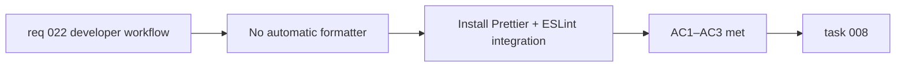

## item_049_configure_prettier_and_integrate_with_eslint - Configure Prettier and integrate with ESLint

> From version: 0.3.0
> Schema version: 1.0
> Status: Draft
> Understanding: 95%
> Confidence: 95%
> Progress: 0%
> Complexity: Small
> Theme: Quality
> Reminder: Update status/understanding/confidence/progress and linked task references when you edit this doc.

# Problem

- The project has ESLint for style guidance but no deterministic code formatter.
- Formatting inconsistencies are caught — or missed — during code review.
- This creates unnecessary review friction and style drift across the codebase.

# Scope

- In:
  - install `prettier` and `eslint-config-prettier` as devDependencies
  - create a `.prettierrc` configuration file with sensible defaults matching the current code style
  - update `eslint.config.js` to include `eslint-config-prettier` so ESLint and Prettier do not conflict
  - run Prettier across the entire codebase and commit the formatted result as a single baseline commit
  - add Prettier to the `lint-staged` configuration (depends on `item_048`) so formatting is enforced on commit
  - add a `format` and/or `format:check` npm script
- Out:
  - changing the code style itself beyond what Prettier's opinionated defaults produce
  - migrating to a different linter
  - adding Prettier to CI as a blocking check (enforced via pre-commit hooks instead)

# Acceptance criteria

- AC1: Prettier is installed and a `.prettierrc` configuration file exists at the project root.
- AC2: `eslint-config-prettier` is installed and integrated in `eslint.config.js` so ESLint and Prettier do not produce conflicting rules.
- AC3: Running `npx prettier --check .` on the codebase produces zero formatting violations.

# AC Traceability

- AC1 -> Scope: install + config file. Proof: `.prettierrc` exists, `prettier` is in devDependencies.
- AC2 -> Scope: ESLint integration. Proof: `npm run lint` does not flag Prettier-managed formatting rules.
- AC3 -> Scope: baseline formatting pass. Proof: `npx prettier --check .` exits with code 0.

# Decision framing

- Product framing: Not required
- Product signals: none — internal developer workflow
- Product follow-up: None.
- Architecture framing: Not required
- Architecture signals: none
- Architecture follow-up: None.

# Links

- Product brief(s): `prod_000_mermaid_generator_product_direction`
- Request: `req_022_strengthen_developer_tooling_test_visibility_and_css_maintainability`
- Primary task(s): `task_008_orchestrate_post_030_developer_tooling_and_quality_wave`

# AI Context

- Summary: Install Prettier with an ESLint integration, format the entire codebase as a baseline, and wire Prettier into the lint-staged pre-commit hook.
- Keywords: prettier, formatter, eslint-config-prettier, code style, formatting, lint-staged, developer workflow
- Use when: Use when touching code formatting, ESLint configuration, or developer workflow tooling.
- Skip when: Skip when the work concerns linting rules, test configuration, or CI pipeline changes.

# Priority

- Impact: Medium
- Urgency: Medium

# Notes

- Derived from `req_022`, developer workflow theme, AC3.
- Depends on `item_048` for lint-staged integration. Can be installed independently but the pre-commit enforcement requires hooks to be in place.
- The baseline formatting commit should be a standalone commit to keep the diff reviewable and separable from functional changes.
