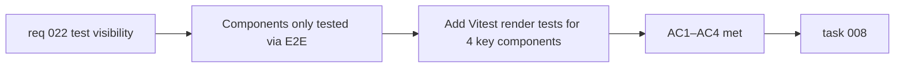

## item_050_add_component_render_tests_for_key_react_components - Add component render tests for key React components

> From version: 0.3.0
> Schema version: 1.0
> Status: Draft
> Understanding: 93%
> Confidence: 90%
> Progress: 0%
> Complexity: Medium
> Theme: Quality
> Reminder: Update status/understanding/confidence/progress and linked task references when you edit this doc.

# Problem

- React components (`AppHeader`, `SettingsModal`, `ExportModal`, `PreviewPanel`) are exercised only through Playwright E2E tests.
- E2E tests are slower (~11s), more fragile, and less precise at isolating component-level regressions than unit-level render tests.
- A component rendering bug that E2E misses (e.g. a missing prop guard, a conditional branch not exercised) has no automated detection until it reaches production.

# Scope

- In:
  - create dedicated Vitest + React Testing Library spec files for at least: `AppHeader`, `SettingsModal`, `ExportModal`, `PreviewPanel`
  - tests should cover: correct rendering given props, conditional UI visibility (e.g. mobile menu, focus mode), and callback invocation on user interaction
  - mock Mermaid rendering and LLM calls where needed to isolate component behavior
- Out:
  - full user flow testing (that belongs in Playwright E2E)
  - snapshot testing (prefer explicit assertions over snapshot fragility)
  - testing hooks already covered by existing unit tests (`usePreviewInteraction`, `useExport`, `useChangelog`)
  - testing `OnboardingModal` and `ChangelogModal` (lower priority, can be added later)

# Acceptance criteria

- AC1: `AppHeader` has a Vitest render test covering: header renders with expected navigation elements, mobile burger menu visibility at narrow viewport, and callback invocation for at least one action button.
- AC2: `SettingsModal` has a Vitest render test covering: modal renders when open, provider list is visible, and closing callback is invoked on Escape or close button.
- AC3: `ExportModal` has a Vitest render test covering: modal renders when open, export action buttons are visible, and closing callback is invoked.
- AC4: `PreviewPanel` has a Vitest render test covering: panel renders with SVG content, zoom controls are visible, and error fallback is displayed when render state contains an error.

# AC Traceability

- AC1 -> Scope: AppHeader render tests. Proof: `npm run test -- src/tests/AppHeader.spec.tsx`.
- AC2 -> Scope: SettingsModal render tests. Proof: `npm run test -- src/tests/SettingsModal.spec.tsx`.
- AC3 -> Scope: ExportModal render tests. Proof: `npm run test -- src/tests/ExportModal.spec.tsx`.
- AC4 -> Scope: PreviewPanel render tests. Proof: `npm run test -- src/tests/PreviewPanel.spec.tsx`.

# Decision framing

- Product framing: Not required
- Product signals: none — internal quality improvement
- Product follow-up: None.
- Architecture framing: Not required
- Architecture signals: none
- Architecture follow-up: None.

# Links

- Product brief(s): `prod_000_mermaid_generator_product_direction`
- Request: `req_022_strengthen_developer_tooling_test_visibility_and_css_maintainability`
- Primary task(s): `task_008_orchestrate_post_030_developer_tooling_and_quality_wave`

# AI Context

- Summary: Write Vitest + React Testing Library render tests for AppHeader, SettingsModal, ExportModal, and PreviewPanel to catch component-level regressions faster than E2E.
- Keywords: component tests, render tests, React Testing Library, Vitest, AppHeader, SettingsModal, ExportModal, PreviewPanel, unit tests
- Use when: Use when touching React component rendering, props, or conditional UI logic.
- Skip when: Skip when the work concerns hook logic, E2E flows, or non-UI library code.

# Priority

- Impact: High
- Urgency: Medium

# Notes

- Derived from `req_022`, test visibility theme, AC4.
- These tests complement E2E — they do not replace it. Focus on render correctness and prop-driven behavior.
- Mermaid rendering should be mocked to avoid pulling in the full Mermaid library in unit tests.
