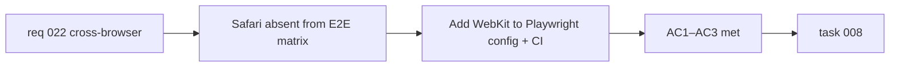

## item_051_add_webkit_to_playwright_browser_matrix - Add WebKit to Playwright browser matrix

> From version: 0.3.0
> Schema version: 1.0
> Status: Draft
> Understanding: 95%
> Confidence: 85%
> Progress: 0%
> Complexity: Small
> Theme: Quality
> Reminder: Update status/understanding/confidence/progress and linked task references when you edit this doc.

# Problem

- Playwright is configured for Chromium and Firefox only.
- Safari (WebKit) accounts for roughly 18% of global web traffic and has known rendering and API differences (clipboard, service worker, CSS).
- Cross-browser regressions affecting Safari users are invisible to the current E2E suite.

# Scope

- In:
  - add a WebKit project entry to `playwright.config.ts`
  - update the CI workflow (`.github/workflows/ci.yml`) to install WebKit alongside Chromium and Firefox
  - run the full E2E suite on WebKit and fix or skip-annotate any platform-specific failures
- Out:
  - adding mobile Safari viewports (desktop WebKit is sufficient for coverage)
  - rewriting existing tests to accommodate WebKit — prefer targeted skip annotations with comments
  - adding Safari-specific E2E scenarios

# Acceptance criteria

- AC1: `playwright.config.ts` includes a WebKit project entry alongside Chromium and Firefox.
- AC2: The CI workflow installs WebKit and runs E2E tests on all three browsers.
- AC3: E2E tests pass on WebKit, with any platform-specific failures skip-annotated and documented in a comment.

# AC Traceability

- AC1 -> Scope: WebKit config entry. Proof: `playwright.config.ts` contains `webkit` project.
- AC2 -> Scope: CI update. Proof: CI workflow installs `webkit` and test job runs on three browsers.
- AC3 -> Scope: test pass or skip-annotate. Proof: `npm run test:e2e` green on all three browsers.

# Decision framing

- Product framing: Not required
- Product signals: cross-browser coverage
- Product follow-up: None.
- Architecture framing: Not required
- Architecture signals: none
- Architecture follow-up: None.

# Links

- Product brief(s): `prod_000_mermaid_generator_product_direction`
- Request: `req_022_strengthen_developer_tooling_test_visibility_and_css_maintainability`
- Primary task(s): `task_008_orchestrate_post_030_developer_tooling_and_quality_wave`

# AI Context

- Summary: Add WebKit to the Playwright browser matrix and CI workflow so E2E tests cover Safari in addition to Chromium and Firefox.
- Keywords: playwright, webkit, safari, cross-browser, E2E, CI, browser matrix
- Use when: Use when touching `playwright.config.ts`, CI workflow, or cross-browser testing.
- Skip when: Skip when the work concerns unit tests, Vitest configuration, or mobile viewports.

# Priority

- Impact: Medium
- Urgency: Low

# Notes

- Derived from `req_022`, cross-browser theme, AC5.
- WebKit may initially be allowed to fail without blocking CI if platform-specific issues surface, then stabilized incrementally.
- Confidence is lower (85%) because WebKit has known differences that may require test adjustments.
