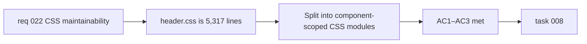

## item_052_split_header_css_into_component_scoped_modules - Split header.css into component-scoped modules

> From version: 0.3.0
> Schema version: 1.0
> Status: Draft
> Understanding: 93%
> Confidence: 88%
> Progress: 0%
> Complexity: Medium
> Theme: Maintainability
> Reminder: Update status/understanding/confidence/progress and linked task references when you edit this doc.

# Problem

- `src/styles/header.css` is 5,317 lines long and contains styles for the app header, navigation, action buttons, mobile burger menu, and various header-related UI states.
- Finding and modifying styles for a specific component requires scanning thousands of lines.
- Accidental style coupling between unrelated header sub-components is hard to detect in a monolithic file.

# Scope

- In:
  - analyze the internal structure of `header.css` and identify logical component boundaries
  - split into component-scoped CSS files (CSS Modules `*.module.css` or per-component CSS files) co-located with or imported by their owning components
  - update all component imports to reference the new CSS files
  - verify zero visual regression by comparing rendered output before and after
- Out:
  - migrating to CSS-in-JS or a utility-first framework (Tailwind, styled-components)
  - changing any visual styles — this is a pure structural reorganization
  - splitting other CSS files (that is `item_053` for modals)

# Acceptance criteria

- AC1: `src/styles/header.css` is replaced by multiple component-scoped CSS files, each imported by its owning component.
- AC2: No visual regression is introduced — the rendered output is pixel-identical before and after the split.
- AC3: All existing automated tests (unit + E2E) remain green.

# AC Traceability

- AC1 -> Scope: CSS split + import updates. Proof: `header.css` no longer exists; new files are imported in components.
- AC2 -> Scope: zero visual regression. Proof: E2E screenshot comparison or manual review.
- AC3 -> Scope: non-regression. Proof: `npm run ci:local` and `npm run test:e2e` green.

# Decision framing

- Product framing: Not required
- Product signals: none — internal maintainability
- Product follow-up: None.
- Architecture framing: Not required
- Architecture signals: modularity
- Architecture follow-up: Consider establishing a CSS module convention for new components going forward.

# Links

- Product brief(s): `prod_000_mermaid_generator_product_direction`
- Request: `req_022_strengthen_developer_tooling_test_visibility_and_css_maintainability`
- Primary task(s): `task_008_orchestrate_post_030_developer_tooling_and_quality_wave`

# AI Context

- Summary: Split the 5,317-line `src/styles/header.css` into component-scoped CSS modules co-located with their owning components, with zero visual regression.
- Keywords: CSS modules, header.css, CSS split, component-scoped, maintainability, refactoring
- Use when: Use when touching header styles or CSS architecture.
- Skip when: Skip when the work concerns modal styles, functional changes, or CSS-in-JS migration.

# Priority

- Impact: Medium
- Urgency: Low

# Notes

- Derived from `req_022`, CSS maintainability theme, AC6.
- The split should follow existing component boundaries: `AppHeader`, mobile menu, action buttons, preview controls.
- CSS Modules (`*.module.css`) are the recommended approach for scoping, but plain per-component CSS files are also acceptable.
