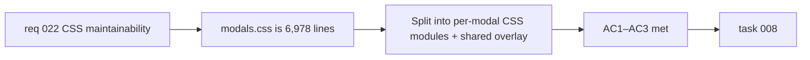

## item_053_split_modals_css_into_component_scoped_modules - Split modals.css into component-scoped modules

> From version: 0.3.0
> Schema version: 1.0
> Status: Draft
> Understanding: 93%
> Confidence: 88%
> Progress: 0%
> Complexity: Medium
> Theme: Maintainability
> Reminder: Update status/understanding/confidence/progress and linked task references when you edit this doc.

# Problem

- `src/styles/modals.css` is 6,978 lines long and contains styles for all modal surfaces: Settings, Export, Onboarding, Changelog, and shared overlay/backdrop patterns.
- Modifying styles for one modal risks unintended side effects on other modals due to the monolithic structure.
- Discoverability is poor — a developer editing `ExportModal.tsx` must search thousands of lines in a separate CSS file.

# Scope

- In:
  - analyze the internal structure of `modals.css` and identify per-modal and shared-overlay boundaries
  - split into component-scoped CSS files co-located with or imported by their owning modal components
  - extract shared overlay/backdrop styles into a common module if reused across modals
  - update all component imports to reference the new CSS files
  - verify zero visual regression
- Out:
  - migrating to CSS-in-JS or a utility-first framework
  - changing any visual styles — pure structural reorganization
  - splitting header CSS (that is `item_052`)

# Acceptance criteria

- AC1: `src/styles/modals.css` is replaced by per-modal CSS files (and optionally a shared overlay module), each imported by its owning component.
- AC2: No visual regression is introduced — the rendered output is pixel-identical before and after the split.
- AC3: All existing automated tests (unit + E2E) remain green.

# AC Traceability

- AC1 -> Scope: CSS split + import updates. Proof: `modals.css` no longer exists; new files are imported in modal components.
- AC2 -> Scope: zero visual regression. Proof: E2E screenshot comparison or manual review.
- AC3 -> Scope: non-regression. Proof: `npm run ci:local` and `npm run test:e2e` green.

# Decision framing

- Product framing: Not required
- Product signals: none — internal maintainability
- Product follow-up: None.
- Architecture framing: Not required
- Architecture signals: modularity
- Architecture follow-up: Align with the CSS convention established in `item_052`.

# Links

- Product brief(s): `prod_000_mermaid_generator_product_direction`
- Request: `req_022_strengthen_developer_tooling_test_visibility_and_css_maintainability`
- Primary task(s): `task_008_orchestrate_post_030_developer_tooling_and_quality_wave`

# AI Context

- Summary: Split the 6,978-line `src/styles/modals.css` into per-modal CSS modules co-located with their owning components, plus a shared overlay module, with zero visual regression.
- Keywords: CSS modules, modals.css, CSS split, component-scoped, maintainability, refactoring, overlay
- Use when: Use when touching modal styles or CSS architecture.
- Skip when: Skip when the work concerns header styles, functional changes, or CSS-in-JS migration.

# Priority

- Impact: Medium
- Urgency: Low

# Notes

- Derived from `req_022`, CSS maintainability theme, AC7.
- Should follow the same CSS module convention established by `item_052`.
- Shared overlay/backdrop patterns (used by all modals) should be extracted into a common module rather than duplicated per-modal.
