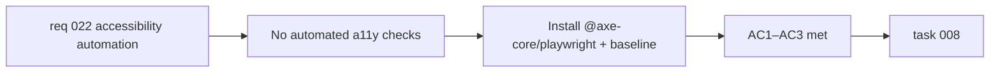

## item_054_integrate_axe_core_accessibility_checks_in_ci - Integrate axe-core accessibility checks in CI
> From version: 0.3.0
> Schema version: 1.0
> Status: Draft
> Understanding: 93%
> Confidence: 88%
> Progress: 0%
> Complexity: Medium
> Theme: Accessibility
> Reminder: Update status/understanding/confidence/progress and linked task references when you edit this doc.

# Problem
- The codebase demonstrates strong manual ARIA discipline, but accessibility regressions are only caught by human review or by the subset of E2E tests that happen to exercise ARIA attributes.
- A missing `aria-label`, a broken focus trap, or a contrast violation can be introduced without any automated detection.
- Automated accessibility auditing would provide a continuous safety net and reduce the manual audit burden.

# Scope
- In:
  - install `@axe-core/playwright` as a devDependency
  - integrate axe accessibility checks into the existing Playwright E2E suite (e.g. run `checkA11y()` on key pages/states after navigation)
  - establish a baseline of known violations so pre-existing minor issues do not block the pipeline on day one
  - document the baseline and the process for resolving violations over time
- Out:
  - fixing all pre-existing accessibility issues in this item (those are tracked separately)
  - adding `vitest-axe` for unit-level accessibility checks (can be added later)
  - achieving WCAG AAA compliance — the goal is automated regression detection, not full certification

# Acceptance criteria
- AC1: `@axe-core/playwright` is installed and integrated into at least three key E2E test scenarios (e.g. main workspace, settings modal open, export modal open).
- AC2: A baseline of known violations is established and documented so the pipeline does not fail on pre-existing issues.
- AC3: New accessibility violations introduced after the baseline cause the E2E test to fail.

# AC Traceability
- AC1 -> Scope: axe integration in E2E. Proof: `npm run test:e2e` runs axe checks and reports results.
- AC2 -> Scope: baseline. Proof: baseline file or inline configuration documents known issues.
- AC3 -> Scope: regression detection. Proof: introducing a deliberate violation (e.g. removing an `aria-label`) causes test failure.

# Decision framing
- Product framing: Not required
- Product signals: accessibility, inclusion
- Product follow-up: Progressively resolve baseline violations in future releases.
- Architecture framing: Not required
- Architecture signals: none
- Architecture follow-up: None.

# Links
- Product brief(s): `prod_000_mermaid_generator_product_direction`
- Request: `req_022_strengthen_developer_tooling_test_visibility_and_css_maintainability`
- Primary task(s): `task_008_orchestrate_post_030_developer_tooling_and_quality_wave`

# AI Context
- Summary: Install `@axe-core/playwright` and integrate automated accessibility checks into key E2E scenarios with a baseline for pre-existing issues.
- Keywords: axe-core, accessibility, a11y, playwright, automated audit, WCAG, CI, regression detection
- Use when: Use when touching accessibility, E2E test infrastructure, or CI pipeline.
- Skip when: Skip when the work concerns unit tests, visual regression testing, or fixing specific accessibility issues.

# Priority
- Impact: Medium
- Urgency: Low

# Notes
- Derived from `req_022`, accessibility automation theme, AC8.
- The baseline approach ensures the pipeline is immediately useful without requiring a full accessibility remediation sprint.
- `@axe-core/playwright` is preferred over a separate CI step because it runs axe in the context of real rendered pages.
