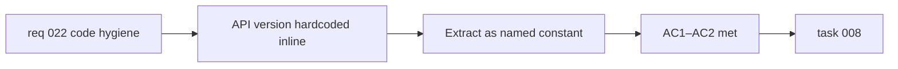

## item_055_extract_anthropic_api_version_as_named_constant - Extract Anthropic API version as named constant

> From version: 0.3.0
> Schema version: 1.0
> Status: Draft
> Understanding: 98%
> Confidence: 98%
> Progress: 0%
> Complexity: Small
> Theme: Quality
> Reminder: Update status/understanding/confidence/progress and linked task references when you edit this doc.

# Problem

- The Anthropic API version string `"2023-06-01"` is hardcoded inline in `src/lib/llm.ts`.
- This is inconsistent with the project's pattern of explicit configuration values.
- A future API version bump requires finding the magic string in the code rather than updating a single named constant.

# Scope

- In:
  - extract `"2023-06-01"` into a named constant (e.g. `ANTHROPIC_API_VERSION`) at the top of `src/lib/llm.ts`
  - replace the inline usage with the constant reference
- Out:
  - changing the Anthropic API version itself
  - moving the constant to an environment variable or config file
  - touching other provider configurations

# Acceptance criteria

- AC1: The Anthropic API version in `src/lib/llm.ts` is defined as a named constant and referenced by name wherever it is used.
- AC2: All existing automated tests remain green.

# AC Traceability

- AC1 -> Scope: constant extraction. Proof: grep for `ANTHROPIC_API_VERSION` in `llm.ts`.
- AC2 -> Scope: non-regression. Proof: `npm run ci:local` green.

# Decision framing

- Product framing: Not required
- Product signals: none
- Product follow-up: None.
- Architecture framing: Not required
- Architecture signals: none
- Architecture follow-up: None.

# Links

- Product brief(s): `prod_000_mermaid_generator_product_direction`
- Request: `req_022_strengthen_developer_tooling_test_visibility_and_css_maintainability`
- Primary task(s): `task_008_orchestrate_post_030_developer_tooling_and_quality_wave`

# AI Context

- Summary: Extract the hardcoded Anthropic API version string `"2023-06-01"` in `src/lib/llm.ts` into a named constant `ANTHROPIC_API_VERSION`.
- Keywords: Anthropic, API version, constant, llm.ts, code hygiene, magic string
- Use when: Use when touching `src/lib/llm.ts` or Anthropic provider configuration.
- Skip when: Skip when the work concerns other providers, API key management, or LLM prompt logic.

# Priority

- Impact: Low
- Urgency: Low

# Notes

- Derived from `req_022`, code hygiene theme, AC9.
- Smallest item in the backlog — can be picked up opportunistically alongside any other `llm.ts` change.
