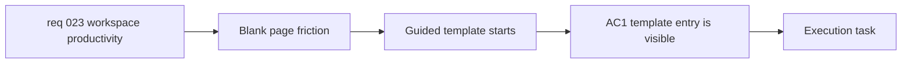

## item_056_add_guided_templates_for_faster_workspace_starts - Add guided templates for faster workspace starts

> From version: 0.4.0
> Schema version: 1.0
> Status: Ready
> Understanding: 98%
> Confidence: 96%
> Progress: 0%
> Complexity: Medium
> Theme: Productivity
> Reminder: Update status/understanding/confidence/progress and linked task references when you edit this doc.

# Problem

- The current workspace starts from a free-form prompt or pasted Mermaid source, which still leaves many users facing a blank page.
- Onboarding explains the product well, but it does not give users domain-shaped starting points for common diagram jobs.
- New and occasional users can stall before their first successful generation, export, or share because they must invent the structure from scratch.

# Scope

- In:
  - add a visible `Start from template` entry point inside the existing authoring workspace
  - ship a curated initial template catalog for API flow, user journey, sequence diagram, architecture cloud, org chart, decision tree, incident or support flow, and process or workflow
  - give each template a name, short description, expected-result example, and editable base prompt
  - provide an editable Mermaid starter for templates where a structural starter improves the starting experience
  - prefill the current workspace prompt and, when applicable, the Mermaid source after template selection
  - let the user edit the prompt and Mermaid source before generation without leaving the main workspace
  - instrument template selection and template-to-first-generation usage
- Out:
  - user-authored templates or template management
  - remote template catalogs or marketplaces
  - a separate landing page flow outside the current workspace
  - replacing direct free-form prompt or pasted-Mermaid entry paths

# Acceptance criteria

- AC1: The workspace surfaces a visible `Start from template` entry point while preserving the existing direct prompt and pasted-Mermaid starts.
- AC2: The initial template catalog includes API flow, user journey, sequence diagram, architecture cloud, org chart, decision tree, incident or support flow, and process or workflow.
- AC3: Every template includes a name, a short description, an expected-result example, and an editable base prompt. Templates that benefit from a structural starter also include an editable Mermaid starter.
- AC4: Selecting a template prefills the current workspace state so the user can edit the prompt, edit the Mermaid starter when present, and generate without leaving the main workspace.
- AC5: The implementation emits measurable event points for template selection and successful first generation from a template so the activation impact can be evaluated after rollout.

# AC Traceability

- AC1 -> Scope: add a visible `Start from template` entry point and preserve direct entry paths. Proof: workspace browser validation.
- AC2 -> Scope: ship the curated initial template catalog. Proof: template catalog review.
- AC3 -> Scope: give each template structured metadata plus an editable base prompt and optional Mermaid starter. Proof: template payload review.
- AC4 -> Scope: prefill the current workspace prompt and Mermaid source after template selection. Proof: interactive workspace validation.
- AC5 -> Scope: instrument template selection and template-to-first-generation usage. Proof: analytics or event contract review.

# Decision framing

- Product framing: Required
- Product signals: conversion journey, navigation and discoverability, experience scope
- Product follow-up: Keep templates as a fast start aid inside the workspace rather than turning them into a separate onboarding product.
- Architecture framing: Consider
- Architecture signals: contracts and integration, state and sync
- Architecture follow-up: Keep template data simple and app-owned so later expansion does not force a premature template-management system.

# Links

- Product brief(s): `prod_000_mermaid_generator_product_direction`
- Architecture decision(s): `adr_000_choose_a_static_pwa_architecture_for_mermaid_generator`
- Request: `req_023_improve_workspace_productivity_with_guided_templates_diagram_improvement_and_local_history`
- Primary task(s): `task_009_orchestrate_workspace_productivity_wave_for_templates_improvement_and_history`

# AI Context

- Summary: Add guided template starts inside the existing workspace so users can move from arrival to a first editable Mermaid draft faster.
- Keywords: templates, guided start, activation, blank page, prompt starter, Mermaid starter
- Use when: Use when implementing or reviewing the guided workspace-entry flow for common diagram types.
- Skip when: Skip when the change only concerns improving an existing diagram or local restore history.

# Priority

- Impact: High
- Urgency: Medium

# Notes

- Derived from request `req_023_improve_workspace_productivity_with_guided_templates_diagram_improvement_and_local_history`.
- This split isolates startup-friction reduction from the improve-existing-diagram and local-history work so the activation slice can ship independently.
- Recommended V1 default: every template ships with an editable base prompt; Mermaid starters are added only where they materially improve the starting structure.
