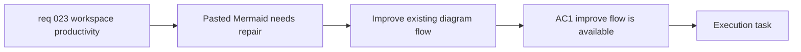

## item_057_add_improve_existing_diagram_flows_for_pasted_mermaid - Add improve-existing-diagram flows for pasted Mermaid

> From version: 0.4.0
> Schema version: 1.0
> Status: Ready
> Understanding: 98%
> Confidence: 95%
> Progress: 0%
> Complexity: High
> Theme: Productivity
> Reminder: Update status/understanding/confidence/progress and linked task references when you edit this doc.

# Problem

- Mermaid-Gen currently creates strong value when a user wants a first draft, but it offers less differentiated value when the user already has Mermaid source.
- A common real-world workflow is to paste Mermaid that is broken, too wide, too verbose, or poorly structured and ask the tool to improve it rather than regenerate from scratch.
- Without an explicit improvement flow, users must either rewrite manually or risk destructive prompt-based generation that may change the meaning of the diagram.

# Scope

- In:
  - expose an `Improve existing diagram` mode or contextual action inside the current workspace
  - accept the current Mermaid source, a selected improvement goal, and optional user constraints
  - support at least these preset intents: fix syntax only, make more readable, reduce width, shorten labels, and restructure for documentation
  - return editable Mermaid as the canonical result and keep the current source when the proposed result is invalid
  - require an explicit review or apply step when the system is uncertain about a change or when the proposed rewrite may alter meaning
  - instrument improve-mode usage, successful apply actions, and improve-to-export or share outcomes
- Out:
  - silently replacing the current diagram with an uncertain rewrite
  - inventing missing business semantics when the source is ambiguous
  - cloud-side review workflows, collaborative comments, or persistent diffs
  - broad diagram-type conversion work beyond explicitly requested improvements

# Acceptance criteria

- AC1: The workspace exposes an `Improve existing diagram` mode or contextual action that accepts the current Mermaid source, an improvement goal, and optional constraints.
- AC2: Improve mode supports at least the preset intents `fix syntax only`, `make more readable`, `reduce width`, `shorten labels`, and `restructure for documentation`.
- AC3: Improve mode returns editable Mermaid as the canonical result and reuses the app's Mermaid validation guardrails so invalid output does not silently replace the current source.
- AC4: When the system is uncertain that a correction or restructuring is safe, it presents the proposed change with an explicit warning and an apply decision instead of overwriting the current diagram automatically.
- AC5: Improvement flows preserve diagram meaning as much as possible and do not invent missing business structure when the source is ambiguous.
- AC6: The implementation emits measurable event points for improve-mode entry, successful apply, and improve-to-export or improve-to-share follow-through.

# AC Traceability

- AC1 -> Scope: expose the improve flow with source, goal, and optional constraints. Proof: workspace browser validation.
- AC2 -> Scope: support the required preset intents. Proof: improve-mode option review.
- AC3 -> Scope: return editable Mermaid and keep current source when the proposal is invalid. Proof: Mermaid validation-path review.
- AC4 -> Scope: require an explicit review or apply step when the system is uncertain. Proof: improve-flow browser validation.
- AC5 -> Scope: do not invent missing business semantics when the source is ambiguous. Proof: prompt contract and example review.
- AC6 -> Scope: instrument improve-mode usage and downstream outcomes. Proof: analytics or event contract review.

# Decision framing

- Product framing: Required
- Product signals: conversion journey, experience scope, retention
- Product follow-up: Position improvement as repair and refinement of the current Mermaid rather than a disguised full-regeneration path.
- Architecture framing: Required
- Architecture signals: contracts and integration, runtime and boundaries, state and sync
- Architecture follow-up: Reuse the existing Mermaid validation and canonical-source contract so the improve flow stays compatible with preview, export, and share.

# Links

- Product brief(s): `prod_000_mermaid_generator_product_direction`
- Architecture decision(s): `adr_000_choose_a_static_pwa_architecture_for_mermaid_generator`
- Request: `req_023_improve_workspace_productivity_with_guided_templates_diagram_improvement_and_local_history`
- Primary task(s): `task_009_orchestrate_workspace_productivity_wave_for_templates_improvement_and_history`

# AI Context

- Summary: Add a repair-and-refine workflow for pasted Mermaid so the product improves existing diagrams safely without losing editability or meaning.
- Keywords: improve diagram, pasted Mermaid, repair, readability, reduce width, shorten labels, restructure, safe apply
- Use when: Use when implementing or reviewing the improve-existing-diagram experience for current Mermaid source.
- Skip when: Skip when the work only concerns guided starts or local history persistence.

# Priority

- Impact: High
- Urgency: High

# Notes

- Derived from request `req_023_improve_workspace_productivity_with_guided_templates_diagram_improvement_and_local_history`.
- This split isolates the highest-value refinement workflow for users who already bring Mermaid into the product.
- Recommended V1 default: use a contextual workspace action plus a review-and-apply flow, not a separate page or a silent auto-rewrite.
