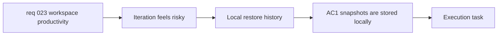

## item_058_add_local_diagram_history_and_restore_points - Add local diagram history and restore points

> From version: 0.4.0
> Schema version: 1.0
> Status: Ready
> Understanding: 98%
> Confidence: 96%
> Progress: 0%
> Complexity: Medium
> Theme: Productivity
> Reminder: Update status/understanding/confidence/progress and linked task references when you edit this doc.

# Problem

- The workspace currently lets users iterate on a Mermaid diagram, but it does not give them a simple local safety net when an edit or AI-assisted change makes the diagram worse.
- Without restore points, users must trust browser undo history or manually copy Mermaid elsewhere, which increases hesitation and perceived risk during experimentation.
- The absence of a lightweight history weakens repeat-use value because the workspace does not yet feel safe for iterative refinement.

# Scope

- In:
  - store browser-local restore points for the current diagram flow
  - create snapshots for initial generation, improve-mode apply, import, shared-link restore, and meaningful manual edits
  - keep the 10 most recent snapshots in app-owned local persistence for V1
  - store timestamp, automatic title, action type, Mermaid source, and associated prompt when available
  - expose a `History` panel with a short textual preview and a `Restore` action
  - debounce or threshold manual-edit snapshot creation so the app does not save on every keystroke
  - instrument snapshot creation and restore usage
- Out:
  - cloud sync, account-backed history, or cross-device restore
  - snapshotting on every single keystroke
  - full visual diff tooling or branch-like history management
  - multi-document project history

# Acceptance criteria

- AC1: The app stores browser-local snapshots for initial generation, improve-mode apply, import, shared-link restore, and meaningful manual edits.
- AC2: V1 keeps the 10 most recent snapshots with timestamp, automatic title, action type, Mermaid source, and associated prompt when available.
- AC3: Manual-edit snapshots use debounce or a meaningful-change threshold and do not trigger on every keystroke.
- AC4: The workspace exposes a `History` panel with a short preview for each snapshot and a `Restore` action.
- AC5: Restoring a snapshot replaces the current canonical Mermaid source without breaking the existing preview, export, or share flows.
- AC6: The implementation emits measurable event points for snapshot creation and history restore usage.

# AC Traceability

- AC1 -> Scope: create snapshots for the defined events and keep them browser-local. Proof: persistence-path review.
- AC2 -> Scope: keep the 10 most recent snapshots with the required metadata. Proof: snapshot payload review.
- AC3 -> Scope: debounce or threshold manual-edit snapshot creation. Proof: history trigger review.
- AC4 -> Scope: expose a `History` panel with preview and restore. Proof: workspace browser validation.
- AC5 -> Scope: restore updates the current canonical Mermaid source. Proof: restore-path validation across preview, export, and share.
- AC6 -> Scope: instrument snapshot creation and restore usage. Proof: analytics or event contract review.

# Decision framing

- Product framing: Required
- Product signals: retention, trust and confidence, experience scope
- Product follow-up: Keep the first history slice lightweight and local so it reduces fear without turning the product into a project-management system.
- Architecture framing: Required
- Architecture signals: data model and persistence, state and sync, delivery and operations
- Architecture follow-up: Use a simple app-owned browser persistence model first, and defer cloud history until there is a proven retention signal.

# Links

- Product brief(s): `prod_000_mermaid_generator_product_direction`
- Architecture decision(s): `adr_000_choose_a_static_pwa_architecture_for_mermaid_generator`
- Request: `req_023_improve_workspace_productivity_with_guided_templates_diagram_improvement_and_local_history`
- Primary task(s): `task_009_orchestrate_workspace_productivity_wave_for_templates_improvement_and_history`

# AI Context

- Summary: Add lightweight browser-local history so users can restore recent Mermaid states after generation, improvement, import, and meaningful edits.
- Keywords: local history, restore, snapshot, browser persistence, debounce, iteration safety
- Use when: Use when implementing or reviewing the local version-history slice for Mermaid diagrams.
- Skip when: Skip when the change only concerns template starts or improve-mode prompting.

# Priority

- Impact: High
- Urgency: Medium

# Notes

- Derived from request `req_023_improve_workspace_productivity_with_guided_templates_diagram_improvement_and_local_history`.
- This split isolates the safety-net and retention slice from the activation and diagram-improvement work.
- Recommended V1 default: keep history in app-owned browser storage with a fixed cap of 10 snapshots and a simple preview-plus-restore UI.
