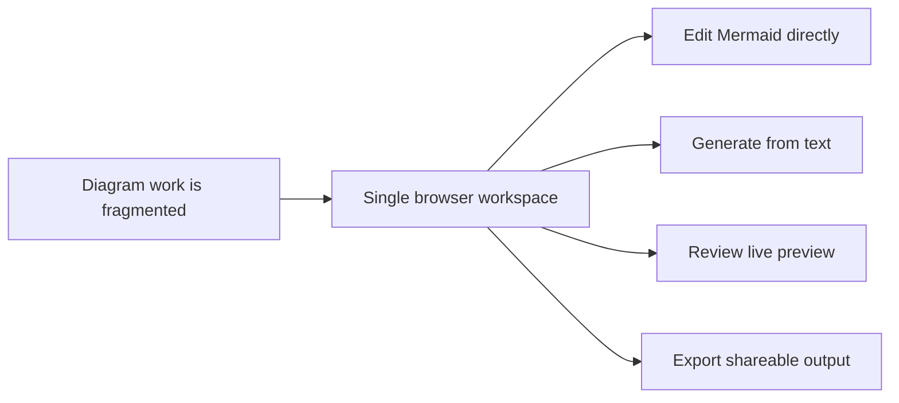

## prod_000_mermaid_generator_product_direction - Mermaid Generator product direction

> Date: 2026-04-02
> Status: Active
> Related request: `req_000_launch_mermaid_generator_web_app`, `req_004_refine_workspace_chrome_help_export_footer_and_preview_focus_behavior`, `req_005_add_first_run_onboarding_modal_with_reactivation_from_settings`, `req_006_add_multi_provider_llm_support_and_expand_settings_management`, `req_017_add_grok_and_mistral_providers_and_rework_settings_provider_ux`, `req_018_add_an_in_app_changelog_modal_accessible_from_settings_and_mobile_navigation`
> Related backlog: `item_005_polish_sticky_workspace_chrome_contextual_help_and_footer`, `item_006_add_first_run_onboarding_modal_and_settings_reactivation`, `item_007_create_multi_provider_llm_adapter_boundary`, `item_008_expand_settings_for_provider_selection_and_local_keys`, `item_009_fix_preview_focus_editor_continuity_and_export_modal_flow`, `item_010_enable_initial_multi_provider_prompt_generation_rollout`, `item_011_add_prompt_generation_diagram_shape_guardrails`, `item_030_add_direct_grok_and_mistral_provider_support_to_the_llm_adapter_layer`, `item_031_rework_settings_provider_management_for_a_growing_provider_catalog`, `item_032_add_a_scrollable_in_app_changelog_history_modal`, `item_033_add_changelog_entry_points_to_settings_and_mobile_burger_navigation`
> Related task: `task_002_orchestrate_workspace_polish_onboarding_and_multi_provider_rollout`, `task_005_orchestrate_render_hardening_provider_expansion_and_in_app_changelog_delivery`
> Related architecture: `adr_000_choose_a_static_pwa_architecture_for_mermaid_generator`, `adr_001_define_static_deployment_and_release_branch_workflow`
> Reminder: Update status, linked refs, scope, decisions, success signals, and open questions when you edit this doc.

# Overview

Mermaid Generator should be a focused browser workspace for writing, refining, and exporting Mermaid diagrams.
The product combines two entry paths in one place: direct code editing and prompt-based diagram generation.
The generated Mermaid stays editable so users can move from rough draft to publishable diagram quickly.
The first release should stay narrow, fast to ship, and consistent with a static PWA-oriented product profile.

# Product problem

Users who work with Mermaid often face a split workflow: one tool to write code, another to validate the rendering, and sometimes a separate AI prompt interface to get a first draft.
That fragmentation slows iteration and makes it harder to move from idea to clean exported diagram.
The product should reduce that friction by giving users one tight loop: describe or paste, preview, refine, export.

# Target users and situations

- Developers, architects, consultants, and product people who already work with Mermaid and want a faster edit and preview loop.
- Users who understand the structure they want but prefer to start from natural-language context instead of writing Mermaid from scratch.
- Solo users who need a lightweight browser tool rather than a full documentation platform or collaborative diagram suite.

# Goals

- Let users get from Mermaid input to visual validation in one browser session with minimal setup.
- Let users move from plain-language context to an editable Mermaid draft without leaving the app.
- Produce exports that are good enough for documentation, reviews, and lightweight deliverables.

# Non-goals

- Real-time multi-user collaboration.
- Full document management, publishing workflows, or team workspaces in the first release.
- Building a model-hosting platform or committing to one LLM provider forever.

# Scope and guardrails

- In: Single-document Mermaid code editor with live preview.
- In: Prompt input area that can generate Mermaid code through a provider-backed LLM flow.
- In: PNG and SVG export from the rendered preview.
- In: Product framing that keeps AI-generated Mermaid editable and inspectable by the user.
- Out: Authentication, cloud project storage, or collaborative editing in the first release.
- Out: Advanced diagram project management such as folders, version history, or review workflows.

# Key product decisions

- One screen should support both entry modes instead of splitting the product into separate editor and generator tools.
- Mermaid source is the canonical artifact; the preview and exports derive from it.
- AI generation is an accelerator, not a replacement for manual editing.
- The first release should optimize for clarity and speed of iteration over breadth of diagram-management features.

# UX and layout direction

- The preview should be the dominant area of the application, not a secondary panel.
- The main workspace should favor a three-part split layout: Mermaid preview as the primary region, Mermaid code editor on the left, and prompt input anchored below the editor in the same left column.
- The product should provide a fast way to expand the preview into an app-level focus mode that hides secondary panels before adding browser-native fullscreen support.
- The preview should support navigation controls appropriate for diagram work, including zoom and panning.
- The first UI implementation should feel like a serious authoring tool rather than a generic AI dashboard.
- Future frontend implementation work for this product should explicitly use the `logics-ui-steering` skill as a guardrail for UI generation and refinement.

# Implementation defaults

- Store user-provided provider keys in local browser persistence for the MVP, with explicit UX messaging that the keys stay on that device.
- Keep the prompt generation area visible when the active provider has no key configured, but lock it with a short explanation and a clear call to action toward `Settings`.
- Keep `Settings` modal-based while it acts as a compact provider-management surface with one active provider and multiple saved local keys.
- Prefer a dedicated code editor experience such as CodeMirror for the Mermaid source rather than a plain textarea in a later refinement wave.
- Keep the browser-first provider model but allow the catalog to grow beyond the initial `OpenAI`, `OpenRouter`, and `Anthropic` set when direct adapters such as `Grok` and `Mistral` are added.
- Treat zoom and pan as preview navigation only; exports should capture the full diagram rather than the current viewport framing.
- The preview toolbar should cover zoom in, zoom out, reset, fit to screen, wheel zoom, preview focus, and a single export entry point; a minimap can wait.
- Support first-run onboarding and contextual help without turning the workspace into a coach-mark-heavy guided product.
- Expose release visibility lightly inside the product through an in-app changelog history modal rather than a full documentation center.
- Treat desktop and tablet landscape as the primary layout targets first, with a clean responsive fallback rather than a full mobile-first authoring experience in the MVP.

# Success signals

- A new user can paste Mermaid code and reach a valid visual preview within a minute.
- A user with only textual context can generate a first Mermaid draft and refine it without leaving the main workspace.
- Export succeeds reliably for the common shareable formats required at launch: SVG and PNG.
- Early feedback confirms that the product feels meaningfully faster than using separate editor, preview, and AI tools.

# References

- `logics/request/req_000_launch_mermaid_generator_web_app.md`
- `logics/architecture/adr_000_choose_a_static_pwa_architecture_for_mermaid_generator.md`
- Reference app: `https://e-plan-editor.onrender.com/`
- Reference repository: `https://github.com/AlexAgo83/electrical-plan-editor`

# Open questions

- Should AI generation launch as an optional bring-your-own-key feature first, or wait for a managed provider proxy?
- Which Mermaid diagram families need to be explicitly supported in the first milestone?
- What is the cleanest responsive fallback when the desktop three-part layout compresses on smaller screens?
