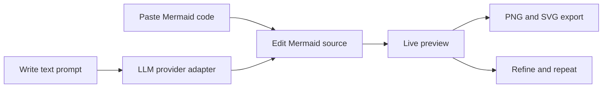

## req_000_launch_mermaid_generator_web_app - Launch Mermaid Generator web app
> From version: 0.1.0
> Schema version: 1.0
> Status: Done
> Understanding: 96%
> Confidence: 95%
> Complexity: Medium
> Theme: UI
> Reminder: Update status/understanding/confidence and references when you edit this doc.

# Needs
- Provide a browser-based Mermaid editor where users can paste Mermaid code, edit it, and see a live preview.
- Provide a prompt-based generation flow where users can paste contextual text and receive Mermaid code plus an immediate preview.
- Support export of the rendered diagram as both PNG and SVG.
- Keep the product eligible for static hosting and PWA behavior.
- Keep the AI generation layer provider-aware so OpenAI can be the first option without hard-coupling the product to one vendor.

# Context
Mermaid Generator is a new web app focused on two primary user paths.

1. A user already has Mermaid code and wants a faster place to edit it, validate it visually, and export it.
2. A user only has textual context and wants an AI-assisted flow that generates a first Mermaid draft they can immediately refine.

The product should stay intentionally focused on a single-document authoring experience first: code editor, prompt panel, live preview, and export.

Key constraints and framing:

- The app should be delivered as a static web app and stay eligible for PWA behavior.
- The technical direction should stay close to the stack and delivery patterns used by the reference project `electrical-plan-editor`.
- Mermaid source remains the editable source of truth, even when it is generated by an LLM.
- AI generation should start with OpenAI compatibility, but the contract should leave room for other providers later.
- Export quality matters because the diagram preview is also a deliverable artifact.

# Acceptance criteria
- Users can paste valid Mermaid code into the app and see a live rendered preview without a page reload.
- Users can edit Mermaid code in place and the preview updates fast enough for iterative authoring.
- Users can provide textual context to an AI prompt flow and receive Mermaid code that is inserted into the editable source area.
- Users can export the rendered result as SVG and PNG from the preview experience.
- The initial product scope can be deployed as a static web app and remains compatible with a PWA-oriented setup.
- The request is framed with companion product and architecture docs that clarify scope and technical direction.

# Definition of Ready (DoR)
- [x] Problem statement is explicit and user impact is clear.
- [x] Scope boundaries (in/out) are explicit.
- [x] Acceptance criteria are testable.
- [x] Dependencies and known risks are listed.

# Companion docs
- Product brief(s): `prod_000_mermaid_generator_product_direction`
- Architecture decision(s): `adr_000_choose_a_static_pwa_architecture_for_mermaid_generator`
# AI Context
- Summary: Build a focused Mermaid authoring web app with live preview, AI-assisted code generation, and export, while preserving a static PWA-friendly delivery model.
- Keywords: mermaid, editor, preview, export, llm, openai, provider adapter, pwa, static app
- Use when: Use when defining backlog slices for editor UX, Mermaid rendering, export, persistence, or AI provider integration.
- Skip when: Skip when the work is about unrelated diagram formats, multi-user collaboration, or non-web delivery targets.

# References
- `logics/product/prod_000_mermaid_generator_product_direction.md`
- `logics/architecture/adr_000_choose_a_static_pwa_architecture_for_mermaid_generator.md`
- Reference app: `https://e-plan-editor.onrender.com/`
- Reference repository: `https://github.com/AlexAgo83/electrical-plan-editor`

# Backlog
- `item_001_bootstrap_static_pwa_foundation_and_delivery_baseline`
- `item_002_build_mermaid_authoring_workspace_and_export_flow`
