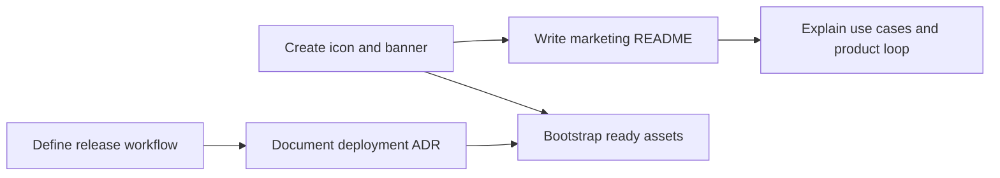

## req_001_create_branding_assets_marketing_readme_and_release_workflow_docs - Create branding assets, marketing README, and release workflow docs

> From version: 0.1.0
> Schema version: 1.0
> Status: Done
> Understanding: 96%
> Confidence: 96%
> Complexity: Medium
> Theme: UI
> Reminder: Update status/understanding/confidence and references when you edit this doc.

# Needs

- Create a polished app icon and reusable branding assets for Mermaid Generator.
- Write a marketing-oriented `README.md` with a strong visual header, clear value proposition, badges, and explanatory Mermaid diagrams.
- Capture the planned deployment and release workflow in an ADR before the GitHub and Render setup is wired.
- Keep the resulting assets easy to reuse later during the app bootstrap and PWA setup.

# Context

The project needs a visible identity layer before the MVP bootstrap is pushed to GitHub.

This request covers three concrete outputs:

1. a project icon and lightweight visual assets suitable for README and future app reuse;
2. a repository README that presents the product in a more marketing-oriented way than a purely technical setup guide;
3. an ADR that explains how deployment and releases should work once the project is published and connected to Render Static Site hosting.

Current planning constraints:

- Development happens on `main`.
- Production-oriented static deployment will later be wired from a `release` branch on Render.
- The normal release rhythm should remain aligned with the user's other projects: version bump, changelog preparation, local CI, promote to `release`, create tag, push, validate GitHub CI, then publish the GitHub release.
- Branding assets should stay simple, editable, and repository-native where possible.

# Acceptance criteria

- The repository contains a reusable app icon asset suitable for future app integration.
- The repository contains at least one branded visual asset suitable for README presentation.
- The root `README.md` exists and presents the project in a product-first tone with badges and Mermaid diagrams.
- The repository contains an ADR that documents the intended `main` to `release` deployment and release workflow for static hosting on Render.
- The request links to the created companion architecture doc and references the concrete delivered files.

# Definition of Ready (DoR)

- [x] Problem statement is explicit and user impact is clear.
- [x] Scope boundaries (in/out) are explicit.
- [x] Acceptance criteria are testable.
- [x] Dependencies and known risks are listed.

# Companion docs

- Product brief(s): (none required for this slice)
- Architecture decision(s): `adr_001_define_static_deployment_and_release_branch_workflow`

# AI Context

- Summary: Create the first visible identity and repository-facing delivery docs for Mermaid Generator, including iconography, marketing README, and deployment workflow ADR.
- Keywords: branding, icon, readme, marketing, badge, release branch, render, github release, changelog
- Use when: Use when shaping repository presentation, brand assets, or release documentation for the early Mermaid Generator project.
- Skip when: Skip when the work concerns editor implementation, Mermaid rendering internals, or LLM provider integration logic.

# References

- `README.md`
- `assets/branding/app-icon.svg`
- `assets/branding/readme-hero.svg`
- `logics/architecture/adr_001_define_static_deployment_and_release_branch_workflow.md`

# Backlog

- `item_000_create_branding_assets_marketing_readme_and_release_workflow_docs`
