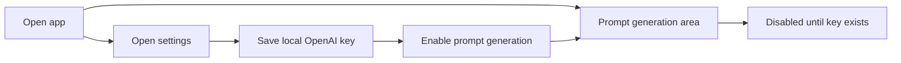

## req_002_add_local_openai_key_setup_and_settings_entry_point - Add local OpenAI key setup and settings entry point
> From version: 0.1.0
> Schema version: 1.0
> Status: Done
> Understanding: 96%
> Confidence: 94%
> Complexity: Medium
> Theme: UI
> Reminder: Update status/understanding/confidence and references when you edit this doc.

# Needs
- Add a visible `Settings` entry point in the app shell.
- Let users configure their own OpenAI API key locally inside the app.
- Keep the LLM prompt-based generation flow unavailable until a valid local key has been provided.
- Use the first settings surface as the foundation for future app options, even if it initially exposes only provider key configuration.

# Context
The product direction already assumes a static app with an initial browser-compatible OpenAI path when users bring their own key.
This request makes that choice explicit in the UI and defines the expected product behavior when no key is configured.

Expected user flow:

1. The user opens the app and sees a `Settings` entry point.
2. The user can add or update an OpenAI API key locally from that settings surface.
3. Until a key exists, the prompt-to-Mermaid generation feature is visibly unavailable.
4. Once a key is configured, the prompt generation flow becomes usable without requiring a separate deployment-side secret.

Constraints and framing:

- The app should remain compatible with the static SPA architecture already documented.
- The key setup should use local browser persistence for the MVP, with explicit messaging that the key stays on the current device.
- The `Settings` surface should launch as a modal and be intentionally small now but structured as a future home for additional app options.
- The disabled state of the LLM prompt area should stay visible so users understand why generation is unavailable.
- The disabled state should include a short explanation and a direct call to action toward `Settings`.

# Acceptance criteria
- The app exposes a `Settings` entry point that is intended to host current and future app options.
- The first settings surface is implemented as a modal and allows the user to enter and persist an OpenAI API key locally in the browser.
- When no local OpenAI key is configured, the prompt-based LLM generation feature remains visible but unavailable in the UI and the user sees a clear explanation plus a direct path to `Settings`.
- When a local OpenAI key is configured, the prompt-based generation flow becomes available without requiring a deployment-managed secret.
- The request stays aligned with the existing product brief and static architecture ADR for a browser-first bring-your-own-key setup.

# Definition of Ready (DoR)
- [x] Problem statement is explicit and user impact is clear.
- [x] Scope boundaries (in/out) are explicit.
- [x] Acceptance criteria are testable.
- [x] Dependencies and known risks are listed.

# Companion docs
- Product brief(s): `prod_000_mermaid_generator_product_direction`
- Architecture decision(s): `adr_000_choose_a_static_pwa_architecture_for_mermaid_generator`
# AI Context
- Summary: Introduce the first user-facing settings surface so local OpenAI key setup can gate prompt-based Mermaid generation in a static app workflow.
- Keywords: settings, openai, api key, local persistence, byok, llm gate, disabled state, app shell
- Use when: Use when defining UX or state-management work for provider configuration and LLM feature availability.
- Skip when: Skip when the work concerns Mermaid editing, export, or release process documentation.

# References
- `logics/request/req_000_launch_mermaid_generator_web_app.md`
- `logics/product/prod_000_mermaid_generator_product_direction.md`
- `logics/architecture/adr_000_choose_a_static_pwa_architecture_for_mermaid_generator.md`

# Backlog
- `item_003_add_local_openai_key_setup_and_settings_entry_point`
