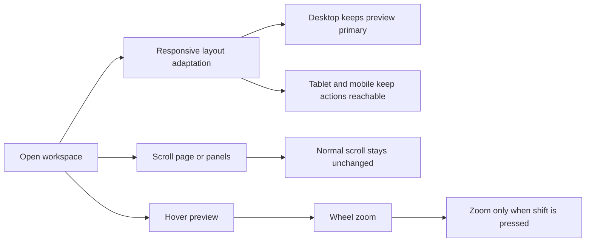

## req_003_improve_responsive_workspace_and_require_shift_for_preview_zoom - Improve responsive workspace and require shift for preview zoom
> From version: 0.1.0
> Schema version: 1.0
> Status: Draft
> Understanding: 97%
> Confidence: 94%
> Complexity: Medium
> Theme: UI
> Reminder: Update status/understanding/confidence and references when you edit this doc.

# Needs
- Make the Mermaid Generator workspace genuinely responsive across desktop, tablet, and mobile widths.
- Keep the preview navigation predictable by allowing wheel-based zoom only while the `Shift` key is actively pressed.
- Prevent accidental zoom interactions during ordinary page or panel scrolling inside the app.

# Context
The current workspace direction is correct at a product level, but two concrete interaction rules still need to be locked down.

First, the app must remain usable on smaller viewports instead of only working on a large desktop canvas. The product brief already states that desktop remains the priority, but the app still needs a coherent responsive behavior for tablet and mobile.

Second, preview zoom should be an intentional action. Users must be able to scroll normally in the page and inside editing surfaces without the preview unexpectedly zooming in or out. The safest default is to require `Shift` as a modifier for wheel zoom.

Expected user flow:

1. The user opens the app on desktop, tablet, or mobile and the workspace remains readable and operable.
2. The preview stays dominant on large screens, while smaller screens reorganize the layout without clipping core actions.
3. The user can scroll the page normally with the mouse wheel or trackpad.
4. The preview only zooms when the pointer is over the preview and `Shift` is pressed during the wheel interaction.

Constraints and framing:

- Keep the existing product direction: preview remains primary, editor stays secondary, and prompt remains available in the workspace.
- Responsive behavior should prioritize usable hierarchy and action access over preserving the exact desktop composition at every width.
- Zoom gating applies to wheel-based zoom; existing explicit zoom controls can remain available without modifier keys.
- The interaction rule should be easy to understand and test.

# Acceptance criteria
- The workspace remains usable across desktop, tablet, and mobile widths, with no critical panel clipping, unusable controls, or broken layout hierarchy.
- On large screens, the preview remains the dominant area while the editor and prompt keep a coherent secondary placement.
- On smaller viewports, the layout adapts so the editor, prompt, preview, and `Settings` entry point remain reachable without overlap or unusable truncation.
- Wheel-based preview zoom only activates when the pointer is over the preview and the `Shift` key is pressed.
- Without `Shift`, wheel or trackpad scrolling does not trigger preview zoom and preserves normal scrolling behavior.

# Definition of Ready (DoR)
- [x] Problem statement is explicit and user impact is clear.
- [x] Scope boundaries (in/out) are explicit.
- [x] Acceptance criteria are testable.
- [x] Dependencies and known risks are listed.

# Companion docs
- Product brief(s): `prod_000_mermaid_generator_product_direction`
- Architecture decision(s): `adr_000_choose_a_static_pwa_architecture_for_mermaid_generator`
# AI Context
- Summary: Tighten the Mermaid Generator workspace so it behaves responsively across viewports and only zooms the preview on wheel input when Shift is held.
- Keywords: responsive, layout, mobile, tablet, desktop, preview, zoom, shift, wheel, interaction
- Use when: Use when defining responsive behavior and safer preview navigation rules for the main Mermaid workspace.
- Skip when: Skip when the work concerns OpenAI settings, export formats, or release workflow documentation.

# References
- `logics/product/prod_000_mermaid_generator_product_direction.md`
- `logics/architecture/adr_000_choose_a_static_pwa_architecture_for_mermaid_generator.md`
- `logics/tasks/task_000_orchestrate_mermaid_generator_mvp_delivery.md`

# Backlog
- `item_004_improve_responsive_workspace_and_require_shift_for_preview_zoom`
