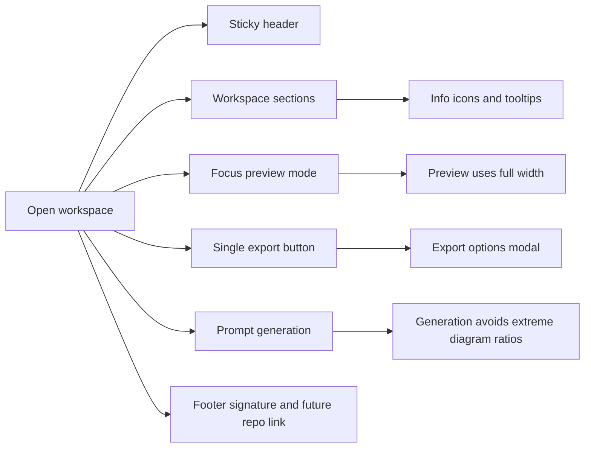

## req_004_refine_workspace_chrome_help_export_footer_and_preview_focus_behavior - Refine workspace chrome help export footer and preview focus behavior

> From version: 0.1.0+focus-docs
> Schema version: 1.0
> Status: Ready
> Understanding: 100%
> Confidence: 98%
> Complexity: Medium
> Theme: UI
> Reminder: Update status/understanding/confidence and references when you edit this doc.

# Needs

- Refine the workspace chrome so the app feels more intentional, lighter, and less noisy.
- Move explanatory copy into contextual help tooltips instead of leaving repeated helper sentences permanently visible.
- Fix the Mermaid source editor bug where manual typing loses focus after the first typed character.
- Fix the broken `Focus preview` behavior so preview mode actually uses the full available width.
- Replace the duplicated export actions with a single export entry point and a dedicated export modal.
- Improve a few weak or noisy pieces of copy and header information.
- Keep the resulting polish compatible with mobile and smaller touch viewports, not only desktop.
- Add a discreet footer signature linked to the future GitHub repository.
- Improve prompt-based generation so produced Mermaid diagrams better respect the preview proportions and avoid runaway width or height.

# Context

The current workspace is functionally close to the intended product, but the surrounding chrome and several interaction details still feel unfinished.

This request groups together the next layer of product polish around the main workspace shell:

1. The header should stay sticky while the rest of the page scrolls underneath it.
2. Contextual helper copy should move into reusable `(i)` help affordances instead of occupying permanent screen space.
3. The Mermaid code editor currently loses focus after the first typed character during manual editing; this should be fixed so typing stays continuous.
4. `Focus preview` currently behaves incorrectly and leaves empty space instead of making the preview fully occupy the available width; this should be investigated in a real browser flow, ideally with Playwright.
5. `Export SVG` and `Export PNG` should become one export button that opens a modal for export options such as format and size.
6. The current tagline `Focused Mermaid authoring, preview, generation, and export.` should be replaced by stronger product-facing copy.
7. The sentence `The MVP stores your OpenAI key locally on this device.` should be removed from the settings modal.
8. Prompt-based generation should guide output toward diagrams that fit the available preview shape better and should avoid extremely long diagrams in width or height when the structure can be distributed more sensibly.
9. A discreet footer should show the app name and copyright, and the footer should become clickable to the GitHub repository once the repository URL exists.
10. `Prompt locked` should be removed from the header.
11. The masked `OpenAI key: XXXX...` indicator should also be removed from the header.

Expected user flow:

1. The user scrolls the workspace and the header remains visible while content moves under it.
2. The user sees a calmer UI, with helper content available on hover through `(i)` icons beside section titles such as `Mermaid source`, `Prompt draft`, and `Preview`.
3. The user can type continuously in the Mermaid code editor without losing focus after the first typed character.
4. The user can activate `Focus preview` and actually get a full-width preview mode without dead space.
5. The user opens a single export action, chooses export options in a modal, and then downloads the requested asset.
6. The user gets better prompt-generation outcomes that stay closer to the usable preview area.

Constraints and framing:

- Keep the preview-first product direction already documented.
- Keep the help system lightweight: hover or focus tooltip behavior is enough for the current phase.
- Do not add decorative header noise while making the header sticky.
- The footer link should be structured so a repository URL can be attached later without reworking the footer design.
- The prompt-generation constraint can be enforced through prompting, generation heuristics, or post-generation checks, but the result must stay browser-first and compatible with the static architecture.
- The UI/UX work for this request should explicitly use `logics-ui-steering` as a guardrail during implementation and refinement.
- The final polish must remain usable on mobile, including the sticky header behavior, tooltip affordances, export flow access, and footer visibility.

# Acceptance criteria

- The header is sticky and remains visible while the rest of the page scrolls underneath it.
- The helper sentences for `Mermaid source`, `Prompt draft`, and `Preview` are moved into help tooltips triggered from visible `(i)` icons near the relevant section labels.
- The Mermaid source editor no longer loses focus after the first typed character during manual editing.
- `Focus preview` uses the available width correctly and does not leave empty dead space on the side in the focused state.
- `Export SVG` and `Export PNG` are replaced by a single export action that opens a modal for export options including at least format and size.
- The header no longer shows `Prompt locked` or the masked OpenAI key state.
- The settings modal no longer shows the sentence `The MVP stores your OpenAI key locally on this device.`
- The marketing line under the app name is replaced by stronger product-facing copy.
- A discreet footer shows the app name and copyright and is structured to link to the GitHub repository once the repository URL is available.
- Prompt-based generation includes guardrails so generated Mermaid diagrams avoid becoming unnecessarily extreme in width or height when a more balanced layout is possible.
- The refined workspace chrome remains usable on mobile and smaller touch viewports, including access to sticky header controls, contextual help, export, and footer affordances.
- The `Focus preview` bug and the final UI behavior are validated in a real browser flow, not only through static code inspection.

# Clarifications

- The sticky header should remain active in normal workspace mode and remain the only shell element preserved in `Focus preview` mode so the preview can use the rest of the available space directly.
- Help affordances should use lightweight tooltip/popover behavior: hover and keyboard focus on desktop, tap-to-open and tap-outside-to-close on mobile.
- `Focus preview` should hide the left rail and use the full app width instead of leaving a dead column on the side; preview-local headers and toolbars should disappear and any remaining focus actions should live in the main header.
- The export flow should use one export button that opens a modal. MVP options should include at least `format` (`PNG` or `SVG`) and export size/scale controls appropriate for raster export.
- `SVG` export should stay vector-first and not require arbitrary width/height resizing in the first export modal iteration.
- The header marketing copy should move toward a professional authoring-tool tone rather than generic AI-product wording.
- Prompt-generation guardrails should start with prompt/system instructions plus light browser-side heuristics, not a heavy auto-regeneration loop.
- Generation should target a stable product-level shape bias rather than relying only on the current live viewport ratio.
- The footer should already be rendered in a discreet way, but the GitHub link can stay inactive or placeholder-backed until the repository URL exists.
- The current editor bug should be fixed in the existing editor implementation first; a broader return to a richer editor can remain a separate future decision.
- Treat this request as one product-level refinement package for now, but allow the backlog stage to split it into multiple coherent delivery slices if the implementation scope becomes too broad.

# Definition of Ready (DoR)

- [x] Problem statement is explicit and user impact is clear.
- [x] Scope boundaries (in/out) are explicit.
- [x] Acceptance criteria are testable.
- [x] Dependencies and known risks are listed.

# Companion docs

- Product brief(s): `prod_000_mermaid_generator_product_direction`
- Architecture decision(s): `adr_000_choose_a_static_pwa_architecture_for_mermaid_generator`

# AI Context

- Summary: Refine the Mermaid Generator workspace chrome with a sticky header, tooltip help affordances, a fixed focus-preview mode, a modal export flow, cleaner header copy, and generation guardrails for better diagram proportions.
- Keywords: sticky header, tooltip, help icon, focus preview, export modal, footer, marketing copy, prompt generation, ratio, mermaid
- Use when: Use when defining the next UI polish slice for the main Mermaid workspace shell and its related generation and export behaviors.
- Skip when: Skip when the work concerns release workflow, deployment setup, or unrelated provider integration.

# References

- `logics/product/prod_000_mermaid_generator_product_direction.md`
- `logics/architecture/adr_000_choose_a_static_pwa_architecture_for_mermaid_generator.md`
- `logics/tasks/task_001_improve_responsive_workspace_and_require_shift_for_preview_zoom.md`
- `logics/skills/logics-ui-steering/SKILL.md`

# Backlog

- `item_005_polish_sticky_workspace_chrome_contextual_help_and_footer`
- `item_009_fix_preview_focus_editor_continuity_and_export_modal_flow`
- `item_011_add_prompt_generation_diagram_shape_guardrails`
