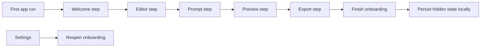

## req_005_add_first_run_onboarding_modal_with_reactivation_from_settings - Add first-run onboarding modal with reactivation from settings

> From version: 0.1.0
> Schema version: 1.0
> Status: Ready
> Understanding: 99%
> Confidence: 96%
> Complexity: Medium
> Theme: UI
> Reminder: Update status/understanding/confidence and references when you edit this doc.

# Needs

- Add a first-run onboarding flow so new users understand how to use Mermaid Generator without guessing the workspace.
- Use a modal-based, step-by-step onboarding similar in spirit to the one already used in `e-plan editor`.
- Let users hide or dismiss onboarding after they have seen it.
- Let users reopen onboarding later from `Settings`.

# Context

The core workspace now combines several important surfaces in one screen: Mermaid source editing, prompt-based generation, preview navigation, and export. That is powerful, but it also means first-time users can arrive in a dense interface without a clear starting path.

This request introduces a guided onboarding flow presented through a modal sequence. The onboarding should remain lightweight and product-focused, not a generic tour overlay. The goal is to explain what the app does and where the key actions live.

The desired flow is:

1. A welcome screen explains what the project does.
2. A second screen presents the Mermaid code editor.
3. A third screen presents the prompt area.
4. A fourth screen presents the preview area.
5. A final screen presents export, with a `Finish` action.

Behavior expectations:

- The onboarding should appear on first run by default.
- The user should be able to hide or dismiss it.
- The dismissed state should be remembered locally in the browser.
- `Settings` should provide a way to reactivate onboarding later.

Constraints and framing:

- Keep the onboarding browser-first and compatible with the current static architecture.
- Prefer a modal wizard flow over scattered tooltips for this first-run experience.
- The onboarding should explain the real workspace that exists; it should not invent future features or fake steps.
- The flow should stay compatible with mobile and smaller viewports, not only desktop.
- The implementation should stay aligned with the calmer authoring-tool UX already documented for the product.

# Acceptance criteria

- The app shows a step-by-step onboarding modal for first-time users.
- The onboarding contains exactly five core steps for the MVP: welcome, code editor, prompt, preview, and export.
- The final onboarding step ends with a `Finish` action that closes the onboarding.
- The user can dismiss or hide onboarding and that choice is remembered locally in the browser.
- The app exposes a way from `Settings` to reopen onboarding after it has been dismissed.
- The onboarding content stays aligned with the actual workspace behavior and does not describe unavailable features.
- The onboarding remains usable on mobile and smaller viewports.
- The onboarding direction stays aligned with the product inspiration from `e-plan editor` without requiring a visual clone.

# Clarifications

- The onboarding should expose a `Skip` action from the beginning of the flow, not only a `Finish` action on the final step.
- Dismissing or skipping onboarding should immediately disable the automatic first-run display until the user reactivates it from `Settings`.
- The onboarding should reuse the same five-step structure on desktop and mobile, but the copy density and spacing should become more compact on small screens.
- The onboarding should explain the current app surfaces clearly without turning into a large feature-tour system with overlays on every control.
- The implementation should stay consistent with the calmer authoring-tool UI direction and should use `logics-ui-steering` during design and refinement work.

# Definition of Ready (DoR)

- [x] Problem statement is explicit and user impact is clear.
- [x] Scope boundaries (in/out) are explicit.
- [x] Acceptance criteria are testable.
- [x] Dependencies and known risks are listed.

# Companion docs

- Product brief(s): `prod_000_mermaid_generator_product_direction`
- Architecture decision(s): `adr_000_choose_a_static_pwa_architecture_for_mermaid_generator`

# AI Context

- Summary: Add a first-run onboarding modal flow that explains the Mermaid Generator workspace step by step, persists dismissal locally, and can be reopened from Settings.
- Keywords: onboarding, first run, modal, wizard, settings, local persistence, welcome, editor, prompt, preview, export
- Use when: Use when defining first-use guidance and reactivation behavior for the Mermaid Generator workspace.
- Skip when: Skip when the work concerns export implementation details, sticky-header polish, or provider configuration alone.

# References

- `logics/product/prod_000_mermaid_generator_product_direction.md`
- `logics/architecture/adr_000_choose_a_static_pwa_architecture_for_mermaid_generator.md`
- Reference app inspiration: `https://e-plan-editor.onrender.com/`
- Reference repository inspiration: `https://github.com/AlexAgo83/electrical-plan-editor`

# Backlog

- `item_006_add_first_run_onboarding_modal_and_settings_reactivation`
