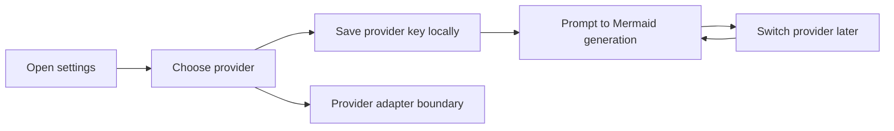

## req_006_add_multi_provider_llm_support_and_expand_settings_management - Add multi-provider LLM support and expand settings management
> From version: 0.1.0
> Schema version: 1.0
> Status: Ready
> Understanding: 99%
> Confidence: 96%
> Complexity: Medium
> Theme: UI
> Reminder: Update status/understanding/confidence and references when you edit this doc.

# Needs
- Expand Mermaid Generator from a single-provider OpenAI setup to a multi-provider LLM architecture.
- Evolve `Settings` so users can manage provider choice, provider-specific API keys, and related generation preferences.
- Keep the app compatible with the current static browser-first bring-your-own-key model while preparing a cleaner abstraction for future providers.

# Context
The product currently assumes one initial OpenAI path, but the long-term direction already leaves room for additional LLM providers behind a provider boundary.

This request formalizes the next step: support multiple LLM APIs instead of only OpenAI, and adapt `Settings` so this no longer behaves like a single-key screen.

The current likely provider candidates include:

- OpenAI
- Anthropic
- Google Gemini
- Mistral
- Groq
- Together AI
- OpenRouter

The exact rollout order can stay flexible, but the product and state model should now be shaped so provider support is not bolted on one provider at a time in ad hoc UI.

Expected user flow:

1. The user opens `Settings`.
2. The user chooses an LLM provider from the supported list.
3. The user enters or updates the API key for that provider locally in the browser.
4. The app uses the selected provider for prompt-to-Mermaid generation.
5. The user can switch providers later without losing the app-wide generation workflow.

Constraints and framing:

- Keep the app browser-first and compatible with the static architecture already documented.
- Keep provider keys in local browser persistence for the current bring-your-own-key model.
- Do not expose project-managed secrets in the public client bundle.
- `Settings` should evolve from “one API key field” into a small provider-management surface without becoming a full preference center yet.
- The UI/UX work for this evolution should explicitly use `logics-ui-steering`.
- The provider abstraction should normalize the app-facing generation contract even if provider request shapes differ underneath.

# Acceptance criteria
- The app supports multiple LLM providers through a provider abstraction instead of a single OpenAI-only integration path.
- `Settings` lets the user select a provider and manage the provider-specific API key locally in the browser.
- The prompt-generation flow uses the currently selected provider without changing the core app workflow.
- The local persistence model remains browser-first and compatible with the current static architecture.
- The provider-management UX remains usable on mobile and smaller viewports.
- The app-facing generation contract stays normalized even if provider-specific request logic differs internally.
- The request stays aligned with the existing static architecture ADR and product direction for provider flexibility.

# Clarifications
- The implementation should establish the full provider abstraction now, but the first enabled rollout can stay smaller than the final provider list.
- The default rollout path should prioritize a small initial provider set such as `OpenAI`, `OpenRouter`, and `Anthropic` before the broader list is enabled.
- `Settings` should support multiple locally stored provider keys, but only one provider should be active at a time for the generation flow.
- The first settings iteration for multi-provider support should prioritize provider selection and key management before exposing advanced model controls.
- Model selection can stay hidden by default in the first provider-management iteration, with future exceptions only if a specific provider path clearly needs it.
- The provider-management UI should stay compatible with mobile and smaller viewports and should use `logics-ui-steering` during implementation.
- The browser-first BYOK model remains the default; managed shared credentials still belong to a future optional proxy layer rather than this request.

# Definition of Ready (DoR)
- [x] Problem statement is explicit and user impact is clear.
- [x] Scope boundaries (in/out) are explicit.
- [x] Acceptance criteria are testable.
- [x] Dependencies and known risks are listed.

# Companion docs
- Product brief(s): `prod_000_mermaid_generator_product_direction`
- Architecture decision(s): `adr_000_choose_a_static_pwa_architecture_for_mermaid_generator`
# AI Context
- Summary: Expand Mermaid Generator to support multiple LLM providers and evolve Settings into a provider-management surface while keeping the current browser-first BYOK architecture.
- Keywords: llm, provider, multi-provider, settings, byok, local persistence, openai, anthropic, gemini, mistral, groq, together, openrouter
- Use when: Use when defining provider abstraction, settings evolution, and local provider-key management for prompt generation.
- Skip when: Skip when the work concerns Mermaid editing, export UX, or non-LLM workspace polish alone.

# References
- `logics/request/req_002_add_local_openai_key_setup_and_settings_entry_point.md`
- `logics/product/prod_000_mermaid_generator_product_direction.md`
- `logics/architecture/adr_000_choose_a_static_pwa_architecture_for_mermaid_generator.md`
- `logics/skills/logics-ui-steering/SKILL.md`

# Backlog
- `item_007_create_multi_provider_llm_adapter_boundary`
- `item_008_expand_settings_for_provider_selection_and_local_keys`
- `item_010_enable_initial_multi_provider_prompt_generation_rollout`
