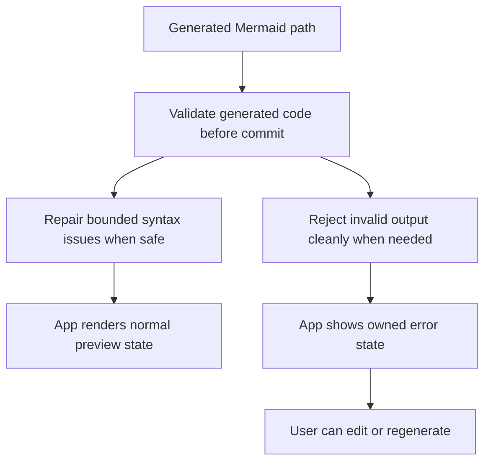

## req_007_harden_generated_mermaid_validation_and_error_handling - Harden generated Mermaid validation and error handling
> From version: 0.1.0
> Schema version: 1.0
> Status: Draft
> Understanding: 98%
> Confidence: 97%
> Complexity: Medium
> Theme: UI
> Reminder: Update status/understanding/confidence and references when you edit this doc.

# Needs
- Prevent generated Mermaid that is syntactically invalid from degrading the main authoring experience.
- Stop exposing Mermaid's raw fallback error rendering to the user when generation returns invalid code.
- Add a safer generated-code validation step so the app can either repair a narrow class of issues or reject the generated output cleanly.

# Context
Prompt generation can currently return Mermaid that looks plausible but is invalid for the Mermaid parser, especially around generated `subgraph` identifiers and follow-up `style` lines.
When that happens, the preview may show Mermaid's own raw error rendering such as `Syntax error in text`, which leaks implementation detail and makes the product feel unstable.
The generated path now has an initial normalization guard for invalid `subgraph` identifiers, but the product still needs a clearer and stricter handling path for invalid generated output.

Constraints:

- keep the app static and browser-first
- avoid mutating manual Mermaid input silently
- allow lightweight auto-repair only for well-bounded generated syntax cases
- prefer app-owned error states over Mermaid-native fallback visuals
- keep the preview panel calm and understandable on desktop and mobile

# Acceptance criteria
- AC1: Generated Mermaid is validated before it replaces the current authoring source in the editor.
- AC2: Mermaid-native raw fallback visuals such as `Syntax error in text` are not shown as the end-user preview state.
- AC3: The app can automatically normalize a bounded class of generated syntax issues, including invalid generated `subgraph` identifiers referenced by styling lines.
- AC4: If generated Mermaid remains invalid after lightweight normalization, the app keeps the current source stable and shows a clear app-owned error state instead of silently swapping in broken code.
- AC5: Manual Mermaid editing is not silently rewritten by this safeguard path; the hardening applies to generated code unless an explicit manual-fix flow is introduced later.
- AC6: The validation and fallback behavior is covered by automated tests.

# Clarifications
- Recommended default: if generated Mermaid stays invalid after bounded normalization, do not replace the current Mermaid source in the editor.
- Recommended default: show an app-owned error state that explains that the generated Mermaid is invalid instead of exposing Mermaid-native fallback visuals.
- Recommended default: keep the generated invalid output available only as an optional debug detail or collapsible inspection area, not as the main preview state.
- Recommended default: apply automatic repair only to narrow generated cases that are deterministic and low-risk, such as invalid generated `subgraph` identifiers and matching `style` references.
- Recommended default: do not silently rewrite Mermaid typed or pasted manually by the user in this request scope.

# Definition of Ready (DoR)
- [x] Problem statement is explicit and user impact is clear.
- [x] Scope boundaries (in/out) are explicit.
- [x] Acceptance criteria are testable.
- [x] Dependencies and known risks are listed.

# Companion docs
- Product brief(s): `prod_000_mermaid_generator_product_direction`
- Architecture decision(s): `adr_000_choose_a_static_pwa_architecture_for_mermaid_generator`
# AI Context
- Summary: Harden the generated Mermaid path so invalid generated diagrams are validated, lightly normalized when safe, and rejected through app-owned error states instead of Mermaid-native fallback visuals.
- Keywords: generated mermaid, validation, fallback, syntax error, subgraph id, normalization, preview error state, guardrail
- Use when: Use when the generated prompt-to-Mermaid flow can inject invalid Mermaid and the product needs safer validation, repair, and error handling.
- Skip when: Skip when the work is only about manual Mermaid authoring, visual polish, or unrelated provider setup.

# References
- `logics/request/req_004_refine_workspace_chrome_help_export_footer_and_preview_focus_behavior.md`
- `logics/request/req_006_add_multi_provider_llm_support_and_expand_settings_management.md`
- `logics/product/prod_000_mermaid_generator_product_direction.md`
- `logics/architecture/adr_000_choose_a_static_pwa_architecture_for_mermaid_generator.md`
- `src/lib/mermaid.ts`
- `src/App.tsx`

# Backlog
- `item_012_validate_generated_mermaid_before_replacing_editor_source`
- `item_014_replace_mermaid_native_syntax_fallback_with_app_owned_error_handling`
