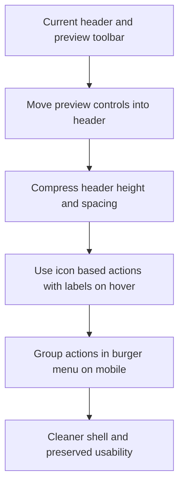

## req_008_compact_header_and_move_preview_controls_into_icon_based_navigation - Compact header and move preview controls into icon based navigation

> From version: 0.1.0
> Schema version: 1.0
> Status: Draft
> Understanding: 99%
> Confidence: 97%
> Complexity: Medium
> Theme: UI
> Reminder: Update status/understanding/confidence and references when you edit this doc.

# Needs

- Reduce the vertical footprint of the current workspace header and preview area chrome.
- Move preview controls into the main header so navigation and actions live in one consistent shell location.
- Replace text-heavy preview controls with icon-based actions that remain understandable through hover or focus labels.
- Keep the resulting control model usable on mobile by collapsing header actions into a burger menu.

# Context

The current preview toolbar still consumes too much height and duplicates application chrome beneath the header.
The product should feel more compact and tool-like, with a tighter sticky header that owns the primary actions.
The preview controls are currently text buttons in the preview panel, which makes the shell heavier than necessary and stretches the top region visually.
The next refinement should consolidate these actions into the top header, convert them to icon-first controls with discoverable labels, and adapt the same controls for smaller screens through a burger menu.

Constraints:

- keep the header readable and compact on desktop
- preserve discoverability through hover, focus, or tap-driven labels/tooltips
- do not remove core preview actions such as zoom, fit, focus preview, export, and settings access
- on mobile, group moved preview actions and `Settings` into one burger menu instead of wrapping several header buttons
- keep the shell aligned with the existing product-native UI direction rather than generic dashboard chrome

# Acceptance criteria

- AC1: Preview controls move from the preview panel into the main header.
- AC2: The moved controls are rendered as icon-based actions rather than text-first buttons.
- AC3: Each icon action exposes a clear text label on hover and keyboard focus so users can understand the control purpose.
- AC4: The header becomes materially more compact in height and spacing than the current implementation.
- AC5: On mobile, the moved preview controls and `Settings` are grouped into one burger menu instead of appearing as a row of separate header buttons.
- AC6: The resulting header and action model remain usable on desktop, tablet, and mobile.

# Clarifications

- Recommended default: move these preview controls into the header: `zoom out`, `zoom in`, `fit`, `focus preview`, and `export`.
- Recommended default: keep `Settings` in the header action system too, rather than as a separate visual pattern.
- Recommended default: `reset` can be omitted from the primary compact header surface unless a later implementation proves it is still needed.
- Recommended default: use icon-first buttons with tooltip labels on hover and keyboard focus, plus `aria-label` support; do not keep persistent text labels beside every icon on desktop.
- Recommended default: on mobile, keep only branding and the burger trigger visible in the header; place the moved preview controls and `Settings` inside the burger menu.
- Recommended default: the burger menu should contain all header actions except branding, not only a subset of secondary actions.

# Definition of Ready (DoR)

- [x] Problem statement is explicit and user impact is clear.
- [x] Scope boundaries (in/out) are explicit.
- [x] Acceptance criteria are testable.
- [x] Dependencies and known risks are listed.

# Companion docs

- Product brief(s): `prod_000_mermaid_generator_product_direction`
- Architecture decision(s): `adr_000_choose_a_static_pwa_architecture_for_mermaid_generator`

# AI Context

- Summary: Refactor the shell so preview controls live in a much more compact header, use icon-based actions with explanatory labels, and collapse into a burger menu on mobile together with settings.
- Keywords: compact header, preview controls, icons, tooltip labels, burger menu, mobile navigation, sticky header, shell refinement
- Use when: Use when the workspace header and preview controls need to be consolidated into a tighter, icon-led navigation model.
- Skip when: Skip when the work only changes Mermaid rendering, providers, onboarding content, or unrelated export logic.

# References

- `logics/request/req_004_refine_workspace_chrome_help_export_footer_and_preview_focus_behavior.md`
- `logics/product/prod_000_mermaid_generator_product_direction.md`
- `logics/architecture/adr_000_choose_a_static_pwa_architecture_for_mermaid_generator.md`
- `src/App.tsx`
- `src/App.css`

# Backlog

- `item_013_move_preview_controls_into_a_compact_icon_based_header`
- `item_015_add_mobile_burger_navigation_for_header_and_preview_controls`
