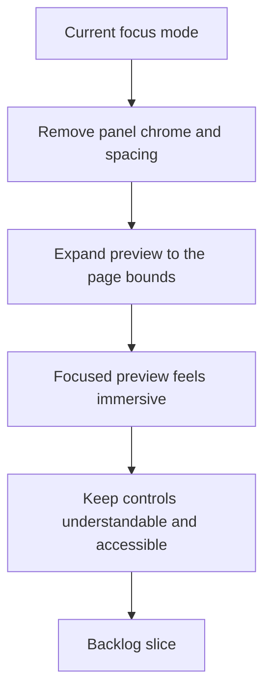

## req_009_make_preview_focus_feel_full_page_instead_of_panel_based - Make preview focus feel full page instead of panel based
> From version: 0.1.0
> Schema version: 1.0
> Status: Draft
> Understanding: 99%
> Confidence: 98%
> Complexity: Medium
> Theme: UI
> Reminder: Update status/understanding/confidence and references when you edit this doc.

# Needs
- Make preview focus feel like a true full-page review mode rather than a panel that simply grows larger.
- Remove the remaining panel decoration that breaks the immersive effect in focus mode.
- Eliminate unnecessary spacing, rounded edges, and panel framing around the preview when focus mode is active.

# Context
The current focus mode hides some surrounding UI, but it still reads visually as the same preview panel with leftover spacing and decoration.
That breaks the intended product feeling: focus mode should feel like the preview has taken over the page, not like the user is still looking at a card inside the workspace.
In practice, the remaining panel border, rounded corners, and extra margins make the focused state look unfinished and reduce the impact of the feature.

Constraints:

- focus mode should feel immersive without introducing a separate route or page
- the preview surface should occupy the available viewport as directly as possible
- leftover panel chrome such as borders, radii, and decorative spacing should disappear in focus mode
- controls still need to remain understandable and accessible while the preview takes over the page
- desktop and mobile behavior should stay coherent even if the exact spacing differs by viewport
- the solution should align with the product-native shell direction instead of looking like a modal or lightbox hack

# Acceptance criteria
- AC1: In focus mode, the preview no longer appears as a decorated panel inside the workspace.
- AC2: Borders, rounded corners, and unnecessary outer spacing around the preview are removed or materially reduced in focus mode.
- AC3: The focused preview surface uses the available page area much more directly and gives the impression of taking over the page.
- AC4: The transition into focus mode remains coherent with the application shell and does not feel like a broken layout state.
- AC5: Controls required during focus mode remain understandable and accessible.
- AC6: The behavior is validated on desktop and mobile-sized layouts.

# Clarifications
- Recommended default: focus mode should feel like a full-page app state, not like a lightbox or a larger card inside the existing workspace.
- Recommended default: keep a very thin shell for essential controls if needed, but remove the visual feeling of a leftover panel around the preview.
- Recommended default: remove or materially reduce panel borders, rounded corners, decorative padding, and footer presence while focus mode is active.
- Recommended default: the preview surface should visually meet the page bounds much more directly, with no obvious wasted margins around it.
- Recommended default: if header controls remain visible in focus mode, they should be compact and restrained so the preview still reads as the page takeover.

# Definition of Ready (DoR)
- [x] Problem statement is explicit and user impact is clear.
- [x] Scope boundaries (in/out) are explicit.
- [x] Acceptance criteria are testable.
- [x] Dependencies and known risks are listed.

# Companion docs
- Product brief(s): `prod_000_mermaid_generator_product_direction`
- Architecture decision(s): `adr_000_choose_a_static_pwa_architecture_for_mermaid_generator`
# AI Context
- Summary: Refine preview focus mode so it feels like a true page takeover, with panel framing, rounded corners, and wasted spacing stripped away while preserving understandable controls.
- Keywords: preview focus, full page, immersive mode, panel chrome, rounded corners, spacing, shell refinement, focus layout
- Use when: Use when the preview focus state should become visually immersive and stop reading as a leftover panel layout.
- Skip when: Skip when the work only concerns generation quality, providers, onboarding, or unrelated header navigation changes.

# References
- `logics/request/req_004_refine_workspace_chrome_help_export_footer_and_preview_focus_behavior.md`
- `logics/request/req_008_compact_header_and_move_preview_controls_into_icon_based_navigation.md`
- `logics/product/prod_000_mermaid_generator_product_direction.md`
- `logics/architecture/adr_000_choose_a_static_pwa_architecture_for_mermaid_generator.md`
- `src/App.tsx`
- `src/App.css`

# Backlog
- `item_016_make_preview_focus_feel_full_page_and_remove_panel_chrome`
