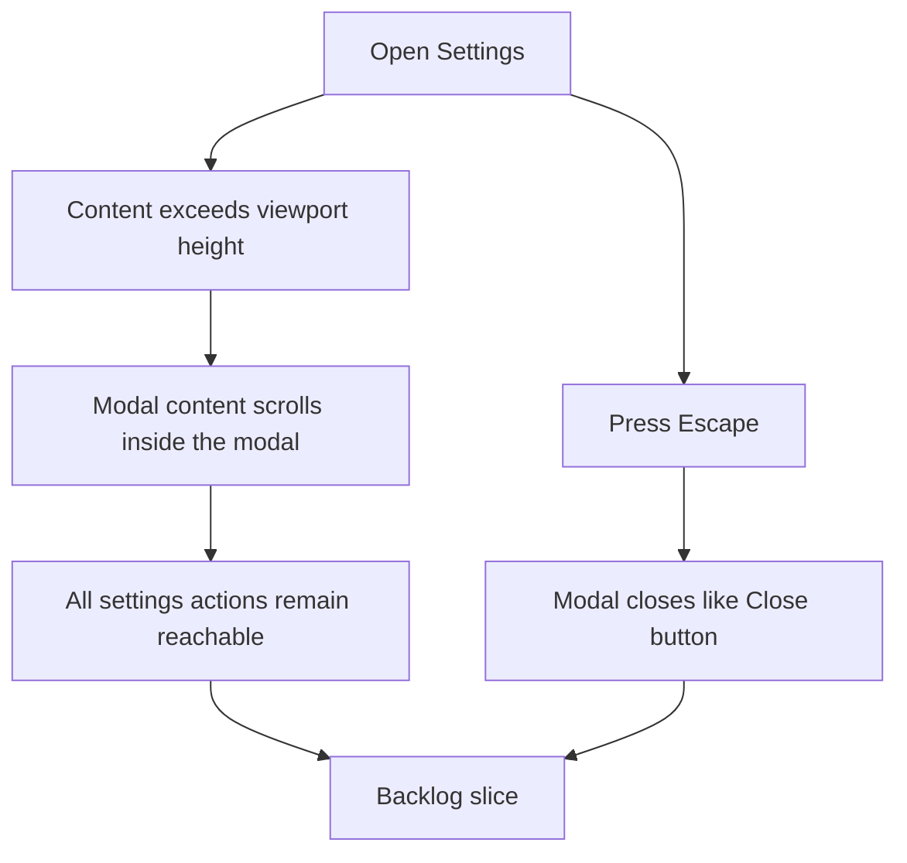

## req_010_make_settings_modal_scrollable_and_dismissible_with_escape - Make settings modal scrollable and dismissible with Escape
> From version: 0.1.0
> Schema version: 1.0
> Status: Done
> Understanding: 99%
> Confidence: 97%
> Complexity: Medium
> Theme: UI
> Reminder: Update status/understanding/confidence and references when you edit this doc.

# Needs
- Make the `Settings` modal fully reachable on mobile and smaller viewports, even when its content exceeds the available height.
- Let users close the `Settings` modal with the `Escape` key as an explicit keyboard equivalent to clicking `Close`.
- Keep the `Settings` interaction aligned with expected modal behavior instead of forcing touch-only or pointer-only dismissal.

# Context
The current `Settings` modal works functionally, but it breaks down on two basic interaction expectations:

1. On mobile and shorter viewports, the modal content is not fully visible and the user cannot comfortably access the entire surface.
2. Pressing `Escape` does not dismiss the modal, even though the UI already exposes a visible `Close` action.

This creates friction in a part of the product that is already critical because it controls provider selection, local API key management, and onboarding reactivation.

Expected user flow:

1. The user opens `Settings` from the header or burger menu.
2. The modal remains usable even on a short mobile viewport because the content area can scroll.
3. The user can reach the provider picker, key field, onboarding action, and footer actions without layout clipping.
4. The user can dismiss the modal either by clicking `Close` or by pressing `Escape`.

Constraints and framing:

- keep `Settings` modal-based rather than turning it into a separate page or route
- prioritize internal modal scrollability rather than relying on the whole page behind the modal to scroll
- preserve the current settings information architecture and provider-management scope
- treat `Escape` dismissal as behaviorally equivalent to the existing `Close` button
- keep the behavior coherent on desktop and mobile, including shorter laptop heights and small touch viewports
- do not broaden this request into a full modal-system refactor unless implementation reveals a concrete blocker

# Acceptance criteria
- AC1: The `Settings` modal remains fully usable when the viewport height is too small to display all of its content at once, including on mobile-sized screens.
- AC2: The `Settings` modal provides an internal scrollable region or equivalent behavior so all of its content and actions can be reached without clipping.
- AC3: Pressing `Escape` while the `Settings` modal is open closes it, with the same user-facing effect as activating the existing `Close` action.
- AC4: The `Escape` behavior works from normal modal focus states and does not require pointer interaction.
- AC5: The updated modal behavior remains coherent with the current header and burger-menu entry points on desktop and mobile.

# Clarifications
- Recommended default: make the modal surface itself scrollable within the viewport instead of letting it overflow off-screen.
- Recommended default: if the modal has a fixed header or action row, only the content region needs to scroll as long as all controls remain reachable and usable.
- Recommended default: `Escape` should dismiss `Settings` whenever the modal is open and no higher-priority interaction inside it explicitly owns that keypress.
- Recommended default: closing via `Escape` should match the current `Close` path rather than introducing a separate teardown path.

# Definition of Ready (DoR)
- [x] Problem statement is explicit and user impact is clear.
- [x] Scope boundaries (in/out) are explicit.
- [x] Acceptance criteria are testable.
- [x] Dependencies and known risks are listed.

# Companion docs
- Product brief(s): `prod_000_mermaid_generator_product_direction`
- Architecture decision(s): `adr_000_choose_a_static_pwa_architecture_for_mermaid_generator`

# AI Context
- Summary: Refine the existing Settings modal so it remains scrollable on smaller viewports and can be dismissed with the Escape key like a standard accessible modal.
- Keywords: settings, modal, mobile, viewport height, scrollable, escape, dismiss, keyboard, accessibility
- Use when: Use when defining the next UX and accessibility polish slice for the existing Settings modal behavior.
- Skip when: Skip when the work concerns provider logic, generation quality, or a broader modal-system redesign.

# References
- `logics/request/req_006_add_multi_provider_llm_support_and_expand_settings_management.md`
- `logics/request/req_008_compact_header_and_move_preview_controls_into_icon_based_navigation.md`
- `logics/product/prod_000_mermaid_generator_product_direction.md`
- `logics/architecture/adr_000_choose_a_static_pwa_architecture_for_mermaid_generator.md`
- `src/App.tsx`
- `src/App.css`

# Backlog
- `item_017_standardize_modal_internal_scrolling_across_current_modal_surfaces`
- `item_019_add_keyboard_dismissal_semantics_to_the_settings_modal`
