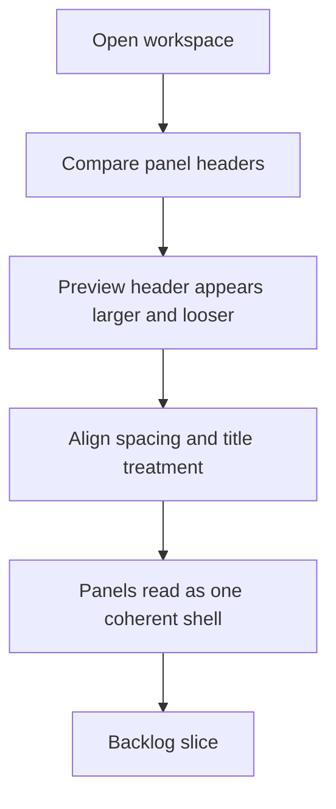

## req_011_align_preview_panel_header_spacing_with_other_panels - Align preview panel header spacing with other panels
> From version: 0.1.0
> Schema version: 1.0
> Status: Done
> Understanding: 99%
> Confidence: 98%
> Complexity: Medium
> Theme: UI
> Reminder: Update status/understanding/confidence and references when you edit this doc.

# Needs
- Align the visual spacing of the `Preview` panel header with the other main workspace panels.
- Remove the unintended extra vertical space and oversized title treatment currently visible in the preview panel.
- Keep the panel shell visually consistent so the preview area does not look heavier or more detached than `Mermaid source` and `Prompt draft`.

# Context
The current workspace shows a noticeable spacing mismatch between the `Preview` panel header and the headers of the two left-rail panels.

In practice, the `Preview` title appears larger and more separated from the preview surface than the `Mermaid source` and `Prompt draft` titles.
This makes the right column feel visually looser and less aligned, even though the overall panel system is meant to read as one coherent shell.

The issue appears to come from the preview header not sharing the same header structure and heading reset behavior as the other panels.
That means the preview title keeps browser-default heading spacing and reads differently from the other panel titles.

Expected user flow:

1. The user opens the workspace.
2. The three main panel headers read as one intentional system.
3. The `Preview` title aligns in scale and spacing with the other panel titles instead of creating a larger empty band above the preview stage.

Constraints and framing:

- keep the current panel architecture and preview-first layout direction
- treat this as a consistency and spacing fix, not as a redesign of the preview panel
- preserve the help affordance and preview readability while reducing the visual mismatch
- prefer structural consistency with the other panel headers over one-off compensating CSS
- keep the result coherent in both normal mode and any responsive layout where the preview panel remains visible

# Acceptance criteria
- AC1: The `Preview` panel header uses spacing and title treatment that are visually aligned with the headers of `Mermaid source` and `Prompt draft`.
- AC2: The `Preview` heading no longer keeps browser-default spacing that makes the panel appear to have excess empty space above the preview surface.
- AC3: The `Preview` help affordance remains present and usable after the spacing alignment.
- AC4: The adjustment does not regress focus mode behavior, where preview-local header chrome is intentionally hidden.
- AC5: The resulting panel alignment remains coherent on desktop and responsive layouts.

# Clarifications
- Recommended default: prefer reusing the same header structure or heading reset rules already used by the other panels instead of compensating with arbitrary top or bottom margins.
- Recommended default: the goal is visual alignment, not to make the preview header tighter than the others.
- Recommended default: fix the underlying shell inconsistency rather than masking it with extra one-off preview spacing overrides.

# Definition of Ready (DoR)
- [x] Problem statement is explicit and user impact is clear.
- [x] Scope boundaries (in/out) are explicit.
- [x] Acceptance criteria are testable.
- [x] Dependencies and known risks are listed.

# Companion docs
- Product brief(s): `prod_000_mermaid_generator_product_direction`
- Architecture decision(s): `adr_000_choose_a_static_pwa_architecture_for_mermaid_generator`

# AI Context
- Summary: Refine the preview panel header so its title spacing and visual weight match the other workspace panels instead of keeping a looser, browser-default heading treatment.
- Keywords: preview panel, header spacing, panel consistency, heading margin, title scale, shell polish, UI alignment
- Use when: Use when defining a UI consistency fix for the preview panel header spacing and title treatment.
- Skip when: Skip when the work concerns focus mode takeover, provider settings, or unrelated modal behavior.

# References
- `logics/request/req_004_refine_workspace_chrome_help_export_footer_and_preview_focus_behavior.md`
- `logics/request/req_008_compact_header_and_move_preview_controls_into_icon_based_navigation.md`
- `logics/product/prod_000_mermaid_generator_product_direction.md`
- `logics/architecture/adr_000_choose_a_static_pwa_architecture_for_mermaid_generator.md`
- `src/App.tsx`
- `src/App.css`

# Backlog
- `item_020_align_preview_panel_header_spacing_with_the_workspace_panel_system`
