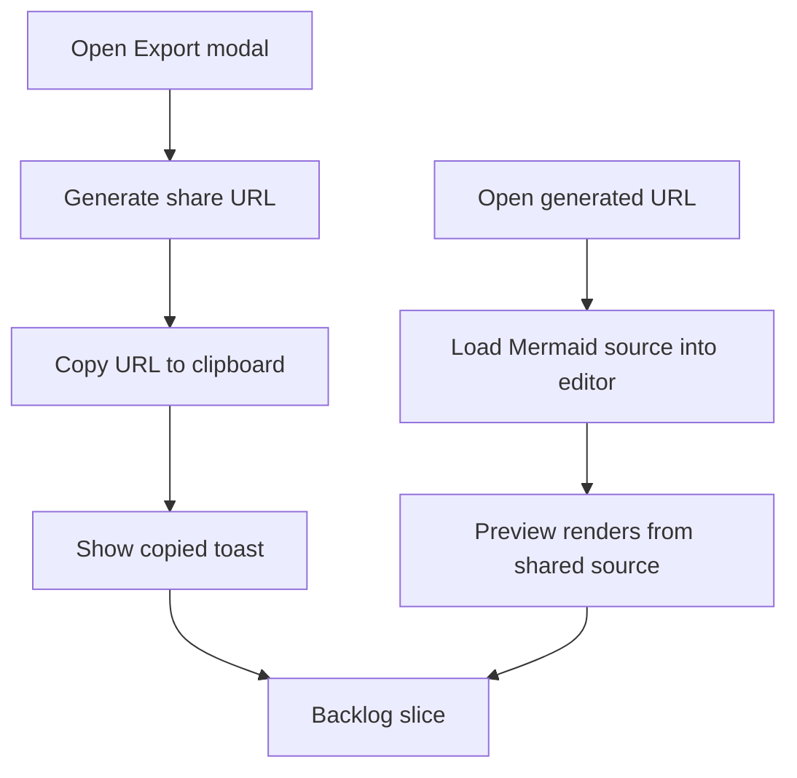

## req_012_share_mermaid_diagrams_through_generated_urls_from_export - Share Mermaid diagrams through generated URLs from export

> From version: 0.1.0
> Schema version: 1.0
> Status: Done
> Understanding: 98%
> Confidence: 96%
> Complexity: Medium
> Theme: UI
> Reminder: Update status/understanding/confidence and references when you edit this doc.

# Needs

- Let users share the current Mermaid diagram by generating a URL that captures the current source.
- Restore the shared Mermaid source automatically when someone opens that generated URL, with the editor prefilled and the preview already updated from it.
- Expose the share-link generation from the existing `Export` modal instead of adding a separate shell entry point.
- Confirm successful share-link creation with a toast that indicates the URL has been copied to the clipboard.

# Context

The current product can export SVG and PNG, but it cannot share the editable Mermaid state itself.
For collaboration and quick handoff, users need a lightweight way to send a link that recreates the current diagram directly in the app.

The intended flow is:

1. The user opens the `Export` modal.
2. The user triggers a share-link action from that modal.
3. The app generates a URL that encodes or otherwise carries the current Mermaid source.
4. The URL is copied to the clipboard automatically.
5. A toast confirms that the share link was copied.
6. When another user opens that URL, the app loads with the Mermaid source already present in the editor and the preview derived from that source.

This should extend the current export/share surface rather than creating a separate top-level share workflow.
The loaded shared Mermaid should behave like a normal editable source after hydration, not like a locked imported artifact.

Constraints and framing:

- keep the current app architecture browser-first and static-host compatible
- make the share-link action live inside the existing `Export` modal
- treat the generated URL as a way to restore Mermaid source state, not as a server-backed document system
- after loading from the URL, the Mermaid source should become the normal editable source of truth in the workspace
- the preview should render from the shared source automatically on load without requiring an extra manual refresh
- the copy confirmation should use a lightweight toast rather than a blocking modal or alert
- avoid broadening this request into account-based sharing, persistence history, or multi-user collaboration
- implementation can choose the exact URL strategy, but the resulting links must be usable when reopened directly in the app

# Acceptance criteria

- AC1: The `Export` modal exposes an action that generates a shareable URL for the current Mermaid diagram.
- AC2: Triggering that action copies the generated URL to the clipboard.
- AC3: After the URL is copied, the app shows a toast confirming that the share link has been copied.
- AC4: Opening the generated URL loads the app with the shared Mermaid source already prefilled in the editor.
- AC5: After loading from the generated URL, the preview is already in sync with the shared Mermaid source without requiring extra user action.
- AC6: The loaded shared Mermaid remains editable like any other Mermaid source in the app.
- AC7: The share-link flow remains coherent with the current static, browser-first architecture and does not require server-side document storage.

# Clarifications

- Recommended default: place the share-link action inside the existing `Export` modal alongside the other output options rather than as a separate topbar action.
- Recommended default: the share link should capture the current Mermaid source only; viewport pan/zoom state and transient UI state do not need to be serialized unless later required.
- Recommended default: after reading a Mermaid payload from the URL, the app should treat it as the current source of truth exactly like manually pasted Mermaid.
- Recommended default: the toast should be short-lived and non-blocking, with copy such as confirming that the link was copied.
- Recommended default: if clipboard copy fails, the eventual implementation can expose fallback handling, but the main success path is automatic copy plus toast.

# Definition of Ready (DoR)

- [x] Problem statement is explicit and user impact is clear.
- [x] Scope boundaries (in/out) are explicit.
- [x] Acceptance criteria are testable.
- [x] Dependencies and known risks are listed.

# Companion docs

- Product brief(s): `prod_000_mermaid_generator_product_direction`
- Architecture decision(s): `adr_000_choose_a_static_pwa_architecture_for_mermaid_generator`

# AI Context

- Summary: Add a share-from-export flow that generates a URL for the current Mermaid source, copies it to the clipboard with a toast confirmation, and restores that Mermaid plus its preview when the URL is opened.
- Keywords: share link, mermaid, url state, export modal, clipboard, toast, restore source, preview hydration
- Use when: Use when defining a lightweight browser-first sharing flow for Mermaid diagrams without server-side persistence.
- Skip when: Skip when the work concerns binary asset export only, account-based collaboration, or unrelated modal polish.

# References

- `logics/request/req_004_refine_workspace_chrome_help_export_footer_and_preview_focus_behavior.md`
- `logics/product/prod_000_mermaid_generator_product_direction.md`
- `logics/architecture/adr_000_choose_a_static_pwa_architecture_for_mermaid_generator.md`
- `src/App.tsx`
- `src/App.css`

# Backlog

- `item_021_add_url_hydration_support_for_shared_mermaid_diagrams`
- `item_022_add_export_modal_share_link_action_with_clipboard_toast`
