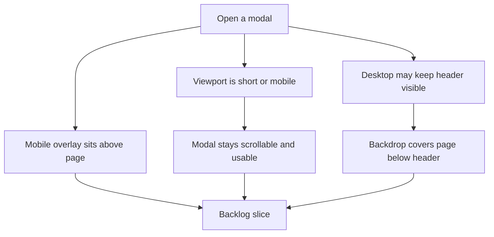

## req_013_standardize_modal_scrolling_and_overlay_layering_across_viewports - Standardize modal scrolling and overlay layering across viewports

> From version: 0.1.0
> Schema version: 1.0
> Status: Done
> Understanding: 99%
> Confidence: 97%
> Complexity: Medium
> Theme: UI
> Reminder: Update status/understanding/confidence and references when you edit this doc.

# Needs

- Standardize modal scrolling behavior across all current and future modals, especially on mobile and shorter viewport heights.
- Ensure every modal sits visually above the page content on mobile instead of letting underlying page layers interfere with the modal surface.
- Keep the global header allowed to remain visible on desktop if that shell decision is preserved, while ensuring the modal backdrop still covers the rest of the page correctly.
- Make the overlay model coherent so modal content, backdrop, page content, and optional sticky header do not fight each other across breakpoints.

# Context

The current modal behavior has started to drift across use cases and viewport sizes.
Some modal problems are content-related, but the broader issue is that the app needs a consistent modal system for scrolling and layer stacking.

Two rules need to be made explicit:

1. On mobile, modals should fully dominate the page layer so they read as true overlays above the interface.
2. On desktop, it is acceptable to keep the sticky header visible, but the modal backdrop still needs to cover the rest of the page cleanly below that header.

Without a shared rule set, modal content can become clipped, the page can remain too visually present behind the modal, and overlay coverage can feel broken or incomplete depending on viewport.

Expected user flow:

1. The user opens any modal such as `Settings` or `Export`.
2. On mobile, the modal clearly sits above the page and the backdrop covers the full page behind it.
3. On desktop, the header may remain visible if intended, but the backdrop still covers the entire page area below the header.
4. If the modal content is taller than the available viewport, the modal remains scrollable and fully usable.

Constraints and framing:

- treat this as a cross-modal behavior standard, not as a one-off fix for a single modal
- prioritize internal modal usability on short viewports, especially mobile
- preserve the current product choice that the desktop sticky header may stay visible while a modal is open
- on desktop, the backdrop should still cover everything outside the preserved header area
- on mobile, do not leave visible page chrome competing with the modal layer
- avoid turning this request into a full modal redesign unless implementation reveals a structural blocker
- keep the solution compatible with the current static, browser-first app architecture
- the eventual implementation can define shared modal primitives or shared CSS rules if that is the cleanest way to enforce consistency

# Acceptance criteria

- AC1: All current app modals remain usable when their content exceeds the available viewport height, including on mobile-sized screens.
- AC2: Modal scrolling behavior is standardized so users can reach all modal content and actions without clipping on shorter viewports.
- AC3: On mobile, modals render above the page content with a backdrop that fully covers the page behind them.
- AC4: On desktop, the product may keep the sticky header visible while a modal is open, but the modal backdrop still covers the full page area outside that preserved header region.
- AC5: The modal layer order remains coherent across breakpoints, with no page content incorrectly appearing above the modal surface or within uncovered backdrop gaps.
- AC6: The standardized behavior applies across the app’s modal surfaces rather than only one specific modal.

# Clarifications

- Recommended default: modal content should scroll inside the modal viewport rather than relying on the underlying page to stay scrollable.
- Recommended default: mobile should treat modals as fully dominant overlays, including over any normal page chrome.
- Recommended default: desktop can preserve the sticky header if desired, but that should be an explicit shell exception rather than a side effect of incomplete overlay coverage.
- Recommended default: backdrop coverage should be visually complete for the page area it is intended to own; uncovered slices of page content should not remain visible because of layering mistakes.
- Recommended default: use shared modal layout and z-index rules so future modals inherit the same behavior automatically.

# Definition of Ready (DoR)

- [x] Problem statement is explicit and user impact is clear.
- [x] Scope boundaries (in/out) are explicit.
- [x] Acceptance criteria are testable.
- [x] Dependencies and known risks are listed.

# Companion docs

- Product brief(s): `prod_000_mermaid_generator_product_direction`
- Architecture decision(s): `adr_000_choose_a_static_pwa_architecture_for_mermaid_generator`

# AI Context

- Summary: Define a consistent modal system across viewports so all modals remain scrollable on short screens, mobile modals fully dominate the page, and desktop can keep the header visible while the backdrop still covers the rest of the page.
- Keywords: modal system, modal scroll, overlay, backdrop, z-index, mobile modal, desktop header, viewport height, layering
- Use when: Use when framing a shared modal behavior standard for scrolling and overlay coverage across the app.
- Skip when: Skip when the work concerns a single modal feature only, unrelated sharing logic, or non-modal shell polish.

# References

- `logics/request/req_010_make_settings_modal_scrollable_and_dismissible_with_escape.md`
- `logics/request/req_012_share_mermaid_diagrams_through_generated_urls_from_export.md`
- `logics/product/prod_000_mermaid_generator_product_direction.md`
- `logics/architecture/adr_000_choose_a_static_pwa_architecture_for_mermaid_generator.md`
- `src/App.tsx`
- `src/App.css`

# Backlog

- `item_017_standardize_modal_internal_scrolling_across_current_modal_surfaces`
- `item_018_standardize_modal_overlay_coverage_and_layer_ordering_across_viewports`
