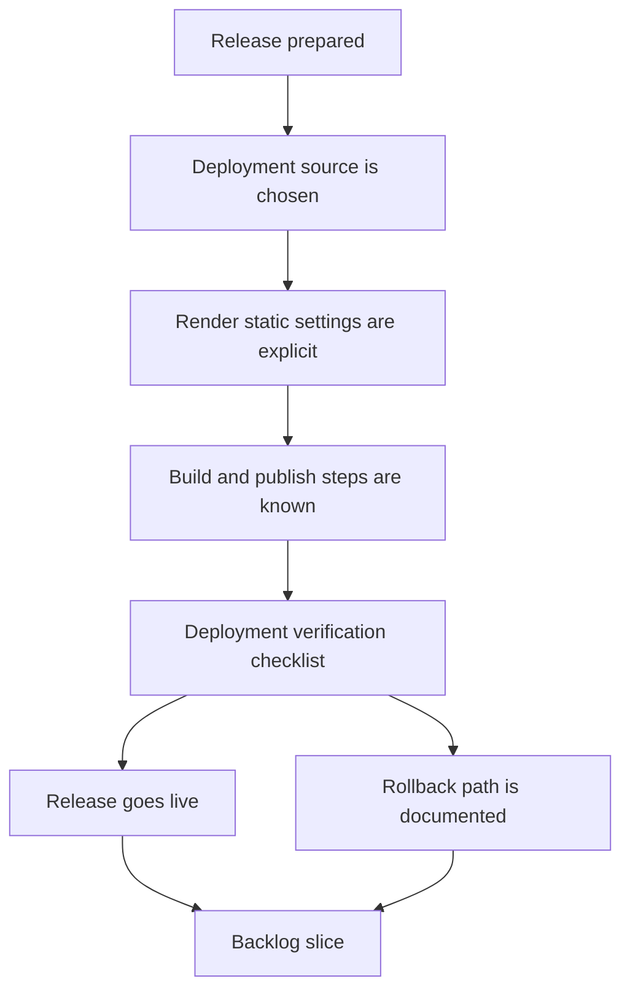

## req_014_define_a_render_deployment_plan_for_mermaid_generator - Define a Render deployment plan for Mermaid Generator

> From version: 0.1.0
> Schema version: 1.0
> Status: Done
> Understanding: 98%
> Confidence: 97%
> Complexity: Medium
> Theme: Deployment
> Reminder: Update status/understanding/confidence and references when you edit this doc.

# Needs

- Define the deployment plan for hosting Mermaid Generator on Render in a way that is explicit, repeatable, and aligned with the current static app architecture.
- Make the Render setup understandable enough that a release can be deployed without guessing service type, root directory, build command, publish directory, or branch strategy.
- Clarify how `main`, `release`, and tagged versions should map to Render deployments so operators do not improvise a deployment flow per release.
- Ensure the deployment plan includes the practical checks needed before promoting a build publicly.

# Context

Mermaid Generator is currently a static React + Vite application with a Render blueprint already present in the repository.
The project has now reached a first release milestone, which means deployment can no longer remain an implicit operator task.

At this point, the repository already suggests a Render Static setup:

- `render.yaml` defines a static service
- the build output is `dist`
- the app is built with `npm ci && npm run build`

What is still missing is the explicit deployment plan that explains how this should be used operationally.
That plan should not only restate the Render form fields, it should also define the intended workflow for first setup, release deployment, rollback expectations, and the minimum validation expected before and after a deploy.

Expected operator flow:

1. The operator prepares a release on the repository side.
2. The operator knows exactly which branch or tag Render should deploy from.
3. The operator configures Render with the correct static-site inputs without guessing.
4. The operator can validate that the deployed app is healthy and corresponds to the expected release.
5. If a release needs to be corrected, the operator can understand the rollback or redeploy path.

Constraints and framing:

- keep this focused on a Render deployment plan, not on rewriting the app architecture
- assume the current hosting model remains a static site on Render unless a blocker is identified
- document both initial setup and ongoing release operations
- include branch and tag expectations now that the repository uses `main`, `release`, and version tags
- make the plan concrete enough for a human operator to follow without tribal knowledge
- avoid adding backend or server-side requirements that do not exist in the current app
- keep the plan compatible with the existing `render.yaml` and current build scripts unless the request explicitly identifies a necessary change

# Acceptance criteria

- AC1: The Render plan explicitly defines the intended Render service type and deployment model for Mermaid Generator.
- AC2: The plan explicitly defines the required Render configuration values, including root directory behavior, build command, and publish directory.
- AC3: The plan defines which repository branch or tag should be used for deployment and how `main`, `release`, and version tags participate in the workflow.
- AC4: The plan covers first-time setup as well as normal release-time deployment steps.
- AC5: The plan includes a practical pre-deploy and post-deploy validation checklist appropriate for the current static app.
- AC6: The plan documents the expected rollback or redeploy path if a release is found to be broken after publication.
- AC7: The final guidance is consistent with the current repository setup rather than requiring operators to infer contradictory commands from multiple sources.

# Clarifications

- Recommended default: Mermaid Generator should continue to deploy as a Render Static Site unless a concrete hosting blocker is found.
- Recommended default: the deployment plan should treat `render.yaml` as the canonical source of Render service configuration, with the request adding the missing operator workflow around it.
- Recommended default: `main` should remain the development integration branch, `release` should remain the operator-facing deployment branch, and version tags should identify the released revision that was published.
- Recommended default: validation should include at least build success, static artifact presence, app load, preview rendering, modal access, and release version visibility in the footer.

# Definition of Ready (DoR)

- [x] Problem statement is explicit and user impact is clear.
- [x] Scope boundaries (in/out) are explicit.
- [x] Acceptance criteria are testable.
- [x] Dependencies and known risks are listed.

# Companion docs

- Product brief(s): `prod_000_mermaid_generator_product_direction`
- Architecture decision(s): `adr_000_choose_a_static_pwa_architecture_for_mermaid_generator`

# AI Context

- Summary: Define the operational deployment plan for hosting the static Mermaid Generator app on Render, including canonical Render settings, branch and tag workflow, validation steps, and rollback expectations.
- Keywords: Render, deployment plan, static site, release branch, tag, build command, publish directory, rollback
- Use when: Use when framing how Mermaid Generator should be deployed and operated on Render in a repeatable way.
- Skip when: Skip when the work is about general UI changes, Mermaid editing behavior, or provider integration unrelated to deployment.

# References

- `render.yaml`
- `package.json`
- `README.md`
- `logics/product/prod_000_mermaid_generator_product_direction.md`
- `logics/architecture/adr_000_choose_a_static_pwa_architecture_for_mermaid_generator.md`

# Backlog

- `item_023_define_render_deployment_contract_and_release_source_strategy`
- `item_024_document_render_setup_validation_and_rollback_runbook`
