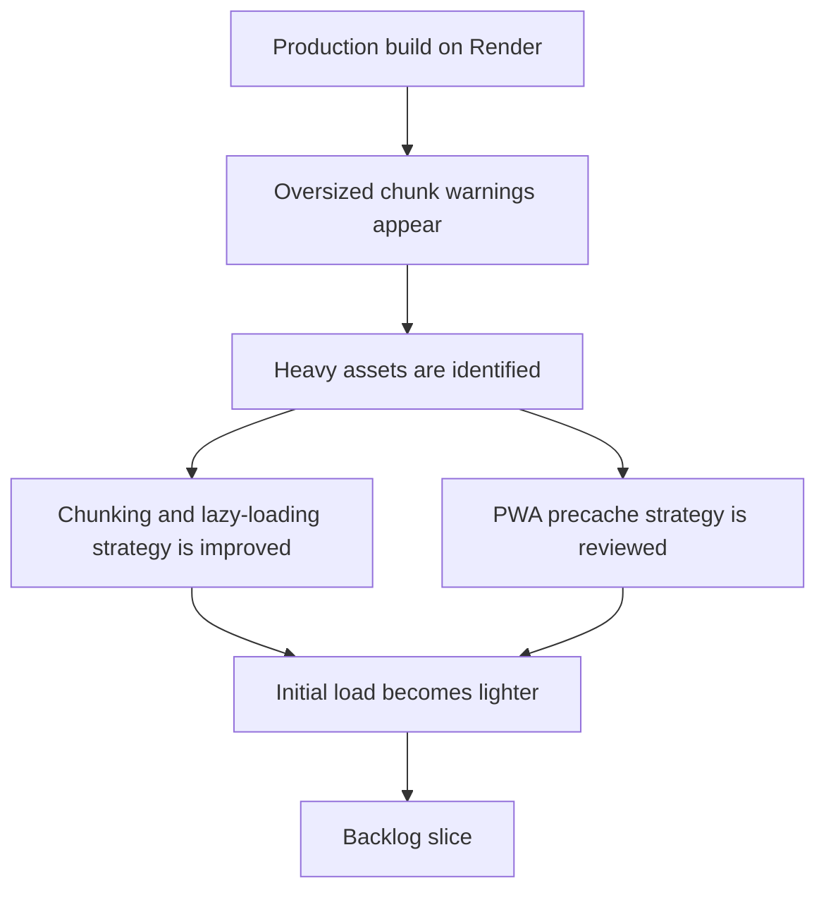

## req_015_reduce_render_bundle_weight_and_pwa_precache_cost - Reduce Render bundle weight and PWA precache cost
> From version: 0.1.0
> Schema version: 1.0
> Status: Done
> Understanding: 98%
> Confidence: 96%
> Complexity: Medium
> Theme: Performance
> Reminder: Update status/understanding/confidence and references when you edit this doc.

# Needs
- Reduce the frontend bundle weight exposed by the current Render production build so the app ships a lighter first-load experience.
- Address the Vite build warnings about oversized chunks instead of leaving them as an accepted default without review.
- Reassess the current PWA precache size so deployment remains healthy but the offline/installable footprint does not grow without control.
- Keep Mermaid Generator fully functional while improving the loading cost of the static app, especially on slower networks and mobile devices.

# Context
The current Render deployment succeeds, but the production build logs surface a real performance concern:

- `mermaid.core` is emitted above the Vite chunk warning threshold
- other large assets such as `wardley`, `cytoscape`, and `katex` also materially increase the shipped payload
- the generated PWA precache is about 3.2 MB

This is not a deployment failure, but it is a signal that the app is shipping a lot of JavaScript and cached assets up front.
For a first release this may be operationally acceptable, but it should not remain implicit technical debt.

The product already relies on a static Render deployment and the current architecture intentionally ships Mermaid in-browser.
That means the likely solution is not a hosting change, but a bundling and loading strategy review:

- code splitting where practical
- chunking strategy improvements
- optional lazy loading of heavy rendering paths
- review of what really needs to be precached by the PWA

Expected user flow:

1. The user opens Mermaid Generator from a deployed Render build.
2. The app loads promptly without downloading an unnecessarily heavy initial bundle.
3. Preview rendering still works correctly once the relevant Mermaid code is needed.
4. PWA behavior remains valid, but the offline cache strategy is intentional rather than accidental.

Constraints and framing:

- keep the app as a static Render-hosted web app
- preserve functional parity for Mermaid editing, preview, export, settings, onboarding, and share flows
- treat this as a performance optimization request, not as a request to remove diagram support casually
- avoid introducing brittle manual optimizations that make future Mermaid upgrades unsafe
- prefer changes that are explainable and maintainable in the repo
- the final result may use lazy loading, chunk strategy changes, or precache tuning, but should remain compatible with the current build and PWA model

# Acceptance criteria
- AC1: The team can identify which build artifacts and dependencies are driving the current large bundle and chunk warnings in production builds.
- AC2: The implemented direction reduces the weight of the initial app load, rather than only hiding or suppressing the warning output.
- AC3: The build no longer emits oversized-chunk warnings by default, or any remaining warning is explicitly justified and documented as an intentional tradeoff.
- AC4: The PWA precache strategy is reviewed so the cached asset footprint is intentional and aligned with the product’s actual offline needs.
- AC5: Mermaid preview, export, share, onboarding, settings, and responsive workspace behavior continue to work after the optimization.
- AC6: The resulting optimization approach remains maintainable for future Mermaid or dependency upgrades.

# Clarifications
- Recommended default: do not block release operations on this issue alone, but treat it as the next performance hardening step.
- Recommended default: prefer reducing first-load cost through code-splitting or deferred loading before considering functional feature cuts.
- Recommended default: if certain Mermaid diagram families or supporting libraries are unusually heavy, load them only when needed rather than bundling them eagerly.
- Recommended default: the PWA should cache what is important for the product experience, not every heavy artifact by default if that materially harms install/update cost.

# Definition of Ready (DoR)
- [x] Problem statement is explicit and user impact is clear.
- [x] Scope boundaries (in/out) are explicit.
- [x] Acceptance criteria are testable.
- [x] Dependencies and known risks are listed.

# Companion docs
- Product brief(s): `prod_000_mermaid_generator_product_direction`
- Architecture decision(s): `adr_000_choose_a_static_pwa_architecture_for_mermaid_generator`

# AI Context
- Summary: Reduce the static frontend payload of Mermaid Generator on Render by addressing oversized Vite chunks and reviewing the current PWA precache strategy without breaking app behavior.
- Keywords: performance, Vite, chunking, lazy loading, bundle size, Render, PWA, precache, Mermaid
- Use when: Use when framing work to improve build output size, first-load performance, and cache footprint for the deployed app.
- Skip when: Skip when the work concerns deployment setup only, CI failures unrelated to bundle size, or UI-only polish.

# References
- `vite.config.ts`
- `render.yaml`
- `package.json`
- `scripts/quality/check-pwa-build-artifacts.mjs`
- `README.md`
- `logics/product/prod_000_mermaid_generator_product_direction.md`
- `logics/architecture/adr_000_choose_a_static_pwa_architecture_for_mermaid_generator.md`

# Backlog
- `item_025_profile_and_split_heavy_frontend_chunks_without_regressing_core_flows`
- `item_026_align_render_cache_and_pwa_precache_behavior_with_static_asset_delivery`
