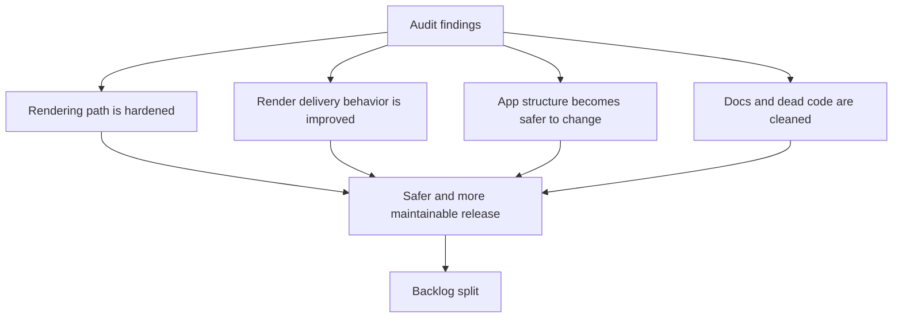

## req_016_harden_runtime_security_delivery_performance_and_repo_maintainability - Harden runtime security, delivery performance, and repository maintainability

> From version: 0.1.0
> Schema version: 1.0
> Status: Done
> Understanding: 98%
> Confidence: 97%
> Complexity: High
> Theme: Hardening
> Reminder: Update status/understanding/confidence and references when you edit this doc.

# Needs

- Address the main audit findings that now represent the most important technical hardening work after the `0.1.0` release.
- Reduce avoidable runtime risk in the Mermaid rendering path, especially where shared user-controlled input is rendered into the DOM.
- Improve delivery quality by aligning static hosting cache behavior and frontend payload cost with the current Render deployment model.
- Reduce structural fragility in the app codebase so routine product changes do not keep landing in one oversized component and one oversized stylesheet.
- Clean up stale documentation and dead code so the repository reflects the real shipped state of the project.

# Context

The repository is currently functional and the local quality gates are green, but the recent audit surfaced several important hardening themes that should no longer stay implicit:

1. The Mermaid rendering pipeline accepts user-controlled shared source, renders it with Mermaid configured in a permissive security mode, and injects the resulting SVG into the DOM.
2. The Render static hosting configuration disables caching for all routes, which conflicts with the presence of hashed build assets and increases the cost of the already-heavy frontend bundle.
3. The current frontend is heavily concentrated in `src/App.tsx` and `src/App.css`, increasing regression risk and making small shell or workflow changes unnecessarily expensive.
4. Some repository messaging and implementation surfaces have drifted from the actual product state, including stale README status badges and code paths that appear no longer authoritative.

None of these issues necessarily block the app from running today, but together they form the next responsible hardening step after the initial release.

Expected outcome:

1. Shared Mermaid rendering becomes safer and more explicit in its trust model.
2. Static delivery on Render becomes more coherent with hashed assets, PWA behavior, and real frontend performance needs.
3. The app becomes easier to evolve because key UI and logic boundaries are less concentrated in one file.
4. The repository becomes easier to trust because docs, runtime, and implementation all describe the same current product.

Constraints and framing:

- keep the project as a static browser-first app hosted on Render
- preserve current end-user capabilities: editing, preview, export, onboarding, settings, share link hydration, and multi-provider prompt generation
- treat this as hardening and maintainability work, not as a product redesign
- avoid introducing server-side components unless a specific issue proves they are necessary
- solutions may be split into multiple backlog items later, but this request should keep the whole hardening package visible as one initiative
- where existing requests already cover part of the topic, this request should align with them instead of contradicting them

# Acceptance criteria

- AC1: The Mermaid rendering path no longer relies on a permissive trust model for shared or user-controlled source without an explicit hardening decision and mitigation.
- AC2: The delivery setup on Render is reviewed and adjusted so cache behavior is coherent with hashed build assets and the intended PWA strategy.
- AC3: The current oversized frontend bundle and precache cost are treated as an optimization target rather than left as an undocumented warning.
- AC4: The main UI and styling concentration in `src/App.tsx` and `src/App.css` is reduced or a clear modularization plan is produced and applied to the most volatile areas.
- AC5: Stale or duplicate implementation surfaces that are no longer authoritative are removed or clearly deprecated.
- AC6: Public-facing project documentation is updated to reflect the actual post-release state of the app.
- AC7: All hardening work preserves the current validated user flows covered by the existing test suite.

# Clarifications

- Recommended default: start by hardening Mermaid rendering and DOM injection before doing broader structural refactors.
- Recommended default: delivery work should improve real caching and loading behavior, not just silence warnings.
- Recommended default: structural cleanup should focus first on the highest-volatility areas of `App.tsx` and `App.css`, rather than forcing a full rewrite in one pass.
- Recommended default: repository hygiene should include both documentation truthfulness and removal of dead code that can mislead future changes.
- Recommended default: this request can be split into dedicated backlog items for security, delivery/performance, structure, and hygiene once the package is approved.

# Definition of Ready (DoR)

- [x] Problem statement is explicit and user impact is clear.
- [x] Scope boundaries (in/out) are explicit.
- [x] Acceptance criteria are testable.
- [x] Dependencies and known risks are listed.

# Companion docs

- Product brief(s): `prod_000_mermaid_generator_product_direction`
- Architecture decision(s): `adr_000_choose_a_static_pwa_architecture_for_mermaid_generator`

# AI Context

- Summary: Convert the current audit findings into a coordinated hardening initiative covering Mermaid rendering security, Render delivery behavior, frontend payload cost, codebase modularity, and repository hygiene.
- Keywords: hardening, security, Mermaid, Render, caching, PWA, bundle size, refactor, maintainability, cleanup
- Use when: Use when planning the next post-release technical hardening wave for Mermaid Generator.
- Skip when: Skip when the work concerns a single isolated UI tweak or a narrow provider-specific feature only.

# References

- `src/App.tsx`
- `src/App.css`
- `src/lib/mermaid.ts`
- `src/lib/share.ts`
- `src/lib/openai.ts`
- `src/lib/useLocalStorageState.ts`
- `render.yaml`
- `README.md`
- `logics/request/req_014_define_a_render_deployment_plan_for_mermaid_generator.md`
- `logics/request/req_015_reduce_render_bundle_weight_and_pwa_precache_cost.md`
- `logics/product/prod_000_mermaid_generator_product_direction.md`
- `logics/architecture/adr_000_choose_a_static_pwa_architecture_for_mermaid_generator.md`

# Backlog

- `item_025_profile_and_split_heavy_frontend_chunks_without_regressing_core_flows`
- `item_026_align_render_cache_and_pwa_precache_behavior_with_static_asset_delivery`
- `item_027_harden_shared_mermaid_rendering_and_dom_injection_boundaries`
- `item_028_reduce_app_shell_concentration_by_extracting_high_volatility_workspace_modules`
- `item_029_clean_dead_code_and_realign_public_project_messaging_with_the_shipped_state`
