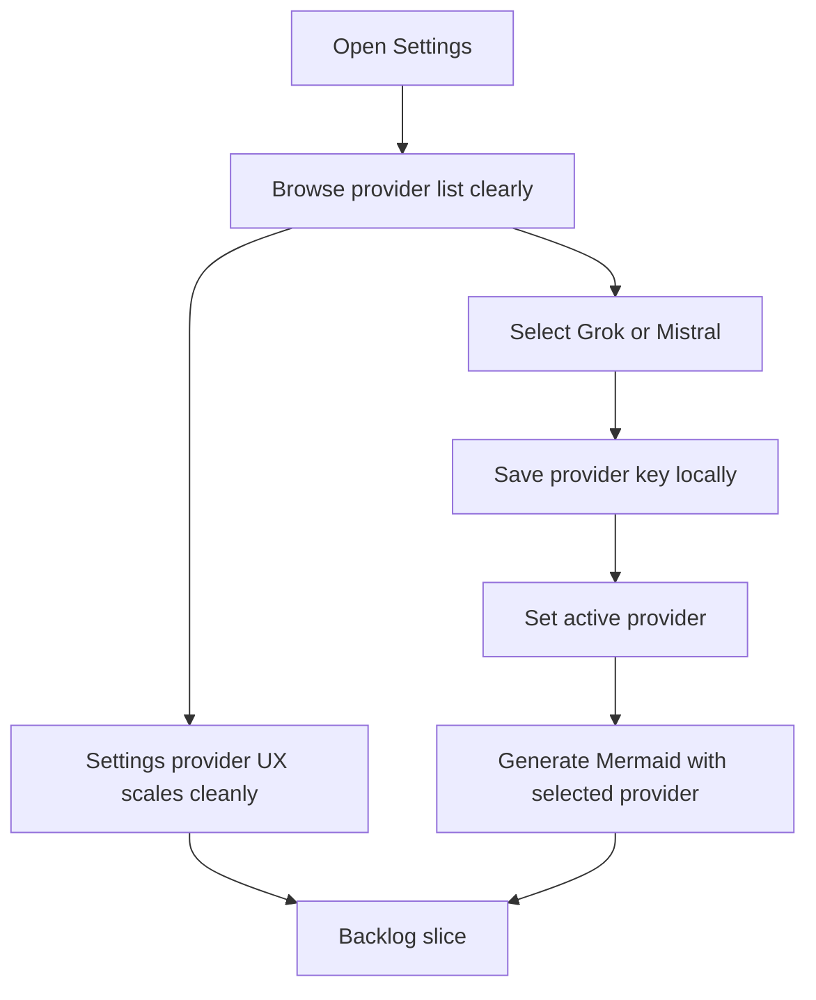

## req_017_add_grok_and_mistral_providers_and_rework_settings_provider_ux - Add Grok and Mistral providers and rework Settings provider UX
> From version: 0.1.0
> Schema version: 1.0
> Status: Done
> Understanding: 98%
> Confidence: 97%
> Complexity: Medium
> Theme: UI
> Reminder: Update status/understanding/confidence and references when you edit this doc.

# Needs
- Extend Mermaid Generator’s current multi-provider setup with support for `Grok` and `Mistral`.
- Rework the `Settings` provider-management UX so the modal remains clear and usable as the provider list grows.
- Preserve the browser-first BYOK model while making provider choice, provider-specific API key entry, and active-provider state easier to understand.
- Avoid turning the settings surface into a cramped provider wall as more providers are added.

# Context
The app already supports a browser-side multi-provider flow centered on:

- OpenAI
- OpenRouter
- Anthropic

That confirms the provider abstraction exists, but the current `Settings` modal was shaped around a smaller initial set.
Adding `Grok` and `Mistral` is now a product-level expansion that likely pushes the current provider UX past its comfortable density.

This request therefore covers two coupled concerns:

1. provider enablement for `Grok` and `Mistral`
2. a UX/UI review of the `Settings` modal so provider management scales cleanly

Expected user flow:

1. The user opens `Settings`.
2. The user can scan the available providers without visual overload.
3. The user selects `Grok`, `Mistral`, or another supported provider.
4. The user enters or updates the key for the selected provider locally in the browser.
5. The user saves settings and uses the selected provider for prompt-to-Mermaid generation.
6. The user can later switch providers without losing the keys already saved for other providers.

Constraints and framing:

- keep the current browser-first BYOK architecture
- keep provider keys local to the browser for this phase
- do not introduce project-managed shared secrets in the frontend
- treat the settings modal as a UX surface that now needs structure, not just two extra cards
- the final UX may reorganize provider selection, descriptions, key entry, and status messaging if that is cleaner than extending the existing layout literally
- preserve mobile usability and modal usability on shorter viewports
- keep the provider-facing generation contract normalized even if Grok and Mistral require slightly different API wiring internally
- explicitly allow UI/UX refinement of `Settings` as part of this request rather than treating it as out of scope

# Acceptance criteria
- AC1: The app supports `Grok` and `Mistral` as selectable providers for prompt-to-Mermaid generation.
- AC2: The provider abstraction remains normalized so the rest of the app does not need provider-specific branching outside the provider layer.
- AC3: `Settings` lets the user manage `Grok` and `Mistral` keys locally in the browser alongside the existing providers.
- AC4: The `Settings` provider-management UX is reworked as needed so the growing provider list remains understandable and usable on desktop and mobile.
- AC5: The active provider can still be changed without losing previously saved keys for the other providers.
- AC6: The prompt-generation workflow continues to behave the same from the user’s perspective after `Grok` and `Mistral` are added.
- AC7: Any UX/UI changes to the settings modal remain consistent with the app’s current shell, modal, and responsive behavior.

# Clarifications
- Recommended default: do not simply append two more provider cards if that makes the current settings modal harder to scan or use.
- Recommended default: the selected provider should remain visually obvious, but non-selected providers should not create unnecessary density.
- Recommended default: key entry should stay tied to the currently selected provider rather than showing many simultaneous credential fields.
- Recommended default: `Grok` and `Mistral` should fit the same local-persistence and active-provider model already used by the app.
- Recommended default: this request explicitly includes UX/UI refinement of `Settings`, and that refinement should use `logics-ui-steering` during implementation.

# Definition of Ready (DoR)
- [x] Problem statement is explicit and user impact is clear.
- [x] Scope boundaries (in/out) are explicit.
- [x] Acceptance criteria are testable.
- [x] Dependencies and known risks are listed.

# Companion docs
- Product brief(s): `prod_000_mermaid_generator_product_direction`
- Architecture decision(s): `adr_000_choose_a_static_pwa_architecture_for_mermaid_generator`

# AI Context
- Summary: Add Grok and Mistral to the app’s provider lineup and treat the settings modal as a scalable provider-management surface rather than extending it naively.
- Keywords: grok, mistral, provider, settings, multi-provider, byok, modal, ux, ui, local persistence
- Use when: Use when defining the next provider expansion and the accompanying settings UX refresh.
- Skip when: Skip when the work concerns deployment, Mermaid rendering, or export behavior unrelated to provider management.

# References
- `logics/request/req_006_add_multi_provider_llm_support_and_expand_settings_management.md`
- `src/lib/llm.ts`
- `src/App.tsx`
- `src/App.css`
- `README.md`
- `logics/product/prod_000_mermaid_generator_product_direction.md`
- `logics/architecture/adr_000_choose_a_static_pwa_architecture_for_mermaid_generator.md`
- `logics/skills/logics-ui-steering/SKILL.md`

# Backlog
- `item_030_add_direct_grok_and_mistral_provider_support_to_the_llm_adapter_layer`
- `item_031_rework_settings_provider_management_for_a_growing_provider_catalog`
