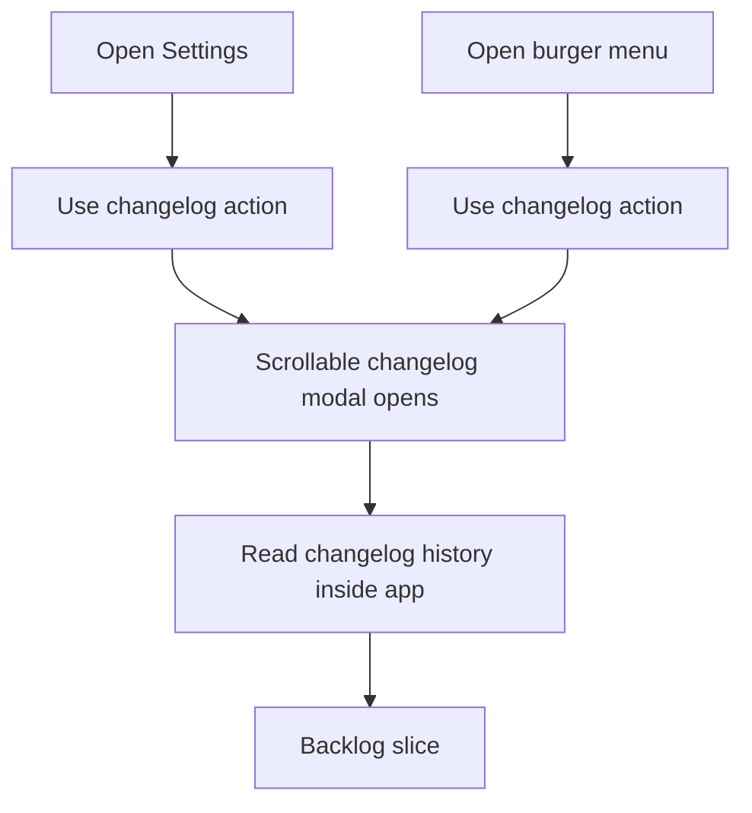

## req_018_add_an_in_app_changelog_modal_accessible_from_settings_and_mobile_navigation - Add an in-app changelog modal accessible from Settings and mobile navigation

> From version: 0.1.0
> Schema version: 1.0
> Status: Done
> Understanding: 98%
> Confidence: 97%
> Complexity: Medium
> Theme: UI
> Reminder: Update status/understanding/confidence and references when you edit this doc.

# Needs

- Add an in-app way to read the app changelogs without leaving Mermaid Generator.
- Expose this access from `Settings` through a dedicated button that opens a scrollable modal.
- On mobile, expose the same changelog entry point in the burger menu so the user can reach it without first opening `Settings`.
- Keep the changelog-reading surface coherent with the app’s current modal system and mobile navigation model.

# Context

The app now has versioned changelog files, but there is no in-product surface for users to consult them.
That creates a gap between shipping releases and making release information discoverable inside the app itself.

The current shell already has two strong navigation surfaces:

- `Settings` for app-level configuration and informational actions
- the mobile burger menu for compact access to top-level actions

This request formalizes the next step:

1. add a changelog-reading action inside `Settings`
2. add the same action to the mobile burger menu
3. present the changelog history in a dedicated modal that remains readable and scrollable on smaller viewports

Expected user flow:

1. The user opens `Settings` and clicks a `Changelog` or equivalent action.
2. A modal opens and lets the user read the app changelog history in a scrollable surface.
3. On mobile, the user can access the same changelog modal from the burger menu without needing to enter `Settings` first.
4. The modal remains usable on short viewports and behaves consistently with the app’s modal patterns.

Constraints and framing:

- keep the changelog reader modal-based rather than routing to a separate page
- prioritize readability and internal scrolling for longer changelog content
- the changelog surface should feel informational and lightweight, not like a settings form
- preserve current modal layering and mobile overlay behavior
- keep the desktop and mobile entry points consistent even if their navigation surfaces differ
- avoid broadening this request into a full documentation center or release-management workflow
- the implementation may load the app changelog history from the repo/runtime representation that best fits the static architecture

# Acceptance criteria

- AC1: `Settings` exposes a dedicated action that opens an app changelog modal.
- AC2: The changelog modal is internally scrollable so longer release notes remain fully readable on short viewports and mobile screens.
- AC3: On mobile, the burger menu exposes a changelog action that opens the same modal without requiring the user to open `Settings` first.
- AC4: The changelog modal behaves consistently with the app’s existing modal and overlay patterns across desktop and mobile.
- AC5: The changelog content is readable inside the app without forcing the user to leave the current workspace.
- AC6: The changelog modal exposes all available app changelogs rather than only the most recent release note.
- AC7: The new informational surface does not regress the current navigation behavior of `Settings`, the burger menu, or the existing modal system.

# Clarifications

- Recommended default: the changelog action in `Settings` should feel like an informational action alongside other app-level actions rather than another provider-setting control.
- Recommended default: the changelog modal should prioritize readable typography and vertical scroll over dense card-like layout.
- Recommended default: mobile should expose the changelog directly in the burger menu because that menu already acts as the compact top-level action surface.
- Recommended default: the first version should expose all available app changelogs in one readable history surface, even if version navigation remains lightweight.

# Definition of Ready (DoR)

- [x] Problem statement is explicit and user impact is clear.
- [x] Scope boundaries (in/out) are explicit.
- [x] Acceptance criteria are testable.
- [x] Dependencies and known risks are listed.

# Companion docs

- Product brief(s): `prod_000_mermaid_generator_product_direction`
- Architecture decision(s): `adr_000_choose_a_static_pwa_architecture_for_mermaid_generator`

# AI Context

- Summary: Add an in-app changelog reader modal reachable from Settings and, on mobile, directly from the burger menu, while keeping the modal scrollable and exposing the app's changelog history.
- Keywords: changelog, release notes, settings, modal, mobile, burger menu, scrollable, app shell, changelog history
- Use when: Use when defining how users should read app release notes inside Mermaid Generator.
- Skip when: Skip when the work concerns deployment automation, release tagging, or provider settings unrelated to in-app changelog access.

# References

- `changelogs/CHANGELOGS_0_1_0.md`
- `src/App.tsx`
- `src/App.css`
- `README.md`
- `logics/request/req_010_make_settings_modal_scrollable_and_dismissible_with_escape.md`
- `logics/request/req_013_standardize_modal_scrolling_and_overlay_layering_across_viewports.md`
- `logics/product/prod_000_mermaid_generator_product_direction.md`
- `logics/architecture/adr_000_choose_a_static_pwa_architecture_for_mermaid_generator.md`

# Backlog

- `item_032_add_a_scrollable_in_app_changelog_history_modal`
- `item_033_add_changelog_entry_points_to_settings_and_mobile_burger_navigation`
