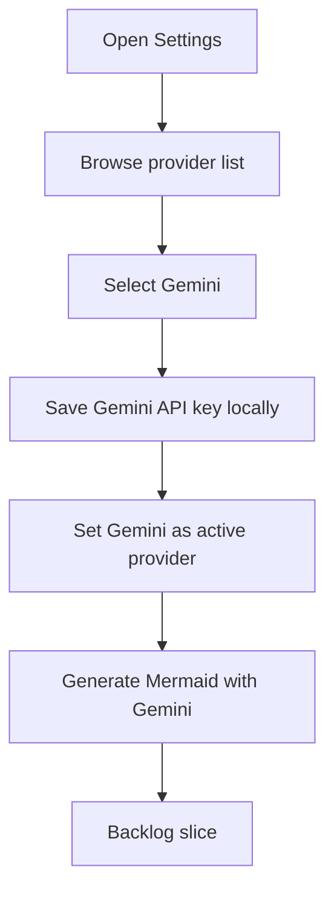

## req_019_add_gemini_api_as_a_supported_provider - Add Gemini API as a supported provider
> From version: 0.1.0
> Schema version: 1.0
> Status: Done
> Understanding: 99%
> Confidence: 98%
> Complexity: Medium
> Theme: UI
> Reminder: Update status/understanding/confidence and references when you edit this doc.

# Needs
- Extend Mermaid Generator’s browser-first multi-provider generation flow with support for `Gemini API`.
- Keep Gemini aligned with the current BYOK model so the user can store a Gemini key locally and switch to it as the active provider.
- Preserve the normalized provider contract so prompt-to-Mermaid generation does not require Gemini-specific branching throughout the app shell.
- Reuse the current provider-management UX work rather than bolting Gemini on as a one-off special case.

# Context
The app already supports multiple browser-side LLM providers and has recently expanded the provider surface through `Grok` and `Mistral`.
That makes `Gemini API` the next natural addition, especially because it is a credible low-cost or free-tier option for a lightweight prompt-to-Mermaid workflow.

This request is intentionally narrower than a full settings redesign:

1. add Gemini as a supported generation provider
2. let the user store and manage a Gemini API key locally
3. make Gemini selectable as the active provider
4. keep the rest of the user experience consistent with the current provider model

Expected user flow:

1. The user opens `Settings`.
2. The user sees `Gemini` in the provider list alongside the current providers.
3. The user selects `Gemini`, enters a Gemini API key, and saves it locally in the browser.
4. The user sets `Gemini` as the active provider.
5. The user generates Mermaid from a prompt using Gemini without any different top-level workflow.

Constraints and framing:

- keep the frontend-only BYOK architecture for this phase
- do not introduce a backend relay or project-managed Gemini secret
- keep provider persistence local to browser storage
- preserve the current generation contract: the provider returns Mermaid text that is validated and then replaces the draft source
- make Gemini fit the same settings, active-provider, and error-surface model already used by the app
- avoid turning this request into a broader provider marketplace or pricing comparison feature

# Acceptance criteria
- AC1: The app supports `Gemini API` as a selectable provider for prompt-to-Mermaid generation.
- AC2: `Settings` lets the user save and manage a Gemini API key locally in the browser.
- AC3: The user can set Gemini as the active provider without losing keys saved for the other providers.
- AC4: The prompt-generation workflow behaves the same from the user’s perspective when Gemini is active.
- AC5: The provider abstraction remains normalized so Gemini-specific behavior is contained inside the provider layer.
- AC6: Provider readiness, missing-key guidance, and provider-specific request failures remain consistent with the app’s current UX patterns.
- AC7: The addition of Gemini does not regress desktop or mobile usability in the current settings and generation flows.

# Clarifications
- Recommended default: add Gemini as a first-class direct provider, not as an OpenRouter alias.
- Recommended default: keep Gemini inside the same local persistence model as the existing providers.
- Recommended default: reuse the current settings/provider-management surface instead of creating a Gemini-specific modal or setup flow.
- Recommended default: use the same Mermaid-only output contract already expected from the other providers.

# Definition of Ready (DoR)
- [x] Problem statement is explicit and user impact is clear.
- [x] Scope boundaries (in/out) are explicit.
- [x] Acceptance criteria are testable.
- [x] Dependencies and known risks are listed.

# Companion docs
- Product brief(s): `prod_000_mermaid_generator_product_direction`
- Architecture decision(s): `adr_000_choose_a_static_pwa_architecture_for_mermaid_generator`

# AI Context
- Summary: Add Gemini API as another direct BYOK provider in the app’s prompt-to-Mermaid generation flow while preserving the current provider abstraction and settings model.
- Keywords: gemini, google ai, provider, byok, settings, prompt generation, mermaid, multi-provider
- Use when: Use when defining Gemini API support in the current browser-first multi-provider architecture.
- Skip when: Skip when the work concerns generic provider UX refactors without Gemini, or deployment and release concerns unrelated to generation providers.

# References
- `logics/request/req_017_add_grok_and_mistral_providers_and_rework_settings_provider_ux.md`
- `src/lib/llm.ts`
- `src/lib/provider-settings.ts`
- `src/components/modals/SettingsModal.tsx`
- `src/App.tsx`
- `README.md`
- `logics/product/prod_000_mermaid_generator_product_direction.md`
- `logics/architecture/adr_000_choose_a_static_pwa_architecture_for_mermaid_generator.md`

# Backlog
- `item_034_add_direct_gemini_provider_support_to_the_browser_side_llm_flow`
