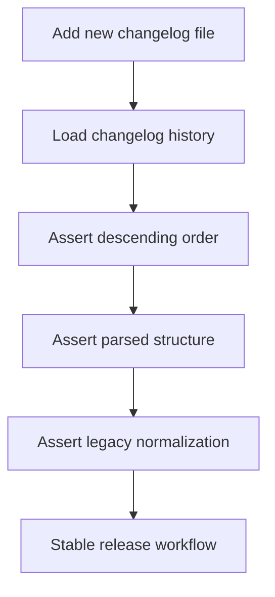

## req_020_make_changelog_tests_release_agnostic - Make changelog tests release-agnostic
> From version: 0.2.0
> Schema version: 1.0
> Status: Ready
> Understanding: 97%
> Confidence: 97%
> Complexity: Small
> Theme: Quality
> Reminder: Update status/understanding/confidence and references when you edit this doc.

# Needs
- Stop coupling changelog tests to specific released version numbers such as `0.1.0` or `0.2.0`.
- Preserve confidence that changelog history loading still works when a new versioned changelog file is added.
- Make future releases possible without having to edit tests only because the newest changelog version changed.
- Keep the real contract under test focused on ordering, structure, and backward compatibility.

# Context
The project now ships versioned changelog files under `changelogs/CHANGELOGS_<version>.md`.
The current test suite includes assertions tied to exact version values at the top of the loaded history.

That creates a fragile release workflow:

1. a new changelog file is added for the next release
2. the loader correctly returns that new version first
3. the test fails even though the feature still behaves correctly
4. release preparation now requires a test edit that does not reflect a product bug

This request narrows the test contract to the behavior that should remain true across every release:

1. changelog entries load successfully
2. the entries remain sorted from newest to oldest
3. each entry exposes the expected parsed structure
4. legacy or partial changelog shapes remain normalized safely

Constraints and framing:

- do not weaken changelog coverage into a trivial smoke test
- do not require manual test updates for each new release file
- keep the loader free to add `0.3.0`, `0.4.0`, and beyond without hard-coded expectation churn
- preserve confidence that the newest release appears first without baking in a specific future version string

# Acceptance criteria
- AC1: Changelog tests do not depend on a hard-coded latest version such as `0.2.0`.
- AC2: The automated tests still verify that changelog entries are returned in descending semantic version order.
- AC3: The automated tests still verify that loaded changelog entries expose the parsed structure required by the changelog modal.
- AC4: Backward-compatibility coverage for legacy changelog entry normalization remains present.
- AC5: Adding a new `CHANGELOGS_<version>.md` file does not require a test edit unless the actual changelog contract changes.

# Clarifications
- Recommended default: test relative ordering and structure, not an explicit list of released versions.
- Recommended default: keep at least one normalization test for older or partial changelog entry shapes.
- Recommended default: treat this as a quality and release-friction improvement, not as a changelog feature redesign.

# Definition of Ready (DoR)
- [x] Problem statement is explicit and user impact is clear.
- [x] Scope boundaries (in/out) are explicit.
- [x] Acceptance criteria are testable.
- [x] Dependencies and known risks are listed.

# Companion docs
- Product brief(s): `prod_000_mermaid_generator_product_direction`

# AI Context
- Summary: Refactor changelog tests so they validate ordering and structure without depending on a specific latest release number.
- Keywords: changelog, tests, release, regression, semantic version, vitest, quality
- Use when: Use when the changelog test suite should remain stable across future releases.
- Skip when: Skip when the work concerns changelog UI rendering, release-note content, or version bump mechanics rather than automated test design.

# References
- `src/tests/changelog.spec.ts`
- `src/lib/changelog.ts`
- `src/components/modals/ChangelogModal.tsx`
- `changelogs/CHANGELOGS_0_1_0.md`
- `changelogs/CHANGELOGS_0_2_0.md`
- `README.md`
- `logics/product/prod_000_mermaid_generator_product_direction.md`

# Backlog
- `item_035_make_changelog_tests_release_agnostic`
