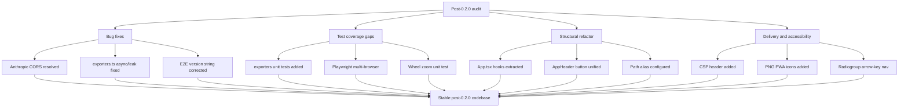

## req_021_address_post_020_audit_findings_across_bugs_tests_structure_and_delivery - Address post-0.2.0 audit findings across bugs, tests, structure, and delivery

> From version: 0.2.0
> Schema version: 1.0
> Status: Ready
> Understanding: 98%
> Confidence: 97%
> Complexity: High
> Theme: Hardening
> Reminder: Update status/understanding/confidence and references when you edit this doc.

# Needs

- Fix confirmed bugs surfaced by the 0.2.0 audit before they degrade the user experience in production.
- Improve test coverage and robustness in areas the audit identified as unprotected or brittle.
- Reduce structural concentration in `App.tsx` so routine product changes do not keep landing in one 1000-line file.
- Harden delivery and security on the static hosting layer with a CSP and proper PWA icons.
- Improve accessibility on simulated radiogroup controls to meet expected keyboard navigation behavior.

# Context

The 0.2.0 release is stable and the local quality gates are green. A post-release audit identified a set of issues spread across four themes that do not individually block the app today but together form the next responsible hardening wave.

**Theme 1 — Confirmed bugs**

Four concrete defects were identified:

1. The Anthropic provider makes a direct browser-to-API call to `https://api.anthropic.com/v1/messages`. Anthropic does not whitelist arbitrary browser origins, so this call is blocked by CORS in every standard browser. The provider silently fails in production without any warning in the UI. No other provider has this problem because they all expose OpenAI-compatible endpoints that tolerate browser origins.

2. `downloadDiagramAsSvg` in `exporters.ts` is declared `async` but contains no `await`. This is semantically misleading and inconsistent with `downloadDiagramAsPng`.

3. In `exporters.ts`, the PNG export path creates a Blob URL with `URL.createObjectURL` and schedules `URL.revokeObjectURL` after the Promise resolves. If `image.onerror` fires, the happy-path cleanup code never runs and the Blob URL leaks for the lifetime of the page.

4. The Playwright smoke test at line 137 asserts `"Mermaid Generator v0.1.0 © 2026"` — a stale version string that has been `0.2.0` since the last release. This test fails against the current build.

**Theme 2 — Test coverage gaps**

The audit identified three areas where coverage is missing or too narrow:

1. `src/lib/exporters.ts` has no unit tests. Both the SVG download path and the PNG canvas path are completely uncovered.
2. Playwright is configured to run on Chromium only. Firefox and WebKit/Safari are excluded, leaving the E2E suite blind to cross-browser regressions.
3. The zoom-with-cursor logic in `handlePreviewWheel` (coordinate translation from pointer position to viewport center) has no dedicated unit test.

**Theme 3 — Structural debt**

`App.tsx` has grown to over 1000 lines and concentrates state management, event handlers, render logic, and JSX for the full application shell. This creates high regression risk when any part of the product evolves. The audit identified three extraction targets:

1. Preview interaction state and handlers (`zoom`, `pan`, `fit`, `wheel`) could live in a `usePreviewInteraction` hook.
2. Export orchestration (`handleExport`, `downloadDiagramAsSvg`, `downloadDiagramAsPng` coordination) could live in a `useExport` hook.
3. Changelog loading and version state could live in a `useChangelog` hook.

Additionally, `HeaderActionButton` and `MobileMenuActionButton` in `AppHeader.tsx` share a near-identical interface and differ only by styling variant. This duplication should be collapsed into a single component with a `variant` prop.

No TypeScript path aliases (`@/`) are configured, making all cross-directory imports fragile to file moves. Adding an alias to `tsconfig.app.json` and `vite.config.ts` would reduce refactoring cost going forward.

**Theme 4 — Delivery and accessibility**

1. `render.yaml` configures no `Content-Security-Policy` header. Combined with the `dangerouslySetInnerHTML` SVG injection path (even though it is sanitized), the absence of a CSP leaves a meaningful defense layer missing.
2. The PWA manifest references only an SVG icon. No PNG 192×192 or 512×512 is present. This causes the Lighthouse installability check to fail and prevents add-to-home-screen on most Android devices.
3. The provider and scale radio groups in `SettingsModal` and `ExportModal` use `<button role="radio">` elements but do not implement arrow-key navigation within the group. Keyboard users relying on the expected radiogroup interaction model cannot cycle through options without Tab.

Note: the changelog test version-coupling issue identified in the same audit pass is already covered by `req_020_make_changelog_tests_release_agnostic` and is excluded from this request.

Expected outcome:

1. The Anthropic provider either works correctly in production or presents a clear, honest error to the user explaining the CORS constraint.
2. `exporters.ts` is free of the async/no-await inconsistency and the Blob URL leak.
3. The stale E2E version assertion matches the actual shipped version and does not regress on future releases.
4. `exporters.ts` has meaningful unit test coverage for both download paths.
5. Playwright runs on at least Chromium and Firefox.
6. `App.tsx` is measurably shorter after hook extractions, and the extracted hooks are individually testable.
7. `AppHeader.tsx` uses a single unified action button component.
8. A TypeScript path alias `@/` is configured and applied to existing imports.
9. A CSP header is present in `render.yaml` that does not break current functionality.
10. The PWA manifest ships PNG icons at 192×192 and 512×512.
11. Arrow-key navigation works correctly within the provider and scale radiogroups.

Constraints and framing:

- keep the project as a static browser-first app hosted on Render — do not introduce a backend just to proxy Anthropic
- treat this as hardening and quality work, not a product redesign
- preserve all current validated user flows covered by the existing test suite
- bug fixes take priority over structural refactors — ship the bug theme first if this request is split
- the Anthropic CORS issue may resolve to a UI warning rather than a working proxy; either outcome is acceptable as long as users are not left with a silent failure

# Acceptance criteria

- AC1: The Anthropic provider either succeeds in production or surfaces a clear inline error message explaining the CORS constraint — no silent failure.
- AC2: `downloadDiagramAsSvg` is no longer declared `async` unless it actually awaits something.
- AC3: The PNG export Blob URL is revoked on both the success and error paths.
- AC4: The Playwright smoke test version assertion matches the actual shipped version and does not require a manual edit on each future release.
- AC5: `src/lib/exporters.ts` has unit test coverage for the SVG download path and the PNG canvas path.
- AC6: The Playwright configuration runs tests on at least Chromium and Firefox.
- AC7: `App.tsx` is refactored so that preview interaction, export orchestration, and changelog loading each live in a dedicated custom hook.
- AC8: `AppHeader.tsx` uses a single action button component with a variant prop, replacing the current duplicated `HeaderActionButton` / `MobileMenuActionButton` pair.
- AC9: A `@/` TypeScript path alias is configured in `tsconfig.app.json` and `vite.config.ts`, and applied to existing imports across the codebase.
- AC10: `render.yaml` includes a `Content-Security-Policy` response header that does not break the current SVG rendering, PWA, or share-link flows.
- AC11: The PWA manifest includes PNG icons at 192×192 and 512×512, and the Lighthouse installability check passes.
- AC12: The provider and scale radiogroups in `SettingsModal` and `ExportModal` support arrow-key navigation between options.
- AC13: All existing automated tests remain green after every change in this request.

# Clarifications

- Recommended default: fix bugs first (AC1–AC4), then tests (AC5–AC6), then structure (AC7–AC9), then delivery and accessibility (AC10–AC12).
- Recommended default: for the Anthropic CORS issue, display a provider-level warning banner in SettingsModal rather than building a proxy, unless a proxy solution is already planned elsewhere.
- Recommended default: hook extractions should not change any observable behavior — treat them as internal refactors with the existing test suite as the regression guard.
- Recommended default: the CSP should allow `unsafe-inline` for styles only if strictly required by the current CSS-in-JS or inline SVG patterns, and should block `unsafe-eval` unconditionally.
- Recommended default: PNG icons can be generated from the existing SVG source at build time using a Vite plugin or a simple build script rather than committing binary assets.
- Recommended default: the E2E version string fix should prefer a dynamic assertion (e.g. matching the version injected by `__APP_VERSION__`) over a new hardcoded string.

# Definition of Ready (DoR)

- [x] Problem statement is explicit and user impact is clear.
- [x] Scope boundaries (in/out) are explicit.
- [x] Acceptance criteria are testable.
- [x] Dependencies and known risks are listed.

# Companion docs

- Product brief(s): `prod_000_mermaid_generator_product_direction`
- Architecture decision(s): `adr_000_choose_a_static_pwa_architecture_for_mermaid_generator`

# AI Context

- Summary: Fix four confirmed post-0.2.0 bugs (Anthropic CORS, async/leak in exporters, stale E2E version string), close test coverage gaps in exporters and cross-browser Playwright, extract App.tsx into focused custom hooks, unify AppHeader button duplication, add a TypeScript path alias, add a CSP header, add PWA PNG icons, and implement arrow-key navigation for radiogroups.
- Keywords: bug fix, CORS, Anthropic, exporters, async, Blob URL, E2E, Playwright, hooks, refactor, CSP, PWA, icons, accessibility, radiogroup, TypeScript alias
- Use when: Use when planning the hardening and quality work for the release immediately following 0.2.0.
- Skip when: Skip when the work concerns new provider integrations, changelog content, diagram feature additions, or the changelog test version-coupling issue already covered by req_020.

# References

- `src/App.tsx`
- `src/lib/exporters.ts`
- `src/lib/llm.ts`
- `src/components/shell/AppHeader.tsx`
- `src/components/modals/SettingsModal.tsx`
- `src/components/modals/ExportModal.tsx`
- `src/tests/changelog.spec.ts`
- `tests/e2e/smoke.spec.ts`
- `vite.config.ts`
- `tsconfig.app.json`
- `playwright.config.ts`
- `render.yaml`
- `public/manifest.webmanifest` (or equivalent)
- `logics/request/req_016_harden_runtime_security_delivery_performance_and_repo_maintainability.md`
- `logics/request/req_020_make_changelog_tests_release_agnostic.md`
- `logics/product/prod_000_mermaid_generator_product_direction.md`
- `logics/architecture/adr_000_choose_a_static_pwa_architecture_for_mermaid_generator.md`

# Backlog

- `item_036_surface_anthropic_cors_constraint_as_an_explicit_provider_warning`
- `item_037_fix_exporters_async_inconsistency_and_blob_url_leak_on_error_path`
- `item_038_fix_stale_version_string_in_e2e_smoke_test`
- `item_039_add_unit_test_coverage_for_exporters_svg_and_png_download_paths`
- `item_040_expand_playwright_configuration_to_include_firefox`
- `item_041_extract_preview_interaction_logic_from_app_into_use_preview_interaction_hook`
- `item_042_extract_export_orchestration_and_changelog_loading_from_app_into_dedicated_hooks`
- `item_043_unify_appheader_action_button_and_add_typescript_path_alias`
- `item_044_add_content_security_policy_header_to_render_static_delivery`
- `item_045_add_png_icons_to_pwa_manifest_for_installability`
- `item_046_implement_arrow_key_navigation_for_provider_and_scale_radiogroups`
