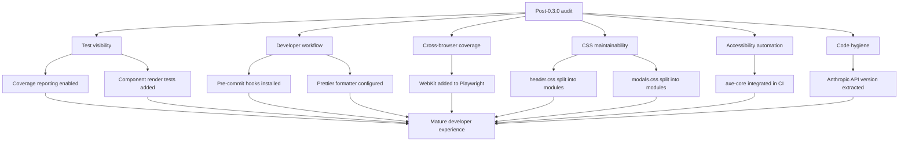

## req_022_strengthen_developer_tooling_test_visibility_and_css_maintainability - Strengthen developer tooling, test visibility, and CSS maintainability
> From version: 0.3.0
> Schema version: 1.0
> Status: Draft
> Understanding: 95%
> Confidence: 90%
> Complexity: High
> Theme: Hardening
> Reminder: Update status/understanding/confidence and references when you edit this doc.

# Needs
- Give the team clear visibility into what code is and is not covered by tests, so coverage gaps are caught before they reach production.
- Enforce code quality automatically at commit time instead of relying solely on CI to catch problems after a push.
- Guarantee consistent code formatting across the codebase without manual review effort.
- Extend component-level test coverage beyond E2E to catch regressions faster and closer to the source.
- Broaden cross-browser E2E coverage to include Safari, which represents a significant share of mobile traffic.
- Reduce the maintenance cost of the two largest CSS files before they grow further and become harder to reason about.
- Surface accessibility regressions automatically in CI instead of relying on manual audits.

# Context
The 0.3.0 release is stable, all quality gates are green, and the codebase scores well on a manual audit: zero `any` types, zero console logs, proper error handling, strong ARIA coverage, and robust SVG sanitization. The issues below are not bugs or regressions — they are tooling and structural gaps that, left unaddressed, will slow down future development and increase the risk of silent quality drift.

**Theme 1 — Test visibility**

The project has 32 unit tests and 32 E2E tests, all passing. However, there is no coverage reporting configured. Without a coverage metric, the team cannot identify which code paths are untested until a bug surfaces in production. Vitest supports c8/Istanbul natively — enabling it is low-effort and high-value.

Additionally, React components (`AppHeader`, `SettingsModal`, `ExportModal`, `OnboardingModal`, `ChangelogModal`, `PreviewPanel`) are exercised only through Playwright E2E tests. E2E tests are slower, more fragile, and less precise at isolating component-level regressions. Lightweight render tests using React Testing Library would catch component bugs earlier in the feedback loop.

**Theme 2 — Developer workflow automation**

Two standard guardrails are missing from the local development workflow:

1. **No pre-commit hooks.** Linting and type checking are enforced only in CI. A developer can push code that fails lint, wait for CI feedback, and iterate remotely. Adding `husky` + `lint-staged` would catch these issues instantly at commit time.

2. **No automatic code formatter.** The project has ESLint for style guidance but no Prettier (or equivalent) for deterministic formatting. Formatting inconsistencies are caught — or missed — during code review. Adding Prettier with an ESLint integration would eliminate this class of review friction entirely.

**Theme 3 — Cross-browser E2E coverage**

Playwright is configured for Chromium and Firefox. Safari (WebKit) is absent from the matrix. Safari accounts for roughly 18% of global web traffic and has known rendering and API differences (clipboard, service worker, CSS). Adding WebKit to the Playwright configuration would close this blind spot.

**Theme 4 — CSS maintainability**

Two CSS files have grown significantly:

| File | Lines |
|------|-------|
| `src/styles/header.css` | 5,317 |
| `src/styles/modals.css` | 6,978 |

These files are internally organized but monolithic. As the product evolves, finding and modifying styles for a specific component requires scanning thousands of lines. Splitting them into component-scoped CSS modules (or at minimum, per-component CSS files imported by their owning component) would improve discoverability and reduce accidental style coupling.

**Theme 5 — Automated accessibility auditing**

The codebase currently demonstrates strong manual ARIA discipline. However, accessibility regressions are only caught by human review or by the subset of E2E tests that happen to exercise ARIA attributes. Integrating an automated accessibility checker (axe-core via `@axe-core/playwright` or `vitest-axe`) into the CI pipeline would provide a continuous safety net.

**Theme 6 — Minor code hygiene**

The Anthropic API version string `"2023-06-01"` is hardcoded inline in `src/lib/llm.ts`. Extracting it as a named constant would align it with the project's pattern of explicit configuration values and make future API version bumps a single-line change.

Expected outcome:

1. `npm run test` produces a coverage report and the team can set a coverage threshold.
2. Pre-commit hooks run lint and type checking before every commit reaches the remote.
3. A formatter enforces consistent style across all source files.
4. Key React components have lightweight unit-level render tests.
5. Playwright runs on Chromium, Firefox, and WebKit.
6. The two large CSS files are split into smaller, component-scoped modules.
7. CI includes an automated accessibility check that fails on new violations.
8. The Anthropic API version is extracted as a named constant.

Constraints and framing:

- treat this as infrastructure and quality work, not a product redesign
- preserve all current validated user flows covered by the existing test suite
- developer tooling changes (hooks, formatter) should not block CI if a developer has not yet installed hooks locally — CI remains the source of truth
- CSS refactoring should not change any rendered visual output — treat it as a pure structural reorganization
- the accessibility checker should start in warning mode or with a baseline so existing minor issues do not block the pipeline on day one
- component unit tests should complement E2E, not replace it — focus on render correctness and prop-driven behavior, not full user flows

# Acceptance criteria
- AC1: Vitest coverage reporting is enabled and `npm run test` outputs a coverage summary. A minimum coverage threshold is configured and enforced.
- AC2: `husky` and `lint-staged` are installed and configured so that `npm run lint` and `npm run typecheck` run automatically on staged files before each commit.
- AC3: Prettier is installed, configured, and integrated with ESLint. Running `npx prettier --check .` on the current codebase produces no formatting violations.
- AC4: At least the following components have dedicated unit-level render tests using React Testing Library: `AppHeader`, `SettingsModal`, `ExportModal`, `PreviewPanel`.
- AC5: The Playwright configuration includes WebKit in addition to Chromium and Firefox, and E2E tests pass on all three browsers in CI.
- AC6: `src/styles/header.css` is replaced by component-scoped CSS modules (or per-component CSS files) imported by their owning components. No visual regression is introduced.
- AC7: `src/styles/modals.css` is replaced by component-scoped CSS modules (or per-component CSS files) imported by their owning components. No visual regression is introduced.
- AC8: An automated accessibility checker (axe-core or equivalent) is integrated into the CI pipeline and reports violations. A baseline is established so pre-existing minor issues do not block the pipeline.
- AC9: The Anthropic API version string in `src/lib/llm.ts` is extracted as a named constant.
- AC10: All existing automated tests remain green after every change in this request.

# Clarifications
- Recommended default: start with developer tooling (AC2–AC3) since these changes are self-contained and immediately improve the workflow for all subsequent work.
- Recommended default: coverage reporting (AC1) should use Vitest's built-in c8 provider and start with a threshold around the current actual coverage, then ratchet upward.
- Recommended default: for CSS splitting (AC6–AC7), prefer CSS Modules (`*.module.css`) co-located with their component files over a CSS-in-JS migration.
- Recommended default: for accessibility automation (AC8), prefer `@axe-core/playwright` integration in the existing E2E suite over a separate CI step, so violations are caught in the context of real rendered pages.
- Recommended default: component render tests (AC4) should focus on: correct rendering given props, conditional UI visibility, and callback invocation — not full interaction flows already covered by E2E.
- Recommended default: WebKit E2E (AC5) may initially be allowed to fail without blocking CI if platform-specific issues surface, then stabilized incrementally.

# Definition of Ready (DoR)
- [x] Problem statement is explicit and user impact is clear.
- [x] Scope boundaries (in/out) are explicit.
- [x] Acceptance criteria are testable.
- [x] Dependencies and known risks are listed.

# Companion docs
- Product brief(s): `prod_000_mermaid_generator_product_direction`
- Architecture decision(s): `adr_000_choose_a_static_pwa_architecture_for_mermaid_generator`

# AI Context
- Summary: Enable Vitest coverage reporting, add pre-commit hooks with husky/lint-staged, configure Prettier, add component-level render tests for key React components, extend Playwright to include WebKit, split the two largest CSS files into component-scoped modules, integrate axe-core accessibility checks in CI, and extract the Anthropic API version constant.
- Keywords: coverage, c8, husky, lint-staged, pre-commit, Prettier, formatter, component tests, React Testing Library, WebKit, Safari, Playwright, CSS modules, CSS splitting, axe-core, accessibility, a11y, automation, developer experience
- Use when: Use when planning the developer tooling and quality infrastructure improvements following the 0.3.0 release.
- Skip when: Skip when the work concerns new product features, provider integrations, diagram capabilities, or bug fixes in existing functionality.

# References
- `src/lib/llm.ts`
- `src/styles/header.css`
- `src/styles/modals.css`
- `src/components/shell/AppHeader.tsx`
- `src/components/modals/SettingsModal.tsx`
- `src/components/modals/ExportModal.tsx`
- `src/components/modals/OnboardingModal.tsx`
- `src/components/modals/ChangelogModal.tsx`
- `src/components/workspace/PreviewPanel.tsx`
- `src/tests/setup.ts`
- `vitest.config.ts`
- `playwright.config.ts`
- `.github/workflows/ci.yml`
- `package.json`
- `eslint.config.js`
- `logics/request/req_021_address_post_020_audit_findings_across_bugs_tests_structure_and_delivery.md`
- `logics/product/prod_000_mermaid_generator_product_direction.md`
- `logics/architecture/adr_000_choose_a_static_pwa_architecture_for_mermaid_generator.md`

# Backlog
- `item_047_enable_vitest_coverage_reporting_with_threshold`
- `item_048_add_pre_commit_hooks_with_husky_and_lint_staged`
- `item_049_configure_prettier_and_integrate_with_eslint`
- `item_050_add_component_render_tests_for_key_react_components`
- `item_051_add_webkit_to_playwright_browser_matrix`
- `item_052_split_header_css_into_component_scoped_modules`
- `item_053_split_modals_css_into_component_scoped_modules`
- `item_054_integrate_axe_core_accessibility_checks_in_ci`
- `item_055_extract_anthropic_api_version_as_named_constant`
