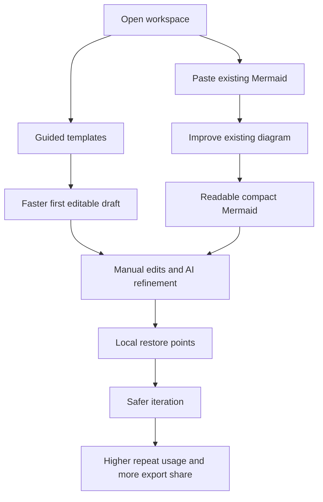

## req_023_improve_workspace_productivity_with_guided_templates_diagram_improvement_and_local_history - Improve workspace productivity with guided templates, diagram improvement, and local history

> From version: 0.4.0
> Schema version: 1.0
> Status: Ready
> Understanding: 98%
> Confidence: 96%
> Complexity: High
> Theme: Productivity
> Reminder: Update status/understanding/confidence and references when you edit this doc.

# Needs

- Reduce blank-page friction so new and occasional users can reach a first useful Mermaid draft faster.
- Make Mermaid-Gen more valuable when the user already has Mermaid source and needs repair, cleanup, or restructuring rather than net-new generation.
- Add local restore points so users can iterate more aggressively without fearing lost work.
- Increase repeat usage by making the workspace faster to start, better at improving existing diagrams, and safer during refinement.

# Context

Mermaid Generator already covers the core loop well: edit Mermaid, preview it live, generate a first draft from text, and export or share the result. That foundation is strong, but the current product still behaves more like a capable generator-editor than a productivity-first Mermaid workspace.

The next product wave should focus on three high-value gaps:

**Theme 1 - Guided starting points**

The current entry modes are a free-form prompt or pasted Mermaid. Both are flexible, but they still leave some users facing a blank page. The workspace needs faster, more guided starting points for common diagram jobs.

The proposed direction is a visible `Start from template` entry point with curated template categories such as:

- API flow
- User journey
- Sequence diagram
- Architecture cloud
- Org chart
- Decision tree
- Incident or support flow
- Process or workflow

Each template should provide enough structure to remove startup friction without hiding the Mermaid source. A template can prefill a guided prompt, an editable Mermaid starter, or both.

**Theme 2 - Improve existing Mermaid**

The product currently helps users generate Mermaid, but it does not yet deliver enough differentiated value when a user pastes Mermaid that is broken, too wide, too verbose, or hard to read. That is a missed opportunity because existing Mermaid cleanup is a strong real-world workflow.

The workspace should expose an `Improve existing diagram` mode or contextual action where the user supplies:

- current Mermaid source
- improvement goal
- optional constraints

Typical improvement intents include:

- fix syntax only
- make it more readable
- reduce width
- shorten labels
- restructure for documentation
- convert diagram type when appropriate

The system must treat editable Mermaid as the source of truth, preserve functional meaning where possible, and avoid speculative rewrites when the source is ambiguous.

**Theme 3 - Local history and restore**

The workspace currently lets users iterate, but it lacks a lightweight local safety net for rolling back to an earlier state, comparing recent changes, or restoring after an unsuccessful experiment. That increases hesitation during editing and weakens the product's repeat-use value.

The product should store a local version history with meaningful restore points after important events such as:

- initial generation
- AI improvement
- meaningful manual edits
- import
- restore from a shared link

Each snapshot should keep lightweight metadata such as timestamp, automatic title, action type, Mermaid source, and associated prompt when available. The first implementation should stay local to the browser and should avoid capturing every keystroke.

Expected outcome:

1. New users reach a first editable draft faster because they can start from a guided template instead of a blank state.
2. Users who already have Mermaid source can improve, repair, and compact it without leaving the workspace or manually rebuilding it.
3. Users can explore edits and AI-assisted transformations with less fear because recent states are locally restorable.
4. Mermaid-Gen feels more like a persistent productivity workspace, which should improve activation, successful exports or shares, and repeat usage.

Constraints and framing:

- keep Mermaid source as the canonical editable artifact
- integrate these capabilities inside the current single-workspace model rather than creating a separate product surface
- prioritize readability and functional clarity over decorative styling
- do not invent business structure when the pasted Mermaid is ambiguous
- treat local history as browser-local only in this phase, with no backend persistence requirement
- use debounced or threshold-based snapshotting for manual edits so performance stays stable
- preserve the current validated edit, preview, export, and share flows

# Acceptance criteria

- AC1: The workspace surfaces a visible `Start from template` entry point when the user lands in the authoring workspace.
- AC2: The initial template catalog includes at least these categories: API flow, user journey, sequence diagram, architecture cloud, org chart, decision tree, incident or support flow, and process or workflow.
- AC3: Each template exposes a name, a short description, an example of the expected result, an editable base prompt, and an editable Mermaid starter when that template benefits from one.
- AC4: After selecting a template, the user can generate from the proposed prompt, edit the prompt before generation, and edit the starting Mermaid directly without leaving the main workspace.
- AC5: The product exposes an `Improve existing diagram` mode or contextual action that accepts current Mermaid source, an improvement goal, and optional constraints.
- AC6: Improve mode supports at least these transformation intents: fix syntax only, make more readable, reduce width, shorten labels, and restructure for documentation.
- AC7: Improve mode always returns editable Mermaid as the source of truth rather than only a rendered preview or non-editable output.
- AC8: When the system is not confident that a correction or restructuring is safe, it presents a proposed change with an explicit warning or review step instead of silently replacing the current diagram.
- AC9: Improvement flows preserve the existing diagram meaning as much as possible and do not invent missing business structure when the source is ambiguous.
- AC10: The workspace stores local restore points for initial generation, AI improvement, import, shared-link restore, and meaningful manual edits using debounced or threshold-based snapshotting instead of saving on every keystroke.
- AC11: Local history keeps the most recent 10 to 20 snapshots with timestamp, automatic title, action type, Mermaid source, and prompt when available, and exposes a `History` panel with at least a short preview and a `Restore` action.
- AC12: The first implementation of history remains browser-local only and does not require authentication, backend storage, or collaborative features.
- AC13: The implementation includes measurable event points for template usage, improve-mode usage, history restore usage, and the related product signals so the team can evaluate startup friction, pasted-source success, and lost-work reduction after rollout.
- AC14: Existing edit, preview, export, and share behavior remain validated after these additions.

# Clarifications

- Recommended default: place the template chooser inside the existing workspace entry flow instead of introducing a separate marketing-style landing page.
- Recommended default: keep the first template set curated and limited; user-defined template management can wait for a later phase.
- Recommended default: position improve mode as repair and refinement of the current Mermaid, not as a disguised full regeneration flow.
- Recommended default: reuse the app's existing Mermaid validation guardrails so unsafe AI output does not silently replace the current source.
- Recommended default: history snapshots should favor meaningful restore points over exhaustive change capture; a basic text preview or simple diff is enough for the first release.
- Recommended default: success measurement should stay privacy-light and compatible with the current static browser-first product architecture.

# Definition of Ready (DoR)

- [x] Problem statement is explicit and user impact is clear.
- [x] Scope boundaries (in/out) are explicit.
- [x] Acceptance criteria are testable.
- [x] Dependencies and known risks are listed.

# Companion docs

- Product brief(s): `prod_000_mermaid_generator_product_direction`
- Architecture decision(s): `adr_000_choose_a_static_pwa_architecture_for_mermaid_generator`

# AI Context

- Summary: Add guided templates for common diagram starts, introduce an improve-existing-diagram flow that repairs and restructures pasted Mermaid without losing editability, and add local restore points so Mermaid-Gen behaves more like a productivity workspace than a one-shot generator.
- Keywords: templates, guided start, startup friction, improve diagram, repair Mermaid, readability, compact layout, shorten labels, restructure, local history, restore, productivity, repeat usage
- Use when: Use when planning the next product wave that should improve activation, existing-diagram refinement, and confidence during iteration.
- Skip when: Skip when the work concerns provider expansion, deployment hardening, changelog visibility, or developer tooling that does not directly change the workspace experience.

# References

- `src/App.tsx`
- `src/components/workspace/PreviewPanel.tsx`
- `src/lib/llm.ts`
- `src/lib/mermaid.ts`
- `src/lib/share.ts`
- `src/lib/provider-settings.ts`
- `src/lib/onboarding.ts`
- `tests/e2e/smoke.spec.ts`
- `logics/product/prod_000_mermaid_generator_product_direction.md`
- `logics/architecture/adr_000_choose_a_static_pwa_architecture_for_mermaid_generator.md`

# Backlog

- `item_056_add_guided_templates_for_faster_workspace_starts`
- `item_057_add_improve_existing_diagram_flows_for_pasted_mermaid`
- `item_058_add_local_diagram_history_and_restore_points`
