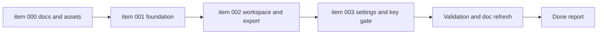

## task_000_orchestrate_mermaid_generator_mvp_delivery - Orchestrate Mermaid Generator MVP delivery
> From version: 0.1.0
> Schema version: 1.0
> Status: Done
> Understanding: 95%
> Confidence: 96%
> Progress: 100%
> Complexity: High
> Theme: UI
> Reminder: Update status/understanding/confidence/progress and dependencies/references when you edit this doc.

# Context
This task orchestrates the full MVP delivery across the current backlog set.
The backlog already contains one completed preparation slice for branding, README, and release documentation, plus three implementation slices that still need execution: foundation bootstrap, authoring workspace, and local OpenAI settings plus feature gating.

Execution constraints:

- Keep the implementation coherent with the product brief and both ADRs already written.
- Treat the prepared brand assets and README as inputs to the bootstrap, not parallel throwaway work.
- Use `logics-ui-steering` on frontend implementation waves, especially the workspace shell, panel hierarchy, and preview behavior.
- Prefer meaningful waves that leave the repository commit-ready after each phase.

# Plan
- [x] 1. Confirm the completed documentation and asset baseline from `item_000` and carry it into the app bootstrap where needed.
- [x] 2. Implement `item_001` by bootstrapping the static React, TypeScript, Vite, and PWA baseline plus the delivery scripts and hosting configuration.
- [x] 3. Implement `item_002` by building the dominant-preview workspace, Mermaid editing flow, preview navigation, focus mode, and full-diagram export.
- [x] 4. Implement `item_003` by adding the `Settings` modal, local OpenAI key persistence, and prompt gating plus explanatory locked states.
- [x] 5. Validate the integrated MVP, update linked Logics docs, and leave the repository in a commit-ready state.

# Delivery checkpoints
- Each completed wave should leave the repository in a coherent, commit-ready state.
- Update the linked Logics docs during the wave that changes the behavior, not only at final closure.
- Prefer a reviewed commit checkpoint at the end of each meaningful wave instead of accumulating several undocumented partial states.

# AC Traceability
- AC1 -> `item_000_create_branding_assets_marketing_readme_and_release_workflow_docs`: branding assets, README, and deployment ADR are present and remain aligned with implementation. Proof: current repo state plus doc refresh if needed.
- AC2 -> `item_001_bootstrap_static_pwa_foundation_and_delivery_baseline`: static app baseline, scripts, and delivery configuration exist and pass initial validation. Proof: lint, test, build, and bootstrap artifact checks.
- AC3 -> `item_002_build_mermaid_authoring_workspace_and_export_flow`: dominant-preview workspace, Mermaid editing, navigation, focus mode, and export are implemented. Proof: targeted UI validation and end-to-end manual or automated checks.
- AC4 -> `item_003_add_local_openai_key_setup_and_settings_entry_point`: settings modal, local key persistence, and locked-until-configured prompt behavior are implemented. Proof: UI state checks for configured and unconfigured paths.

# Decision framing
- Product framing: Linked
- Product signals: workspace layout, settings UX, preview dominance, disabled-state messaging
- Product follow-up: Keep the task synchronized with `prod_000_mermaid_generator_product_direction` during each UI wave.
- Architecture framing: Linked
- Architecture signals: static hosting, local persistence, provider integration boundary, release workflow
- Architecture follow-up: Keep the task synchronized with `adr_000_choose_a_static_pwa_architecture_for_mermaid_generator` and `adr_001_define_static_deployment_and_release_branch_workflow`.

# Links
- Product brief(s): `prod_000_mermaid_generator_product_direction`
- Architecture decision(s): `adr_000_choose_a_static_pwa_architecture_for_mermaid_generator`, `adr_001_define_static_deployment_and_release_branch_workflow`
- Backlog item: `item_000_create_branding_assets_marketing_readme_and_release_workflow_docs`, `item_001_bootstrap_static_pwa_foundation_and_delivery_baseline`, `item_002_build_mermaid_authoring_workspace_and_export_flow`, `item_003_add_local_openai_key_setup_and_settings_entry_point`
- Request(s): `req_000_launch_mermaid_generator_web_app`, `req_001_create_branding_assets_marketing_readme_and_release_workflow_docs`, `req_002_add_local_openai_key_setup_and_settings_entry_point`

# AI Context
- Summary: Orchestrate the Mermaid Generator MVP across foundation, authoring workspace, export, and local OpenAI settings while preserving the documented product and architecture direction.
- Keywords: mvp, bootstrap, pwa, mermaid, workspace, export, settings, openai, local persistence, ui steering
- Use when: Use when implementing or validating the coordinated MVP delivery waves across the current backlog set.
- Skip when: Skip when the work is a separate future slice such as collaboration, managed backend proxying, or post-MVP product expansion.

# References
- `logics/product/prod_000_mermaid_generator_product_direction.md`
- `logics/architecture/adr_000_choose_a_static_pwa_architecture_for_mermaid_generator.md`
- `logics/architecture/adr_001_define_static_deployment_and_release_branch_workflow.md`
- `logics/skills/logics-ui-steering/SKILL.md`
- `README.md`

# Validation
- `python3 logics/skills/logics-doc-linter/scripts/logics_lint.py`
- `npm run lint`
- `npm run test`
- `npm run build`
- `npm run test:e2e`
- Capture any stack-specific validation adjustments introduced by the bootstrap if command names differ.

# Definition of Done (DoD)
- [x] Scope implemented and acceptance criteria covered.
- [x] Validation commands executed and results captured.
- [x] Linked request/backlog/task docs updated during completed waves and at closure.
- [x] Each completed wave left a commit-ready checkpoint or an explicit exception is documented.
- [x] Status is `Done` and progress is `100%`.

# Report
- Wave 1: foundation bootstrap completed with React, Vite, TypeScript, PWA config, Render blueprint, CI workflow, and baseline test/build/quality commands. Validation passed for `npm run lint`, `npm run typecheck`, `npm run test`, `npm run build`, and `npm run quality:pwa`.
- Wave 2: authoring workspace completed with dominant preview layout, CodeMirror editing, Mermaid rendering, focus mode, zoom/pan, and SVG/PNG export. Validation passed for `npm run lint`, `npm run typecheck`, `npm run test`, `npm run build`, and `npm run quality:pwa`.
- Wave 3: local OpenAI settings completed with a top-level `Settings` entry point, modal key management, local browser persistence, locked prompt messaging, and client-side Mermaid generation via the configured key. Validation passed for `npm run lint`, `npm run typecheck`, `npm run test`, `npm run build`, and `npm run quality:pwa`.
- Final validation: `python3 logics/skills/logics-doc-linter/scripts/logics_lint.py`, `npm run lint`, `npm run typecheck`, `npm run test`, `npm run build`, `npm run quality:pwa`, and `npm run test:e2e` all passed. Playwright Chromium was installed locally with `npx playwright install chromium` to enable the browser check.
