## task_001_improve_responsive_workspace_and_require_shift_for_preview_zoom - Improve responsive workspace and require shift for preview zoom
> From version: 0.1.0
> Schema version: 1.0
> Status: Ready
> Understanding: 97%
> Confidence: 94%
> Progress: 0%
> Complexity: Medium
> Theme: UI
> Reminder: Update status/understanding/confidence/progress and dependencies/references when you edit this doc.

# Context
- Derived from backlog item `item_004_improve_responsive_workspace_and_require_shift_for_preview_zoom`.
- Source file: `logics/backlog/item_004_improve_responsive_workspace_and_require_shift_for_preview_zoom.md`.
- Related request(s): `req_003_improve_responsive_workspace_and_require_shift_for_preview_zoom`.
- Make the Mermaid Generator workspace genuinely responsive across desktop, tablet, and mobile widths.
- Keep the preview navigation predictable by allowing wheel-based zoom only while the `Shift` key is actively pressed.
- Prevent accidental zoom interactions during ordinary page or panel scrolling inside the app.

```mermaid
%% logics-kind: task
%% logics-signature: task|improve-responsive-workspace-and-require|item-004-improve-responsive-workspace-an|1-confirm-scope-dependencies-and-linked|npm-run-lint
flowchart LR
    Backlog[item_004_improve_responsive_workspace_and_] --> Step1[1. Confirm scope dependencies and linked]
    Step1 --> Step2[2. Implement the next coherent delivery]
    Step2 --> Step3[3. Checkpoint the wave in a]
    Step3 --> Validation[Run the relevant automated tests for]
    Validation --> Report[Done report]
```

# Plan
- [ ] 1. Confirm scope, dependencies, and linked acceptance criteria.
- [ ] 2. Rework the workspace layout for desktop, tablet, and mobile so core panels and actions remain usable without clipping or overlap.
- [ ] 3. Update preview wheel interaction so zoom only triggers while `Shift` is pressed and normal scrolling remains unchanged otherwise.
- [ ] 4. Validate the responsive and interaction changes with viewport and browser checks, then update the linked Logics docs.
- [ ] CHECKPOINT: leave the current wave commit-ready and update the linked Logics docs before continuing.
- [ ] FINAL: Update related Logics docs

# Delivery checkpoints
- Each completed wave should leave the repository in a coherent, commit-ready state.
- Update the linked Logics docs during the wave that changes the behavior, not only at final closure.
- Prefer a reviewed commit checkpoint at the end of each meaningful wave instead of accumulating several undocumented partial states.

# AC Traceability
- AC1 -> Scope: The workspace remains usable across desktop, tablet, and mobile widths, with no critical panel clipping, unusable controls, or broken layout hierarchy. Proof: manual and browser-driven viewport validation confirms usable layout at large, medium, and small breakpoints.
- AC2 -> Scope: On large screens, the preview remains the dominant area while the editor and prompt keep a coherent secondary placement. Proof: desktop validation confirms preview-first composition and secondary editor/prompt placement.
- AC3 -> Scope: On smaller viewports, the layout adapts so the editor, prompt, preview, and `Settings` entry point remain reachable without overlap or unusable truncation. Proof: tablet and mobile validation confirms access to preview, source editor, prompt, and settings control.
- AC4 -> Scope: Wheel-based preview zoom only activates when the pointer is over the preview and the `Shift` key is pressed. Proof: interaction validation confirms preview scale changes only on modifier-gated wheel input.
- AC5 -> Scope: Without `Shift`, wheel or trackpad scrolling does not trigger preview zoom and preserves normal scrolling behavior. Proof: interaction validation confirms ordinary wheel input leaves preview scale unchanged and preserves scroll behavior.

# Decision framing
- Product framing: Required
- Product signals: navigation and discoverability, experience scope
- Product follow-up: Create or link a product brief before implementation moves deeper into delivery.
- Architecture framing: Consider
- Architecture signals: data model and persistence
- Architecture follow-up: Review whether an architecture decision is needed before implementation becomes harder to reverse.

# Links
- Product brief(s): `prod_000_mermaid_generator_product_direction`
- Architecture decision(s): `adr_000_choose_a_static_pwa_architecture_for_mermaid_generator`
- Backlog item: `item_004_improve_responsive_workspace_and_require_shift_for_preview_zoom`
- Request(s): `req_003_improve_responsive_workspace_and_require_shift_for_preview_zoom`

# AI Context
- Summary: Tighten the Mermaid Generator workspace so it behaves responsively across viewports and only zooms the preview on wheel...
- Keywords: responsive, layout, mobile, tablet, desktop, preview, zoom, shift, wheel, interaction
- Use when: Use when defining responsive behavior and safer preview navigation rules for the main Mermaid workspace.
- Skip when: Skip when the work concerns OpenAI settings, export formats, or release workflow documentation.

# References
- `logics/product/prod_000_mermaid_generator_product_direction.md`
- `logics/architecture/adr_000_choose_a_static_pwa_architecture_for_mermaid_generator.md`
- `logics/tasks/task_000_orchestrate_mermaid_generator_mvp_delivery.md`
- `logics/skills/logics-ui-steering/SKILL.md`

# Validation
- `npm run lint`
- `npm run typecheck`
- `npm run test`
- `npm run build`
- `npm run test:e2e`
- Browser-driven responsive checks at desktop, tablet, and mobile widths
- Browser-driven interaction check for wheel zoom with and without `Shift`

# Definition of Done (DoD)
- [ ] Scope implemented and acceptance criteria covered.
- [ ] Validation commands executed and results captured.
- [ ] Linked request/backlog/task docs updated during completed waves and at closure.
- [ ] Each completed wave left a commit-ready checkpoint or an explicit exception is documented.
- [ ] Status is `Done` and progress is `100%`.

# Report
