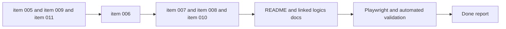

## task_002_orchestrate_workspace_polish_onboarding_and_multi_provider_rollout - Orchestrate workspace polish onboarding and multi provider rollout
> From version: 0.1.0
> Schema version: 1.0
> Status: Ready
> Understanding: 96%
> Confidence: 94%
> Progress: 0%
> Complexity: High
> Theme: UI
> Reminder: Update status/understanding/confidence/progress and dependencies/references when you edit this doc.

# Context
This task orchestrates the next delivery package after the initial MVP and responsive corrections. It groups together three streams that are now clear enough to execute in a controlled order:

- workspace polish around sticky chrome, contextual help, focus/export fixes, footer, and prompt-shape guardrails
- first-run onboarding with reactivation from `Settings`
- multi-provider LLM groundwork plus the first provider rollout

Execution constraints:

- Split the work into meaningful waves and create one commit per completed wave.
- Update linked Logics docs during the wave that changes the behavior, not only at the end.
- Refresh `README.md` when user-visible behavior, settings flows, provider support, or export/onboarding guidance change materially.
- Use `logics-ui-steering` on all frontend UI waves so the shell, onboarding, settings, and modal flows stay product-native.
- End the orchestration with Playwright validation across the touched user flows if possible in the local environment; where a live provider call cannot be exercised safely, validate the deterministic UI states and note the limitation.

# Plan
- [ ] 1. Confirm the linked backlog scope and execution order for `item_005`, `item_006`, `item_007`, `item_008`, `item_009`, `item_010`, and `item_011`.
- [ ] 2. Wave 1: implement sticky workspace chrome, contextual help, copy cleanup, and footer polish from `item_005`, then update linked docs and create a dedicated commit.
- [ ] 3. Wave 2: implement editor-focus fix, preview-focus correction, and export modal flow from `item_009`, then update linked docs and create a dedicated commit.
- [ ] 4. Wave 3: implement onboarding first-run modal and `Settings` reactivation from `item_006`, then update linked docs and create a dedicated commit.
- [ ] 5. Wave 4: implement the multi-provider adapter boundary from `item_007`, then update linked docs and create a dedicated commit.
- [ ] 6. Wave 5: expand `Settings` for provider selection and local keys from `item_008`, then update linked docs and create a dedicated commit.
- [ ] 7. Wave 6: enable the initial multi-provider prompt-generation rollout from `item_010`, then update linked docs and create a dedicated commit.
- [ ] 8. Wave 7: implement prompt-generation diagram-shape guardrails from `item_011`, then update linked docs and create a dedicated commit.
- [ ] 9. Finalize `README.md`, refresh the affected Logics docs, and run automated plus Playwright validation for the completed package.
- [ ] CHECKPOINT: leave the current wave commit-ready and update the linked Logics docs before continuing.
- [ ] FINAL: update related Logics docs and README before closing the task

# Delivery checkpoints
- Each completed wave should leave the repository in a coherent, commit-ready state.
- Create one intentional commit per completed wave instead of bundling several waves together.
- Update the linked Logics docs during the wave that changes the behavior, not only at final closure.
- Refresh `README.md` once the user-visible flows have materially changed and before the final validation/report step.
- Prefer a reviewed commit checkpoint at the end of each meaningful wave instead of accumulating several undocumented partial states.

# AC Traceability
- AC1 -> `item_005_polish_sticky_workspace_chrome_contextual_help_and_footer`: sticky header, contextual help, calmer copy, and discreet footer are implemented without regressing mobile usability. Proof: UI validation plus browser checks on desktop and mobile.
- AC2 -> `item_009_fix_preview_focus_editor_continuity_and_export_modal_flow`: editor typing, focus preview, and unified export modal behave correctly. Proof: targeted browser validation and Playwright checks.
- AC3 -> `item_006_add_first_run_onboarding_modal_and_settings_reactivation`: first-run onboarding appears, can be skipped/finished, persists locally, and can be reopened from `Settings`. Proof: UI state validation and Playwright onboarding flow.
- AC4 -> `item_007_create_multi_provider_llm_adapter_boundary`: a normalized provider boundary exists and the current OpenAI path runs through it. Proof: code-path validation plus targeted automated tests.
- AC5 -> `item_008_expand_settings_for_provider_selection_and_local_keys`: settings manage multiple local provider keys with one active provider and mobile-safe behavior. Proof: settings UI checks and persistence validation.
- AC6 -> `item_010_enable_initial_multi_provider_prompt_generation_rollout`: the selected enabled provider drives prompt generation without changing the core user workflow. Proof: automated tests, UI validation, and live smoke check when safe/possible.
- AC7 -> `item_011_add_prompt_generation_diagram_shape_guardrails`: generation guidance discourages extreme diagram ratios without introducing a heavy regeneration loop. Proof: prompt/heuristic validation and representative generation checks.
- AC8 -> Documentation closure: `README.md` and linked Logics docs reflect the delivered behavior and validation evidence. Proof: updated docs and final report.

# Decision framing
- Product framing: Required
- Product signals: conversion journey, navigation and discoverability, experience scope
- Product follow-up: Keep this orchestration synchronized with `prod_000_mermaid_generator_product_direction` while the UI and onboarding flows evolve.
- Architecture framing: Required
- Architecture signals: contracts and integration, runtime and boundaries, data model and persistence
- Architecture follow-up: Keep this orchestration synchronized with `adr_000_choose_a_static_pwa_architecture_for_mermaid_generator` and add a new ADR only if provider rollout or export behavior forces a new irreversible boundary decision.

# Links
- Product brief(s): `prod_000_mermaid_generator_product_direction`
- Architecture decision(s): `adr_000_choose_a_static_pwa_architecture_for_mermaid_generator`
- Backlog item: `item_005_polish_sticky_workspace_chrome_contextual_help_and_footer`, `item_006_add_first_run_onboarding_modal_and_settings_reactivation`, `item_007_create_multi_provider_llm_adapter_boundary`, `item_008_expand_settings_for_provider_selection_and_local_keys`, `item_009_fix_preview_focus_editor_continuity_and_export_modal_flow`, `item_010_enable_initial_multi_provider_prompt_generation_rollout`, `item_011_add_prompt_generation_diagram_shape_guardrails`
- Request(s): `req_004_refine_workspace_chrome_help_export_footer_and_preview_focus_behavior`, `req_005_add_first_run_onboarding_modal_with_reactivation_from_settings`, `req_006_add_multi_provider_llm_support_and_expand_settings_management`

# AI Context
- Summary: Orchestrate the next Mermaid Generator delivery package across workspace polish, onboarding, multi-provider settings, provider adapters, and prompt-generation guardrails while keeping commits and docs synchronized by wave.
- Keywords: workspace polish, onboarding, multi-provider, settings, provider adapter, export modal, sticky header, footer, tooltip, guardrails
- Use when: Use when executing the coordinated post-MVP wave set that spans UI polish, onboarding, and multi-provider LLM enablement.
- Skip when: Skip when the work is an isolated bugfix or a separate future slice not linked to `req_004`, `req_005`, or `req_006`.

# References
- `logics/product/prod_000_mermaid_generator_product_direction.md`
- `logics/architecture/adr_000_choose_a_static_pwa_architecture_for_mermaid_generator.md`
- `logics/tasks/task_001_improve_responsive_workspace_and_require_shift_for_preview_zoom.md`
- `logics/skills/logics-ui-steering/SKILL.md`
- `README.md`

# Validation
- `python3 logics/skills/logics-doc-linter/scripts/logics_lint.py`
- `npm run lint`
- `npm run typecheck`
- `npm run test`
- `npm run build`
- `npm run test:e2e`
- Playwright browser checks for sticky header, tooltip/help affordances, focus preview, export modal, onboarding, settings/provider selection, and responsive/mobile flows
- Capture any provider-specific live-validation limitation if a safe local key or environment is not available during execution

# Definition of Done (DoD)
- [ ] Scope implemented and acceptance criteria covered.
- [ ] Validation commands executed and results captured.
- [ ] Linked request/backlog/task docs updated during completed waves and at closure.
- [ ] Each completed wave left a commit-ready checkpoint and a dedicated commit, or an explicit exception is documented.
- [ ] `README.md` is refreshed for any materially changed user-facing flows before closure.
- [ ] Status is `Done` and progress is `100%`.

# Report
