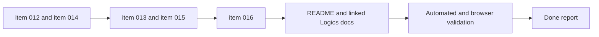

## task_003_orchestrate_mermaid_hardening_and_compact_header_focus_delivery - Orchestrate Mermaid hardening and compact header focus delivery

> From version: 0.1.0+final
> Schema version: 1.0
> Status: Done
> Understanding: 100%
> Confidence: 99%
> Progress: 100%
> Complexity: High
> Theme: UI
> Reminder: Update status/understanding/confidence/progress and dependencies/references when you edit this doc.

# Context

This task orchestrates the next shell and generation-hardening package after task 002.
It groups together three related streams that should be delivered in a controlled order:

- generated Mermaid hardening so invalid generated output is validated, normalized when safe, and rejected through app-owned error states
- compact desktop header refinement with icon-based preview controls
- mobile header consolidation plus a more immersive focus-preview takeover mode
- in that focus-preview mode, the main header remains as the only shell chrome and the preview surface becomes the only content below it

Execution constraints:

- implement the Mermaid hardening waves before the shell refactor so generation failures stay understandable while the UI is changing
- use `logics-ui-steering` on all header, burger-menu, and focus-mode waves
- keep the repository commit-ready at the end of each wave and update the linked Logics docs during that wave
- finish with browser validation on desktop and mobile flows, especially generation failure handling, header actions, burger menu behavior, and focus-preview mode with only the main header left above the preview surface

# Plan

- [x] 1. Confirm scope, dependencies, and acceptance criteria for `item_012`, `item_013`, `item_014`, `item_015`, and `item_016`.
- [x] 2. Wave 1: implement generated Mermaid validation before replacing editor source from `item_012`, then update linked docs and checkpoint the wave.
- [x] 3. Wave 2: replace Mermaid-native syntax fallback with app-owned error handling from `item_014`, then update linked docs and checkpoint the wave.
- [x] 4. Wave 3: move preview controls into a compact icon-based desktop header from `item_013`, then update linked docs and checkpoint the wave.
- [x] 5. Wave 4: add mobile burger navigation for header and preview controls from `item_015`, then update linked docs and checkpoint the wave.
- [x] 6. Wave 5: make preview focus feel full page and remove panel chrome from `item_016`, leaving only the main header above the preview surface, then update linked docs and checkpoint the wave.
- [x] 7. Finalize README and affected Logics docs, then run automated plus browser validation for the full package.
- [x] CHECKPOINT: leave the current wave commit-ready and update the linked Logics docs before continuing.
- [x] FINAL: update related Logics docs and README before closure

# Delivery checkpoints

- Each completed wave should leave the repository in a coherent, commit-ready state.
- Update the linked Logics docs during the wave that changes the behavior, not only at final closure.
- Prefer a reviewed commit checkpoint at the end of each meaningful wave instead of accumulating several undocumented partial states.

# AC Traceability

- AC1 -> `item_012_validate_generated_mermaid_before_replacing_editor_source`: generated Mermaid is validated and lightly normalized before it can replace the editor source. Proof: automated tests and representative generated-output checks.
- AC2 -> `item_014_replace_mermaid_native_syntax_fallback_with_app_owned_error_handling`: Mermaid-native syntax fallback visuals are replaced by app-owned error handling. Proof: browser validation and automated tests around invalid generated output.
- AC3 -> `item_013_move_preview_controls_into_a_compact_icon_based_header`: preview controls move into a compact icon-based desktop header with understandable labels. Proof: desktop browser validation and responsive UI checks.
- AC4 -> `item_015_add_mobile_burger_navigation_for_header_and_preview_controls`: mobile header actions are grouped into one burger menu together with `Settings`. Proof: mobile browser validation and interaction checks.
- AC5 -> `item_016_make_preview_focus_feel_full_page_and_remove_panel_chrome`: focus mode feels like a full-page takeover rather than a decorated panel, with only the main header left above the preview surface. Proof: desktop and mobile browser validation in focus mode.
- AC6 -> Documentation closure: README and linked Logics docs reflect the delivered shell and hardening behavior. Proof: updated docs and final report.

# Decision framing

- Product framing: Required
- Product signals: conversion journey, navigation and discoverability, experience scope
- Product follow-up: Keep this orchestration synchronized with `prod_000_mermaid_generator_product_direction` while the shell and focus flows evolve.
- Architecture framing: Required
- Architecture signals: contracts and integration, runtime and boundaries, data model and persistence
- Architecture follow-up: Keep this orchestration synchronized with `adr_000_choose_a_static_pwa_architecture_for_mermaid_generator` while generated Mermaid validation and preview fallback handling evolve.

# Links

- Product brief(s): `prod_000_mermaid_generator_product_direction`
- Architecture decision(s): `adr_000_choose_a_static_pwa_architecture_for_mermaid_generator`
- Backlog item: `item_012_validate_generated_mermaid_before_replacing_editor_source`, `item_013_move_preview_controls_into_a_compact_icon_based_header`, `item_014_replace_mermaid_native_syntax_fallback_with_app_owned_error_handling`, `item_015_add_mobile_burger_navigation_for_header_and_preview_controls`, `item_016_make_preview_focus_feel_full_page_and_remove_panel_chrome`
- Request(s): `req_007_harden_generated_mermaid_validation_and_error_handling`, `req_008_compact_header_and_move_preview_controls_into_icon_based_navigation`, `req_009_make_preview_focus_feel_full_page_instead_of_panel_based`

# AI Context

- Summary: Orchestrate the next Mermaid Generator delivery package across generated Mermaid hardening, compact header controls, mobile burger navigation, and immersive focus-preview behavior where only the main header remains above the preview surface.
- Keywords: mermaid hardening, syntax fallback, compact header, icon controls, burger menu, focus preview, shell refinement
- Use when: Use when executing the coordinated wave set that combines generated Mermaid hardening with the next shell and focus-mode refinements.
- Skip when: Skip when the work is an isolated fix inside only one backlog item with no orchestration need.

# Validation

- `python3 logics/skills/logics-doc-linter/scripts/logics_lint.py`
- `npm run lint`
- `npm run typecheck`
- `npm run test`
- `npm run build`
- `npm run test:e2e`
- Browser validation for invalid generated Mermaid fallback handling, compact desktop header controls, mobile burger navigation, and focus-preview takeover behavior

# Definition of Done (DoD)

- [x] Scope implemented and acceptance criteria covered.
- [x] Validation commands executed and results captured.
- [x] Linked request/backlog/task docs updated during completed waves and at closure.
- [x] Each completed wave left a commit-ready checkpoint or an explicit exception is documented.
- [x] `README.md` is refreshed if the visible shell or focus-mode behavior changes materially.
- [x] Status is `Done` and progress is `100%`.

# Report

- Wave 5 completed: focus mode now removes preview-local headings and panel framing, stretches the preview stage across the content area below the sticky header, and keeps the mobile header menu closable while open by keeping the header interaction layer above the mobile backdrop.
- Finalization completed: README now reflects header-owned controls, mobile burger navigation, focus mode as a header-plus-preview surface, generated Mermaid validation before source replacement, and app-owned preview fallback copy.
- Validation completed on the final state with `python3 logics/skills/logics-doc-linter/scripts/logics_lint.py`, `npm run lint`, `npm run typecheck`, `npm run test`, `npm run build`, and `npm run test:e2e`.
