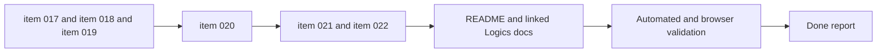

## task_004_orchestrate_modal_system_standardization_and_mermaid_share_link_delivery - Orchestrate modal system standardization and Mermaid share link delivery

> From version: 0.1.0+wave6
> Schema version: 1.0
> Status: Done
> Understanding: 99%
> Confidence: 97%
> Progress: 100%
> Complexity: High
> Theme: UI
> Reminder: Update status/understanding/confidence/progress and dependencies/references when you edit this doc.

# Context

This task orchestrates the next workspace polish and sharing package after task 003.
It groups together three related streams that should be delivered in a controlled order:

- shared modal-system standardization for scroll behavior on short viewports
- shared modal overlay and backdrop layering across mobile and desktop shell rules
- shareable Mermaid URLs with runtime hydration, export-modal creation, clipboard copy, and toast feedback
- one small preview-panel consistency fix that can ride inside the same shell package without coupling to the share flow

Execution constraints:

- deliver the shared modal foundations before the modal-specific polish so `Settings` and `Export` can reuse the same behavior
- keep the desktop shell exception explicit: the header may stay visible while the modal backdrop still covers the rest of the page
- implement the shared Mermaid URL hydration contract before the export modal grows the share-link creation action
- keep the repository commit-ready at the end of each wave and update the linked Logics docs during that wave
- finish with browser validation on desktop and mobile flows, especially modal scroll, modal overlay coverage, settings keyboard dismissal, preview header alignment, and shared Mermaid URL loading

# Plan

- [ ] 1. Confirm scope, dependencies, and linked acceptance criteria.
- [x] 1. Confirm scope, dependencies, and linked acceptance criteria.
- [x] 2. Wave 1: standardize modal internal scrolling across current modal surfaces from `item_017`, then update linked docs and checkpoint the wave.
- [x] 3. Wave 2: standardize modal overlay coverage and layer ordering across viewports from `item_018`, then update linked docs and checkpoint the wave.
- [x] 4. Wave 3: add keyboard dismissal semantics to the settings modal from `item_019`, then update linked docs and checkpoint the wave.
- [x] 5. Wave 4: align preview panel header spacing with the workspace panel system from `item_020`, then update linked docs and checkpoint the wave.
- [x] 6. Wave 5: add URL hydration support for shared Mermaid diagrams from `item_021`, then update linked docs and checkpoint the wave.
- [x] 7. Wave 6: add the export modal share link action with clipboard toast from `item_022`, then update linked docs and checkpoint the wave.
- [x] 8. Finalize README and affected Logics docs, then run automated plus browser validation for the full package.
- [x] CHECKPOINT: leave the current wave commit-ready and update the linked Logics docs before continuing.
- [x] FINAL: update related Logics docs and README before closure

# Delivery checkpoints

- Each completed wave should leave the repository in a coherent, commit-ready state.
- Update the linked Logics docs during the wave that changes the behavior, not only at final closure.
- Prefer a reviewed commit checkpoint at the end of each meaningful wave instead of accumulating several undocumented partial states.

# AC Traceability

- AC1 -> `item_017_standardize_modal_internal_scrolling_across_current_modal_surfaces`: current app modals remain scrollable and usable on short viewports. Proof: desktop and mobile modal validation.
- AC2 -> `item_018_standardize_modal_overlay_coverage_and_layer_ordering_across_viewports`: mobile modals fully dominate the page and desktop preserves the header only as an explicit shell exception while the backdrop still covers the rest. Proof: responsive overlay validation.
- AC3 -> `item_019_add_keyboard_dismissal_semantics_to_the_settings_modal`: the Settings modal closes on `Escape` with the same effect as `Close`. Proof: keyboard interaction validation.
- AC4 -> `item_020_align_preview_panel_header_spacing_with_the_workspace_panel_system`: preview header spacing aligns with the rest of the workspace panel system. Proof: UI shell comparison and browser validation.
- AC5 -> `item_021_add_url_hydration_support_for_shared_mermaid_diagrams`: opening a supported shared Mermaid URL hydrates the editor and preview while preserving editability. Proof: shared URL browser validation.
- AC6 -> `item_022_add_export_modal_share_link_action_with_clipboard_toast`: the Export modal can generate, copy, and confirm a share link through a toast. Proof: export share-flow validation.
- AC7 -> Documentation closure: linked Logics docs and README reflect the delivered modal and sharing behavior. Proof: updated docs and final report.

# Decision framing

- Product framing: Required
- Product signals: conversion journey, navigation and discoverability, experience scope
- Product follow-up: Keep this orchestration synchronized with `prod_000_mermaid_generator_product_direction` while modal behavior and sharing evolve.
- Architecture framing: Required
- Architecture signals: contracts and integration, runtime and boundaries, data model and persistence
- Architecture follow-up: Keep this orchestration synchronized with `adr_000_choose_a_static_pwa_architecture_for_mermaid_generator` while modal layering and URL-state sharing evolve.

# Links

- Product brief(s): `prod_000_mermaid_generator_product_direction`
- Architecture decision(s): `adr_000_choose_a_static_pwa_architecture_for_mermaid_generator`
- Backlog item: `item_017_standardize_modal_internal_scrolling_across_current_modal_surfaces`, `item_018_standardize_modal_overlay_coverage_and_layer_ordering_across_viewports`, `item_019_add_keyboard_dismissal_semantics_to_the_settings_modal`, `item_020_align_preview_panel_header_spacing_with_the_workspace_panel_system`, `item_021_add_url_hydration_support_for_shared_mermaid_diagrams`, `item_022_add_export_modal_share_link_action_with_clipboard_toast`
- Request(s): `req_010_make_settings_modal_scrollable_and_dismissible_with_escape`, `req_011_align_preview_panel_header_spacing_with_other_panels`, `req_012_share_mermaid_diagrams_through_generated_urls_from_export`, `req_013_standardize_modal_scrolling_and_overlay_layering_across_viewports`

# AI Context

- Summary: Orchestrate the next Mermaid Generator package across shared modal-system standardization, settings keyboard dismissal, preview header consistency, and shareable Mermaid URL delivery from the export flow.
- Keywords: modal system, scrolling, overlay, backdrop, escape, preview header, share URL, clipboard, toast
- Use when: Use when executing the coordinated wave set that combines modal shell standardization with the new Mermaid share-link flow.
- Skip when: Skip when the work is an isolated fix inside only one backlog item with no orchestration need.

# Validation

- `python3 logics/skills/logics-doc-linter/scripts/logics_lint.py`
- `npm run lint`
- `npm run typecheck`
- `npm run test`
- `npm run build`
- `npm run test:e2e`
- Browser validation for modal scroll behavior, modal overlay coverage, settings keyboard dismissal, preview header alignment, and shared Mermaid URL loading plus export sharing

# Definition of Done (DoD)

- [x] Scope implemented and acceptance criteria covered.
- [x] Validation commands executed and results captured.
- [x] Linked request/backlog/task docs updated during completed waves and at closure.
- [x] Each completed wave left a commit-ready checkpoint or an explicit exception is documented.
- [x] `README.md` is refreshed if the visible modal or sharing behavior changes materially.
- [x] Status is `Done` and progress is `100%`.

# Report

- Wave 1 completed: current modal surfaces now use a shared viewport-bounded container with internal scroll regions so onboarding, settings, and export remain reachable on short mobile viewports without relying on page scroll behind the modal.
- Wave 2 completed: modal backdrops now preserve the sticky header area on desktop while still covering the rest of the page, and mobile keeps the modal overlay full-screen above the page chrome.
- Wave 3 completed: the Settings modal now closes on `Escape` through the same state path as the explicit `Close` action, with validation covering both unit-level and browser-level keyboard interaction.
- Wave 4 completed: the Preview header now reuses the shared panel header structure so its title sizing and spacing align with the other workspace panels while focus mode still strips preview-local chrome.
- Wave 5 completed: the app now understands shared Mermaid URL payloads, hydrates the editor source from supported links, keeps preview rendering in sync on load, and avoids surfacing onboarding on top of an opened shared diagram.
- Wave 6 completed: the Export modal now exposes a share-link action that copies a generated Mermaid URL to the clipboard, confirms success through a toast, and reuses the hydration contract so opening the copied link restores the source plus live preview state.
- Final closure completed: README and the linked request/task docs now reflect the shipped modal standards plus Mermaid sharing flow, with full lint, typecheck, unit, build, and browser validation executed for the package.
