## task_005_orchestrate_render_hardening_provider_expansion_and_in_app_changelog_delivery - Orchestrate Render hardening, provider expansion, and in-app changelog delivery

> From version: 0.1.0
> Schema version: 1.0
> Status: Done
> Understanding: 99%
> Confidence: 97%
> Progress: 100%
> Complexity: High
> Theme: Hardening
> Reminder: Update status/understanding/confidence/progress and dependencies/references when you edit this doc.

# Context

This task orchestrates the next post-release hardening and expansion package after task 004.
It groups together five related request tracks:

- Render deployment contract and operator runbook
- frontend bundle-weight and PWA delivery improvements
- runtime security and repository maintainability hardening
- provider expansion with `Grok` and `Mistral` plus a scalable `Settings` UX
- an in-app changelog history surface available from `Settings` and mobile navigation

Execution constraints:

- establish the deployment contract and operator runbook early so the release model is explicit before further delivery changes land
- treat Mermaid rendering hardening as an early wave because it carries the highest runtime risk
- keep bundle, cache, and PWA delivery work grouped so performance tradeoffs are evaluated coherently
- sequence provider plumbing before the `Settings` UX rework that depends on the expanded catalog
- deliver the changelog reader surface before wiring every shell entry point to it
- keep the repository commit-ready at the end of each wave and update linked Logics docs during the same wave

```mermaid
%% logics-kind: task
%% logics-signature: task|orchestrate-render-hardening-provider-ex|item-023-define-render-deployment-contra|1-confirm-scope-dependencies-request-ove|python3-logics-skills-logics-doc-linter-
flowchart LR
    Deploy[item 023 and item 024] --> Security[item 027]
    Security --> Perf[item 025 and item 026]
    Perf --> Structure[item 028 and item 029]
    Structure --> Providers[item 030 and item 031]
    Providers --> Changelog[item 032 and item 033]
    Changelog --> Validation[Docs and validation]
    Validation --> Report[Done report]
```

# Plan

- [x] 1. Confirm scope, dependencies, request overlap, and wave sequencing across items `023` to `033`.
- [x] 2. Wave 1: deliver the Render deployment contract and release-source strategy from `item_023`, then update linked docs and checkpoint the wave.
- [x] 3. Wave 2: deliver the Render setup, validation, and rollback runbook from `item_024`, then update linked docs and checkpoint the wave.
- [x] 4. Wave 3: harden the shared Mermaid rendering and DOM injection boundaries from `item_027`, then update linked docs and checkpoint the wave.
- [x] 5. Wave 4: profile and split heavy frontend chunks from `item_025`, then update linked docs and checkpoint the wave.
- [x] 6. Wave 5: align Render cache and PWA precache behavior from `item_026`, then update linked docs and checkpoint the wave.
- [x] 7. Wave 6: reduce App shell concentration and clean stale code or docs from `item_028` and `item_029`, then update linked docs and checkpoint the wave.
- [x] 8. Wave 7: add direct `Grok` and `Mistral` provider support from `item_030`, then update linked docs and checkpoint the wave.
- [x] 9. Wave 8: rework `Settings` provider management for the growing provider catalog from `item_031`, then update linked docs and checkpoint the wave.
- [x] 10. Wave 9: add the scrollable in-app changelog history modal from `item_032`, then update linked docs and checkpoint the wave.
- [x] 11. Wave 10: add changelog entry points in `Settings` and the mobile burger menu from `item_033`, then update linked docs and checkpoint the wave.
- [x] 12. Finalize README and affected Logics docs, then run the full automated plus browser validation set for the package.
- [x] CHECKPOINT: leave the current wave commit-ready and update linked Logics docs before continuing.
- [x] FINAL: update related Logics docs and README before closure.

# Delivery checkpoints

- Each completed wave should leave the repository in a coherent, commit-ready state.
- Update linked Logics docs during the wave that changes the behavior, not only at final closure.
- Prefer reviewed commit checkpoints at the end of each wave instead of accumulating several undocumented partial states.

# AC Traceability

- AC1 -> `item_023_define_render_deployment_contract_and_release_source_strategy`: the Render service contract and branch/tag release-source strategy are explicit. Proof: deployment contract documentation review.
- AC2 -> `item_024_document_render_setup_validation_and_rollback_runbook`: first-time setup, validation, and rollback are documented for operators. Proof: runbook review.
- AC3 -> `item_025_profile_and_split_heavy_frontend_chunks_without_regressing_core_flows`, `item_026_align_render_cache_and_pwa_precache_behavior_with_static_asset_delivery`: frontend load cost and delivery behavior are improved intentionally. Proof: build output and validation review.
- AC4 -> `item_027_harden_shared_mermaid_rendering_and_dom_injection_boundaries`: the Mermaid render path no longer relies on implicit permissive trust assumptions. Proof: security-path review plus regression validation.
- AC5 -> `item_028_reduce_app_shell_concentration_by_extracting_high_volatility_workspace_modules`, `item_029_clean_dead_code_and_realign_public_project_messaging_with_the_shipped_state`: code concentration and repo hygiene are improved without breaking current flows. Proof: structural diff, doc review, and validation.
- AC6 -> `item_030_add_direct_grok_and_mistral_provider_support_to_the_llm_adapter_layer`, `item_031_rework_settings_provider_management_for_a_growing_provider_catalog`: provider expansion and settings scalability are delivered coherently. Proof: provider and settings browser validation.
- AC7 -> `item_032_add_a_scrollable_in_app_changelog_history_modal`, `item_033_add_changelog_entry_points_to_settings_and_mobile_burger_navigation`: the app exposes a scrollable changelog history modal with desktop and mobile entry points. Proof: browser validation and changelog-history review.

# Decision framing

- Product framing: Required
- Product signals: conversion journey, navigation and discoverability, experience scope
- Product follow-up: Keep the product shell coherent while deploy guidance, settings UX, and changelog discoverability evolve together.
- Architecture framing: Required
- Architecture signals: deployment and environments, runtime and boundaries, security and trust, performance and capacity, code organization and ownership
- Architecture follow-up: Keep this orchestration aligned with the static PWA ADR while hardening runtime behavior and expanding provider support.

# Links

- Product brief(s): `prod_000_mermaid_generator_product_direction`
- Architecture decision(s): `adr_000_choose_a_static_pwa_architecture_for_mermaid_generator`
- Backlog item: `item_023_define_render_deployment_contract_and_release_source_strategy`, `item_024_document_render_setup_validation_and_rollback_runbook`, `item_025_profile_and_split_heavy_frontend_chunks_without_regressing_core_flows`, `item_026_align_render_cache_and_pwa_precache_behavior_with_static_asset_delivery`, `item_027_harden_shared_mermaid_rendering_and_dom_injection_boundaries`, `item_028_reduce_app_shell_concentration_by_extracting_high_volatility_workspace_modules`, `item_029_clean_dead_code_and_realign_public_project_messaging_with_the_shipped_state`, `item_030_add_direct_grok_and_mistral_provider_support_to_the_llm_adapter_layer`, `item_031_rework_settings_provider_management_for_a_growing_provider_catalog`, `item_032_add_a_scrollable_in_app_changelog_history_modal`, `item_033_add_changelog_entry_points_to_settings_and_mobile_burger_navigation`
- Request(s): `req_014_define_a_render_deployment_plan_for_mermaid_generator`, `req_015_reduce_render_bundle_weight_and_pwa_precache_cost`, `req_016_harden_runtime_security_delivery_performance_and_repo_maintainability`, `req_017_add_grok_and_mistral_providers_and_rework_settings_provider_ux`, `req_018_add_an_in_app_changelog_modal_accessible_from_settings_and_mobile_navigation`

# AI Context

- Summary: Orchestrate the next hardening and product-expansion package across Render deployment planning, runtime security, performance delivery, provider growth, settings UX scaling, and in-app changelog history.
- Keywords: Render, hardening, security, bundle size, PWA, provider expansion, settings UX, changelog modal
- Use when: Use when executing the coordinated post-release package spanning requests 014 through 018.
- Skip when: Skip when the work is an isolated fix inside only one backlog item with no orchestration need.

# Validation

- `python3 logics/skills/logics-doc-linter/scripts/logics_lint.py`
- `npm run lint`
- `npm run typecheck`
- `npm run test`
- `npm run build`
- `npm run quality:pwa`
- `npm run test:e2e`
- Browser validation for Render-deploy assumptions, shared Mermaid rendering safety, provider management flows, and in-app changelog access on desktop and mobile

# Definition of Done (DoD)

- [x] Scope implemented and acceptance criteria covered.
- [x] Validation commands executed and results captured.
- [x] Linked request/backlog/task docs updated during completed waves and at closure.
- [x] Each completed wave left a commit-ready checkpoint or an explicit exception is documented.
- [x] `README.md` is refreshed if delivery, provider, or changelog behavior changes materially.
- [x] Status is `Done` and progress is `100%`.

# Report

- Waves 1 and 2 completed: the Render deployment contract is now explicit in `README.md`, `render.yaml`, and `adr_001_define_static_deployment_and_release_branch_workflow.md`, including canonical Static Site settings, `release` as the operator-facing deployment branch, pre/post-deploy checks, and rollback guidance.
- Waves 3, 4, and 5 completed: the Mermaid preview trust model is now hardened through strict Mermaid rendering plus SVG sanitization, the app shell has been split into smaller header/workspace/modal modules, and delivery behavior now uses explicit asset caching plus a reduced PWA precache footprint aligned with the static hosting model.
- Waves 6, 7, and 8 completed: stale implementation surfaces were removed, public project messaging was realigned with the shipped product state, direct `Grok` and `Mistral` providers were added to the normalized adapter layer, and the Settings modal now scales through a provider navigation plus detail-pane UX.
- Waves 9 and 10 completed: the app now exposes a scrollable in-app changelog history modal backed by the versioned changelog files, with entry points from both Settings and the mobile burger navigation.
- Validation completed: `python3 logics/skills/logics-doc-linter/scripts/logics_lint.py`, `npm run lint`, `npm run typecheck`, `npm run test`, `npm run build`, `npm run quality:pwa`, and `npm run test:e2e` all pass after delivery.
- Explicit tradeoff captured: initial load and precache cost are materially improved, but Vite still warns about `mermaid.core` and `wardley` chunks above 500 kB; this remains a documented follow-up performance target rather than an untracked regression.
