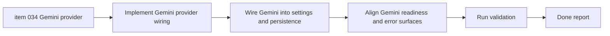

## task_006_orchestrate_gemini_provider_delivery - Orchestrate Gemini provider delivery
> From version: 0.1.0
> Schema version: 1.0
> Status: Done
> Understanding: 99%
> Confidence: 98%
> Progress: 100%
> Complexity: Medium
> Theme: Integration
> Reminder: Update status/understanding/confidence/progress and dependencies/references when you edit this doc.

# Context
This task delivers the next provider expansion slice after the current multi-provider work added `Grok` and `Mistral`.
The goal is to integrate `Gemini API` as another direct browser-side BYOK provider while preserving the current generation contract, local key storage, provider selection behavior, and app-owned error surfaces.

Execution constraints:

- keep Gemini inside the existing static PWA and BYOK architecture
- avoid any backend relay or project-managed secret
- preserve the current `Settings` and prompt-panel behavior except where Gemini must be wired into the existing provider catalog
- validate both the happy path and provider-specific error behavior

# Plan
- [x] 1. Confirm Gemini scope against the current provider abstraction, persistence model, and existing provider catalog.
- [x] 2. Wave 1: add direct Gemini provider support in the LLM adapter layer and keep the normalized generation contract intact.
- [x] 3. Wave 2: wire Gemini into provider settings, active-provider handling, and readiness state in the current UI.
- [x] 4. Wave 3: validate Gemini-specific failure handling and ensure the prompt panel keeps the current error UX conventions.
- [x] 5. Finalize linked Logics docs and README if Gemini materially changes the documented provider list.
- [x] CHECKPOINT: leave the repository commit-ready at the end of each wave and update linked docs during the same wave.
- [x] FINAL: capture validation evidence and close linked docs when the slice is complete.

# Delivery checkpoints
- Each completed wave should leave the repository in a coherent, commit-ready state.
- Update linked Logics docs during the wave that changes the behavior, not only at final closure.
- Prefer one meaningful commit checkpoint per wave instead of stacking undocumented partial changes.

# AC Traceability
- AC1 -> `item_034_add_direct_gemini_provider_support_to_the_browser_side_llm_flow`: Gemini is available as a direct selectable provider. Proof: provider configuration review.
- AC2 -> `item_034_add_direct_gemini_provider_support_to_the_browser_side_llm_flow`: Gemini key storage and active-provider switching work in the current settings flow. Proof: settings and local-persistence validation.
- AC3 -> `item_034_add_direct_gemini_provider_support_to_the_browser_side_llm_flow`: the normalized prompt-generation contract stays intact. Proof: generation-path validation.
- AC4 -> `item_034_add_direct_gemini_provider_support_to_the_browser_side_llm_flow`: Gemini failures flow through the existing provider error UX. Proof: provider error-state validation.

# Decision framing
- Product framing: Required
- Product signals: experience scope, conversion journey
- Product follow-up: Keep Gemini consistent with the current provider-selection model rather than adding bespoke UX.
- Architecture framing: Required
- Architecture signals: contracts and integration, runtime and boundaries
- Architecture follow-up: Preserve the browser-side BYOK static architecture while extending the provider adapter matrix.

# Links
- Product brief(s): `prod_000_mermaid_generator_product_direction`
- Architecture decision(s): `adr_000_choose_a_static_pwa_architecture_for_mermaid_generator`
- Backlog item: `item_034_add_direct_gemini_provider_support_to_the_browser_side_llm_flow`
- Request(s): `req_019_add_gemini_api_as_a_supported_provider`

# AI Context
- Summary: Orchestrate Gemini API delivery as a direct BYOK provider inside the app’s existing normalized multi-provider generation flow.
- Keywords: gemini, provider, byok, settings, llm, integration, prompt generation
- Use when: Use when implementing and validating the Gemini provider slice end to end.
- Skip when: Skip when the work is an unrelated provider-agnostic UI tweak.

# Validation
- `python3 logics/skills/logics-doc-linter/scripts/logics_lint.py`
- `npm run lint`
- `npm run test -- src/tests/llm.spec.ts src/tests/app.spec.tsx`
- `npm run build`
- Browser validation for Gemini key setup, provider switching, prompt generation, and provider-specific error feedback

# Definition of Done (DoD)
- [x] Scope implemented and acceptance criteria covered.
- [x] Validation commands executed and results captured.
- [x] Linked request/backlog/task docs updated during completed waves and at closure.
- [x] Each completed wave left a commit-ready checkpoint or an explicit exception is documented.
- [x] `README.md` is refreshed if the provider list changes materially.
- [x] Status is `Done` and progress is `100%`.

# Report
- Wave 1 completed: `Gemini API` is now part of the normalized provider catalog in `src/lib/llm.ts`, using Google’s direct OpenAI-compatible endpoint and a stable `gemini-2.5-flash` default model.
- Wave 2 completed: the existing provider settings and active-provider flow picked up Gemini automatically through the shared provider catalog and local provider-key store, so no bespoke UI branch was needed.
- Wave 3 completed: Gemini request success and failure paths are now covered in `src/tests/llm.spec.ts`, and the app-level settings visibility is covered in `src/tests/app.spec.tsx` plus the provider-catalog smoke assertion.
- Documentation updated: `README.md` now includes Gemini in the visible provider list and provider setup overview.
- Validation completed: `python3 logics/skills/logics-doc-linter/scripts/logics_lint.py`, `npm run lint`, `npm run test -- src/tests/llm.spec.ts src/tests/app.spec.tsx`, and `npm run build` pass. Browser validation on a fresh preview instance confirms that Gemini appears in `Settings` alongside the existing providers.
- Explicit note: the targeted Playwright smoke command against the default local config reused an older preview server and therefore did not reflect the latest provider catalog; a fresh preview on a separate port confirmed the Gemini UI state.
