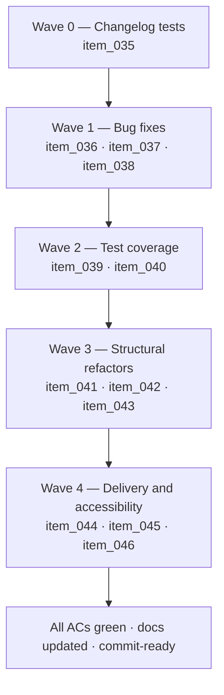

## task_007_orchestrate_post_020_audit_hardening_and_quality_wave - Orchestrate post-0.2.0 audit hardening and quality wave

> From version: 0.2.0
> Schema version: 1.0
> Status: Done
> Understanding: 98%
> Confidence: 97%
> Progress: 100%
> Complexity: High
> Theme: Hardening
> Reminder: Update status/understanding/confidence/progress and dependencies/references when you edit this doc.

# Context

This task delivers all the improvements identified in the post-0.2.0 audit across five sequential waves. The wave ordering is designed so that high-priority bug fixes ship first, test coverage is added before structural refactors, and delivery/accessibility work closes the wave independently of code-level changes.

Execution constraints:

- keep the project as a static browser-first app hosted on Render — no backend proxy is in scope
- every wave must leave the repository in a coherent, commit-ready state before the next wave begins
- the existing `npm run ci:local` pipeline (lint + typecheck + tests + build + quality:pwa) is the primary regression guard
- update linked backlog item statuses and progress during the wave that changes the behavior, not only at final closure

# Plan

- [x] **Wave 0 — Changelog tests** (`item_035`)
  - [x] 0.1. Read `src/tests/changelog.spec.ts` and `src/lib/changelog.ts` to understand the current assertion structure.
  - [x] 0.2. Refactor version-specific assertions to relative structural assertions (ordering, shape, normalization) that do not name a specific latest version string.
  - [x] 0.3. Run `npm run test -- src/tests/changelog.spec.ts` and verify all AC1–AC5 pass.
  - [x] 0.4. Update `item_035` status to Done, commit.

- [x] **Wave 1 — Bug fixes** (`item_036`, `item_037`, `item_038`)
  - [x] 1.1. **Anthropic CORS warning** (`item_036`): read `src/components/modals/SettingsModal.tsx` and `src/lib/llm.ts`. Add an inline warning banner when the Anthropic provider is selected. Improve the prompt-panel error message for network-level failures on the Anthropic path.
  - [x] 1.2. **exporters.ts fixes** (`item_037`): read `src/lib/exporters.ts`. Remove `async` from `downloadDiagramAsSvg`. Add `URL.revokeObjectURL` to the `image.onerror` branch of `downloadDiagramAsPng`.
  - [x] 1.3. **E2E version string** (`item_038`): read `tests/e2e/smoke.spec.ts`. Update the version assertion to match the current build version dynamically or update it to `0.2.0` with a comment documenting the update strategy.
  - [x] 1.4. Run `npm run ci:local`. Fix any regressions before proceeding.
  - [x] 1.5. Update `item_036`, `item_037`, `item_038` status to Done, commit.

- [x] **Wave 2 — Test coverage** (`item_039`, `item_040`)
  - [x] 2.1. **exporters unit tests** (`item_039`): create `src/tests/exporters.spec.ts`. Mock `URL.createObjectURL`, `URL.revokeObjectURL`, `HTMLCanvasElement.prototype.toBlob`, and anchor `click`. Cover SVG path (Blob creation, anchor trigger, URL revocation) and PNG path (canvas pipeline, correct scale, anchor trigger, revocation on success and on `image.onerror`).
  - [x] 2.2. **Playwright Firefox** (`item_040`): read `playwright.config.ts`. Add `{ name: 'firefox', use: { ...devices['Desktop Firefox'] } }` to the projects array. Run `npm run test:e2e` and confirm all scenarios pass on both Chromium and Firefox. Skip-annotate any known Firefox limitation with a comment.
  - [x] 2.3. Run `npm run ci:local` plus `npm run test:e2e`. Fix any regressions.
  - [x] 2.4. Update `item_039`, `item_040` status to Done, commit.

- [x] **Wave 3 — Structural refactors** (`item_041`, `item_042`, `item_043`)
  - [x] 3.1. **usePreviewInteraction hook** (`item_041`): create `src/hooks/usePreviewInteraction.ts`. Move viewport state, zoom/pan/fit handlers, `handlePreviewWheel`, and the ResizeObserver fit effect from `App.tsx` into the hook. Consume the hook in `App.tsx`. Add a unit test for `handlePreviewWheel` coordinate translation in `src/tests/usePreviewInteraction.spec.ts`.
  - [x] 3.2. **useExport + useChangelog hooks** (`item_042`): create `src/hooks/useExport.ts` and `src/hooks/useChangelog.ts`. Move export state/handlers and changelog loading state/effect into their respective hooks. Consume both in `App.tsx`.
  - [x] 3.3. **AppHeader unification + path alias** (`item_043`): collapse `HeaderActionButton` and `MobileMenuActionButton` into a single `ActionButton` with a `variant` prop in `AppHeader.tsx`. Add `"@/*": ["src/*"]` to `tsconfig.app.json` `paths` and the matching `resolve.alias` to `vite.config.ts`. Migrate existing imports across the codebase to use `@/`.
  - [x] 3.4. Run `npm run ci:local` and `npm run test:e2e`. Fix any regressions. Verify `App.tsx` line count has decreased meaningfully.
  - [x] 3.5. Update `item_041`, `item_042`, `item_043` status to Done, commit.

- [x] **Wave 4 — Delivery and accessibility** (`item_044`, `item_045`, `item_046`)
  - [x] 4.1. **CSP header** (`item_044`): read `render.yaml`. Define a `Content-Security-Policy` header covering `default-src 'self'`, `script-src`, `style-src`, `img-src` (data URIs), `connect-src` (all six LLM provider base URLs), and `worker-src` (Service Worker). Block `unsafe-eval`. Add `unsafe-inline` for styles only if Mermaid's inline style attributes require it, with an explanatory comment. Validate on a deployed Render preview.
  - [x] 4.2. **PWA PNG icons** (`item_045`): generate 192×192 and 512×512 PNG icons from the existing SVG source (use `@vite-pwa/assets-generator` or a one-shot build script). Add both to `public/` (or the equivalent configured assets directory). Reference them in the PWA manifest with correct `type`, `sizes`, and `purpose` fields. Run a Lighthouse audit on a deployed preview to confirm installability passes.
  - [x] 4.3. **Radiogroup arrow-key navigation** (`item_046`): read `src/components/modals/SettingsModal.tsx` and `src/components/modals/ExportModal.tsx`. Add ArrowDown/Right (next, wrapping) and ArrowUp/Left (previous, wrapping) `onKeyDown` handlers on the radiogroup. Apply roving `tabIndex`: `0` on the selected option, `-1` on all others.
  - [x] 4.4. Run `npm run ci:local` and `npm run test:e2e`. Manual keyboard validation for radiogroup navigation. Manual validation of CSP and PWA on a Render preview branch.
  - [x] 4.5. Update `item_044`, `item_045`, `item_046` status to Done, commit.

- [x] **CHECKPOINT**: all 12 backlog items are Done, `npm run ci:local` is green, `npm run test:e2e` is green on Chromium and Firefox.
- [x] **FINAL**: update this task's status to Done, progress to 100%, and capture the validation report below.

# Delivery checkpoints

- Each wave must leave the repository in a coherent, commit-ready state before the next wave begins.
- Update linked backlog item statuses during the wave that changes the behavior, not only at final closure.
- Prefer one meaningful commit checkpoint per wave rather than stacking undocumented partial changes.

# AC Traceability

| AC                             | Backlog item | Wave   |
| ------------------------------ | ------------ | ------ |
| req_020 AC1–AC5                | `item_035`   | Wave 0 |
| req_021 AC1                    | `item_036`   | Wave 1 |
| req_021 AC2–AC3                | `item_037`   | Wave 1 |
| req_021 AC4                    | `item_038`   | Wave 1 |
| req_021 AC5                    | `item_039`   | Wave 2 |
| req_021 AC6                    | `item_040`   | Wave 2 |
| req_021 AC7 (preview)          | `item_041`   | Wave 3 |
| req_021 AC7 (export/changelog) | `item_042`   | Wave 3 |
| req_021 AC8–AC9                | `item_043`   | Wave 3 |
| req_021 AC10                   | `item_044`   | Wave 4 |
| req_021 AC11                   | `item_045`   | Wave 4 |
| req_021 AC12                   | `item_046`   | Wave 4 |

# Decision framing

- Product framing: Required
- Product signals: experience scope, release workflow, conversion journey
- Product follow-up: Consider a 0.3.0 release once this wave is complete and all ACs are green.
- Architecture framing: Required
- Architecture signals: contracts and integration, runtime and boundaries, security model
- Architecture follow-up: Update the ADR or add a security note documenting the CSP directives and the hook extraction architecture once Wave 4 is complete.

# Links

- Product brief(s): `prod_000_mermaid_generator_product_direction`
- Architecture decision(s): `adr_000_choose_a_static_pwa_architecture_for_mermaid_generator`
- Request(s):
  - `req_020_make_changelog_tests_release_agnostic`
  - `req_021_address_post_020_audit_findings_across_bugs_tests_structure_and_delivery`
- Backlog items:
  - `item_035_make_changelog_tests_release_agnostic`
  - `item_036_surface_anthropic_cors_constraint_as_an_explicit_provider_warning`
  - `item_037_fix_exporters_async_inconsistency_and_blob_url_leak_on_error_path`
  - `item_038_fix_stale_version_string_in_e2e_smoke_test`
  - `item_039_add_unit_test_coverage_for_exporters_svg_and_png_download_paths`
  - `item_040_expand_playwright_configuration_to_include_firefox`
  - `item_041_extract_preview_interaction_logic_from_app_into_use_preview_interaction_hook`
  - `item_042_extract_export_orchestration_and_changelog_loading_from_app_into_dedicated_hooks`
  - `item_043_unify_appheader_action_button_and_add_typescript_path_alias`
  - `item_044_add_content_security_policy_header_to_render_static_delivery`
  - `item_045_add_png_icons_to_pwa_manifest_for_installability`
  - `item_046_implement_arrow_key_navigation_for_provider_and_scale_radiogroups`

# AI Context

- Summary: Orchestrate 12 backlog items across 5 waves — changelog tests, bug fixes (CORS, exporters, E2E), test coverage (exporters unit tests, Playwright Firefox), structural refactors (App.tsx hooks, AppHeader, path alias), and delivery/accessibility (CSP, PWA icons, radiogroup keyboard nav).
- Keywords: hardening, quality, audit, CORS, Anthropic, exporters, Playwright, Firefox, hooks, App.tsx, refactor, CSP, PWA, icons, accessibility, radiogroup, changelog tests
- Use when: Use when implementing any part of the post-0.2.0 audit hardening wave.
- Skip when: Skip when the work concerns a new provider integration, a new diagram feature, or changelog content.

# Validation

- `python3 logics/skills/logics-doc-linter/scripts/logics_lint.py`
- `npm run lint`
- `npm run typecheck`
- `npm run test`
- `npm run build`
- `npm run quality:pwa`
- `npm run test:e2e` (Chromium + Firefox after Wave 2)
- Lighthouse PWA audit on a deployed Render preview (after Wave 4)
- Manual keyboard validation of radiogroup navigation (after Wave 4)
- Manual browser validation of CSP (after Wave 4)

# Definition of Done (DoD)

- [ ] All 12 backlog items are marked Done with progress 100%.
- [ ] `npm run ci:local` is green.
- [ ] `npm run test:e2e` is green on Chromium and Firefox.
- [ ] Lighthouse PWA installability check passes on a deployed preview.
- [ ] CSP header is present and validated on a deployed Render preview.
- [ ] Radiogroup arrow-key navigation works correctly in SettingsModal and ExportModal.
- [ ] Linked request and backlog docs are updated during their respective waves.
- [ ] Status is `Done` and progress is `100%`.

# Report

- `npm run ci:local` passed after each completed wave and on the final integrated state.
- `npm run test:e2e` passed on both Chromium and Firefox with 32 green smoke scenarios, including the new radiogroup keyboard-navigation coverage.
- `src/App.tsx` dropped from 1040 lines to 705 lines after the hook extraction wave.
- `sips` generated committed `public/icon-192.png` and `public/icon-512.png`, and the PWA manifest now advertises SVG + PNG install targets.
- `render.yaml` now serves a route-wide CSP that keeps `script-src 'self'`, blocks `unsafe-eval`, and limits `connect-src` to the six supported provider origins.
- Render-preview-specific CSP header verification and deployed Lighthouse confirmation still require a pushed preview deployment; the local build, manifest, and E2E suite are green.
