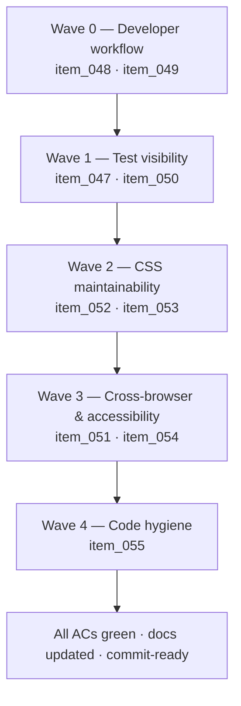

## task_008_orchestrate_post_030_developer_tooling_and_quality_wave - Orchestrate post-0.3.0 developer tooling and quality wave

> From version: 0.3.0
> Schema version: 1.0
> Status: In Progress
> Understanding: 95%
> Confidence: 95%
> Progress: 80%
> Complexity: High
> Theme: Hardening
> Reminder: Update status/understanding/confidence/progress and dependencies/references when you edit this doc.

# Context

This task delivers all the developer tooling, test visibility, CSS maintainability, and accessibility automation improvements identified in the post-0.3.0 audit across five sequential waves. The wave ordering is designed so that foundational tooling ships first (formatter, hooks), test infrastructure follows, then structural CSS refactors run on a fully validated baseline, and cross-browser + accessibility work closes the wave.

Execution constraints:

- every wave must leave the repository in a coherent, commit-ready state before the next wave begins
- the existing `npm run ci:local` pipeline (lint + typecheck + tests + build + quality:pwa) is the primary regression guard
- CSS refactoring waves must not change any rendered visual output
- update linked backlog item statuses and progress during the wave that changes the behavior, not only at final closure

# Plan

- [x] **Wave 0 — Developer workflow** (`item_048`, `item_049`)
  - [x] 0.1. **Pre-commit hooks** (`item_048`): install `husky` and `lint-staged` as devDependencies. Add a `prepare` script to `package.json`. Configure `.husky/pre-commit` to run `npx lint-staged`. Configure `lint-staged` in `package.json` to run `eslint --fix` on staged `.ts` and `.tsx` files.
  - [x] 0.2. **Prettier** (`item_049`): install `prettier` and `eslint-config-prettier` as devDependencies. Create `.prettierrc` with defaults matching the current code style (single quotes, trailing commas, etc. — infer from existing code). Update `eslint.config.js` to include `eslint-config-prettier`. Add `prettier --write` to `lint-staged` config. Add `format` and `format:check` npm scripts. Run `npx prettier --write .` and commit the baseline formatting as a standalone commit.
  - [x] 0.3. Run `npm run ci:local`. Fix any regressions.
  - [x] 0.4. Update `item_048`, `item_049` status to Done, commit.

- [x] **Wave 1 — Test visibility** (`item_047`, `item_050`)
  - [x] 1.1. **Coverage reporting** (`item_047`): install `@vitest/coverage-v8` as a devDependency. Update `vitest.config.ts` to enable the `v8` coverage provider with a `reporter` (text + lcov) and a `thresholds` block. Run `npm run test` to determine baseline coverage, then set thresholds at or slightly below actual values. Add `coverage/` to `.gitignore`.
  - [x] 1.2. **Component render tests** (`item_050`): create `src/tests/AppHeader.spec.tsx`, `src/tests/SettingsModal.spec.tsx`, `src/tests/ExportModal.spec.tsx`, `src/tests/PreviewPanel.spec.tsx`. Mock Mermaid rendering and LLM calls. Cover: render correctness, conditional UI (mobile menu, focus mode), callback invocation, error fallback states.
  - [x] 1.3. Run `npm run ci:local`. Fix any regressions. Verify coverage threshold does not fail.
  - [x] 1.4. Update `item_047`, `item_050` status to Done, commit.

- [x] **Wave 2 — CSS maintainability** (`item_052`, `item_053`)
  - [x] 2.1. **header.css split** (`item_052`): read `src/styles/header.css` and map internal sections to components. Split into component-scoped CSS files (e.g. `AppHeader.module.css`, `MobileMenu.module.css`, or per-component `.css` files). Update imports in all consuming components. Visually verify no regression.
  - [x] 2.2. **modals.css split** (`item_053`): read `src/styles/modals.css` and map internal sections to modal components. Split into per-modal CSS files (e.g. `SettingsModal.css`, `ExportModal.css`, `OnboardingModal.css`, `ChangelogModal.css`) plus a shared `modal-overlay.css`. Update imports. Visually verify no regression.
  - [x] 2.3. Run `npm run ci:local` and `npm run test:e2e`. Fix any regressions.
  - [x] 2.4. Update `item_052`, `item_053` status to Done, commit.

- [x] **Wave 3 — Cross-browser & accessibility** (`item_051`, `item_054`)
  - [x] 3.1. **WebKit in Playwright** (`item_051`): read `playwright.config.ts`. Add `{ name: 'webkit', use: { ...devices['Desktop Safari'] } }` to the projects array. Update `.github/workflows/ci.yml` to install WebKit (`npx playwright install --with-deps chromium firefox webkit`). Run `npm run test:e2e` and skip-annotate any WebKit-specific failures with a comment.
  - [x] 3.2. **axe-core integration** (`item_054`): install `@axe-core/playwright` as a devDependency. Add accessibility checks to at least three E2E scenarios: main workspace loaded, settings modal open, export modal open. Establish a baseline configuration that excludes pre-existing minor violations. Verify that introducing a deliberate violation (e.g. removing an `aria-label`) causes test failure.
  - [x] 3.3. Run `npm run ci:local` and `npm run test:e2e` on all three browsers. Fix or skip-annotate regressions.
  - [x] 3.4. Update `item_051`, `item_054` status to Done, commit.

- [ ] **Wave 4 — Code hygiene** (`item_055`)
  - [ ] 4.1. **Anthropic API version constant** (`item_055`): read `src/lib/llm.ts`. Extract `"2023-06-01"` into a `const ANTHROPIC_API_VERSION = "2023-06-01"` at the top of the file. Replace all inline usages with the constant.
  - [ ] 4.2. Run `npm run ci:local`. Fix any regressions.
  - [ ] 4.3. Update `item_055` status to Done, commit.

- [ ] **CHECKPOINT**: all 9 backlog items are Done, `npm run ci:local` is green, `npm run test:e2e` is green on Chromium, Firefox, and WebKit.
- [ ] **FINAL**: update this task's status to Done, progress to 100%, and capture the validation report below.

# Delivery checkpoints

- Each wave must leave the repository in a coherent, commit-ready state before the next wave begins.
- Update linked backlog item statuses during the wave that changes the behavior, not only at final closure.
- Prefer one meaningful commit checkpoint per wave rather than stacking undocumented partial changes.
- The Prettier baseline formatting commit (Wave 0) must be a standalone commit separate from functional changes.

# AC Traceability

| AC          | Backlog item | Wave   |
| ----------- | ------------ | ------ |
| req_022 AC1 | `item_047`   | Wave 1 |
| req_022 AC2 | `item_048`   | Wave 0 |
| req_022 AC3 | `item_049`   | Wave 0 |
| req_022 AC4 | `item_050`   | Wave 1 |
| req_022 AC5 | `item_051`   | Wave 3 |
| req_022 AC6 | `item_052`   | Wave 2 |
| req_022 AC7 | `item_053`   | Wave 2 |
| req_022 AC8 | `item_054`   | Wave 3 |
| req_022 AC9 | `item_055`   | Wave 4 |

# Decision framing

- Product framing: Not required
- Product signals: developer experience, quality infrastructure
- Product follow-up: Consider a 0.4.0 release once this wave is complete and all ACs are green.
- Architecture framing: Not required
- Architecture signals: modularity (CSS split), testing strategy (component tests + axe)
- Architecture follow-up: Document the CSS module convention and the accessibility baseline approach once Wave 3 is complete.

# Links

- Product brief(s): `prod_000_mermaid_generator_product_direction`
- Architecture decision(s): `adr_000_choose_a_static_pwa_architecture_for_mermaid_generator`
- Request(s):
  - `req_022_strengthen_developer_tooling_test_visibility_and_css_maintainability`
- Backlog items:
  - `item_047_enable_vitest_coverage_reporting_with_threshold`
  - `item_048_add_pre_commit_hooks_with_husky_and_lint_staged`
  - `item_049_configure_prettier_and_integrate_with_eslint`
  - `item_050_add_component_render_tests_for_key_react_components`
  - `item_051_add_webkit_to_playwright_browser_matrix`
  - `item_052_split_header_css_into_component_scoped_modules`
  - `item_053_split_modals_css_into_component_scoped_modules`
  - `item_054_integrate_axe_core_accessibility_checks_in_ci`
  - `item_055_extract_anthropic_api_version_as_named_constant`

# AI Context

- Summary: Orchestrate 9 backlog items across 5 waves — developer workflow (husky, Prettier), test visibility (coverage reporting, component render tests), CSS maintainability (header + modals split), cross-browser & accessibility (WebKit, axe-core), and code hygiene (Anthropic API version constant).
- Keywords: developer tooling, husky, lint-staged, prettier, coverage, c8, component tests, CSS modules, CSS split, webkit, safari, axe-core, accessibility, quality wave
- Use when: Use when implementing any part of the post-0.3.0 developer tooling and quality wave.
- Skip when: Skip when the work concerns new product features, provider integrations, or bug fixes in existing functionality.

# Validation

- `python3 logics/skills/logics-doc-linter/scripts/logics_lint.py`
- `npm run lint`
- `npm run typecheck`
- `npm run test` (with coverage report)
- `npm run build`
- `npm run quality:pwa`
- `npm run test:e2e` (Chromium + Firefox + WebKit after Wave 3)
- `npx prettier --check .` (after Wave 0)
- Manual visual verification of CSS split (after Wave 2)

# Definition of Done (DoD)

- [ ] All 9 backlog items are marked Done with progress 100%.
- [ ] `npm run ci:local` is green.
- [ ] `npm run test:e2e` is green on Chromium, Firefox, and WebKit.
- [ ] `npm run test` outputs a coverage report with enforced thresholds.
- [ ] `npx prettier --check .` exits with code 0.
- [ ] Pre-commit hooks are functional on a fresh `npm install`.
- [ ] CSS files are split and no visual regression is present.
- [ ] axe-core accessibility checks run in at least three E2E scenarios.
- [ ] Linked request and backlog docs are updated during their respective waves.
- [ ] Status is `Done` and progress is `100%`.

# Report

(to be completed after execution)

## Wave 0

- Added Husky + lint-staged with a tracked `pre-commit` hook and a `prepare` install path.
- Added Prettier plus `eslint-config-prettier`, `format`, and `format:check`, then recorded a standalone baseline formatting commit.
- Validation: `npx prettier --check .` and `npm run ci:local`.

## Wave 1

- Enabled V8 coverage in Vitest so `npm run test` now emits terminal and `lcov` reports with enforced global thresholds.
- Added dedicated render specs for `AppHeader`, `SettingsModal`, `ExportModal`, and `PreviewPanel`.
- Validation: `npm run test` and `npm run ci:local`.

## Wave 2

- Replaced `src/styles/header.css` with co-located header/app-shell CSS files and removed the monolithic import from `App.tsx`.
- Replaced `src/styles/modals.css` with per-modal CSS files plus a shared modal stylesheet.
- Validation: `npm run ci:local`, `npm run test:e2e`, and manual desktop/mobile verification on the preview build.

## Wave 3

- Added WebKit to the Playwright project matrix and updated CI to install `chromium firefox webkit`.
- Added `@axe-core/playwright` smoke coverage for the workspace shell, settings modal, and export modal, plus a deliberate failing proof test.
- Fixed real accessibility regressions found during rollout by labeling the editor/prompt textareas and raising link/tooltip contrast instead of suppressing the findings.
- Validation: `npm run build`, targeted Playwright accessibility runs, `npm run test:e2e`, and `npm run ci:local`.
