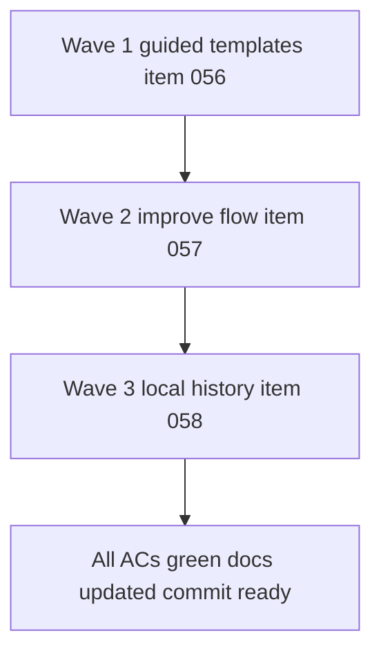

## task_009_orchestrate_workspace_productivity_wave_for_templates_improvement_and_history - Orchestrate workspace productivity wave for templates, improvement, and history

> From version: 0.4.0
> Schema version: 1.0
> Status: Ready
> Understanding: 98%
> Confidence: 96%
> Progress: 0%
> Complexity: High
> Theme: Productivity
> Reminder: Update status/understanding/confidence/progress and dependencies/references when you edit this doc.

# Context

This task delivers the next product wave after `0.4.0` by turning request `023` into three coordinated delivery slices:

- guided template starts for faster activation
- improve-existing-diagram flows for pasted Mermaid
- local history and restore points for safer iteration

The wave order is intentional:

- templates ship first because they reduce startup friction with the least risk to existing workspace contracts
- improve mode ships second because it depends on the current Mermaid generation and validation flow
- local history ships last so it can capture the final shape of template and improve-mode events instead of being designed around temporary state transitions

Execution constraints:

- keep Mermaid source as the canonical editable artifact across every wave
- preserve current edit, preview, export, and share flows while the workspace gains new capabilities
- require explicit review on uncertain improve-mode rewrites rather than allowing silent destructive replacement
- keep local history browser-local only for this wave
- leave the repository commit-ready at the end of each wave and update linked Logics docs during the same wave

# Plan

- [ ] 1. Confirm scope boundaries, shared workspace-state changes, and instrumentation expectations across `item_056`, `item_057`, and `item_058`.
- [ ] 2. Wave 1: deliver guided templates from `item_056`, validate the entry flow, update linked docs, and checkpoint the wave.
- [ ] 3. Wave 2: deliver improve-existing-diagram flows from `item_057`, validate safe apply behavior, update linked docs, and checkpoint the wave.
- [ ] 4. Wave 3: deliver local history and restore from `item_058`, validate snapshot triggers and restore behavior, update linked docs, and checkpoint the wave.
- [ ] 5. Finalize linked request/backlog/task docs and run the integrated validation set for template start, improve flow, history restore, export, and share.
- [ ] CHECKPOINT: leave the repository commit-ready at the end of each wave and update linked docs during the same wave.
- [ ] FINAL: capture validation evidence and close linked docs when the full wave is complete.

# Delivery checkpoints

- Each completed wave should leave the repository in a coherent, commit-ready state.
- Update linked Logics docs during the wave that changes the behavior, not only at final closure.
- Prefer one meaningful commit checkpoint per wave instead of stacking undocumented partial changes.
- If a shared workspace-state refactor is required, land it in the earliest wave that needs it and keep it behavior-preserving.

# AC Traceability

- AC1 to AC5 -> `item_056_add_guided_templates_for_faster_workspace_starts`: guided starts, template metadata, workspace prefills, and activation instrumentation. Proof: template browser validation plus event-contract review.
- AC5 to AC10 -> `item_057_add_improve_existing_diagram_flows_for_pasted_mermaid`: improve-mode inputs, preset intents, safe editable output, guarded apply flow, and improve instrumentation. Proof: improve-flow validation and Mermaid guardrail review.
- AC10 to AC13 -> `item_058_add_local_diagram_history_and_restore_points`: browser-local snapshots, metadata model, debounced manual-edit capture, history panel, restore flow, and restore instrumentation. Proof: history persistence and restore validation.
- AC14 -> `item_056_add_guided_templates_for_faster_workspace_starts`, `item_057_add_improve_existing_diagram_flows_for_pasted_mermaid`, `item_058_add_local_diagram_history_and_restore_points`: existing edit, preview, export, and share flows remain validated after integration. Proof: integrated regression suite and browser validation.

# Decision framing

- Product framing: Required
- Product signals: conversion journey, retention, trust and confidence, experience scope
- Product follow-up: Keep this wave focused on productivity inside the existing workspace rather than expanding into collaboration or project management.
- Architecture framing: Required
- Architecture signals: contracts and integration, state and sync, data model and persistence, runtime and boundaries
- Architecture follow-up: Keep template, improve, and history changes aligned around one canonical Mermaid source and a simple browser-first persistence model.

# Links

- Product brief(s): `prod_000_mermaid_generator_product_direction`
- Architecture decision(s): `adr_000_choose_a_static_pwa_architecture_for_mermaid_generator`
- Request(s):
  - `req_023_improve_workspace_productivity_with_guided_templates_diagram_improvement_and_local_history`
- Backlog items:
  - `item_056_add_guided_templates_for_faster_workspace_starts`
  - `item_057_add_improve_existing_diagram_flows_for_pasted_mermaid`
  - `item_058_add_local_diagram_history_and_restore_points`

# AI Context

- Summary: Orchestrate the productivity wave that adds guided template starts, safe improve-existing-diagram flows, and browser-local history with restore points.
- Keywords: templates, improve mode, history, restore, productivity, workspace, activation, retention
- Use when: Use when implementing any part of the coordinated post-0.4.0 workspace-productivity wave.
- Skip when: Skip when the work is an isolated fix outside the template, improve, or history package.

# Validation

- `python3 logics/skills/logics-doc-linter/scripts/logics_lint.py`
- `npm run lint`
- `npm run typecheck`
- `npm run test`
- `npm run build`
- `npm run quality:pwa`
- `npm run test:e2e`
- Browser validation for template selection, improve-mode review and apply, history restore, export, and share

# Definition of Done (DoD)

- [ ] All 3 backlog items are marked `Done` with `Progress: 100%`.
- [ ] Existing edit, preview, export, and share flows remain green after the integrated wave.
- [ ] Guided template selection works in the current workspace and first-generation instrumentation is visible.
- [ ] Improve mode returns editable Mermaid, reuses validation guardrails, and requires explicit review when a rewrite is uncertain.
- [ ] History snapshots are stored browser-locally with the required metadata and restore correctly updates the canonical source.
- [ ] Linked request and backlog docs are updated during their respective waves.
- [ ] Status is `Done` and progress is `100%`.

# Report

(to be completed after execution)
